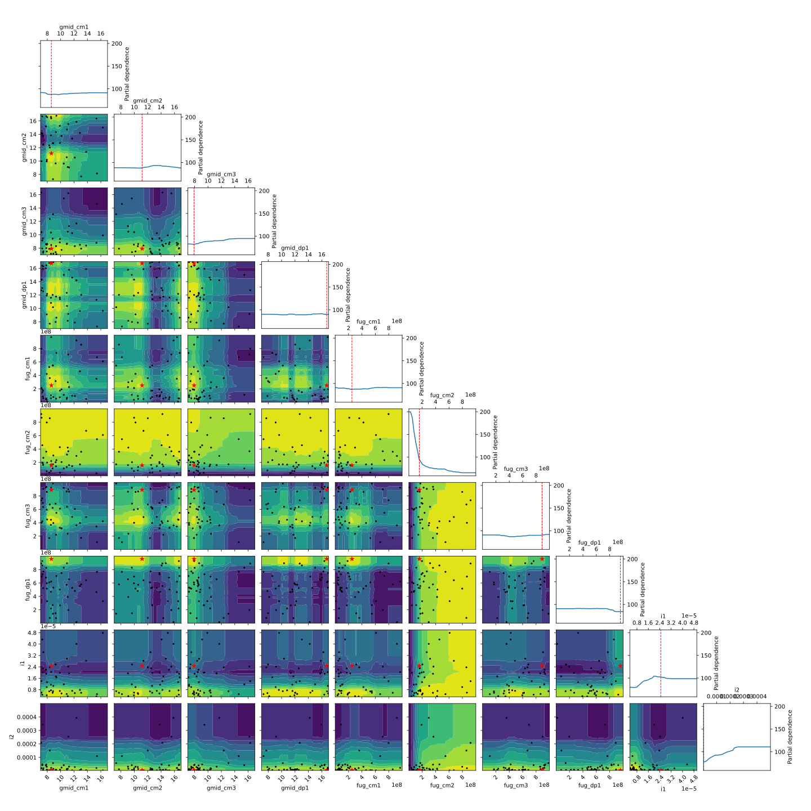

<h1 align="center">bAC²Eball</h1>

Using [Bayesian optimization methods](https://scikit-optimize.github.io/) with
[AC²E](https://github.com/matthschw/ace) takes about as long as nine innings.

<b align="center">Gaussian Process Minimizer</b>



## Setup

The basic setup is as follows:

```hy
(optimizer :func                    design-objective
           :dimensions              design-space 
           :n-calls                 200
           :n-random-starts         50
           :base-estimator          estimator
           :initial-point-generator generator
           :acq-func                acquisitor
           :xi                      0.01
           :kappa                   1.96
           :random-state            666
           :n-jobs                  42
           :verbose                 True)
```

Where 
- `optimizer  ∈  [forest-minimize gbrt-minimize gp-minimize]` 
- `estimator  ∈  ["RF" "ET"]` 
- `generator  ∈  ["random" "sobol" "halton" "hammersly" "lhs" "grid"]` 
- `acquisitor ∈  ["LCB" "EI" "PI"]` 

For the [symmetrical amplifier](https://raw.githubusercontent.com/matthschw/ace/main/figures/op2.png)
the design space is:

```hy
(setv design-space 
  [ (space.Real 7.0 17.0  :name "gmid_cm1" :prior "normal")
    (space.Real 7.0 17.0  :name "gmid_cm2" :prior "normal")
    (space.Real 7.0 17.0  :name "gmid_cm3" :prior "normal")
    (space.Real 7.0 17.0  :name "gmid_dp1" :prior "normal")
    (space.Real 1e6 1e9   :name "fug_cm1"  :prior "uniform")
    (space.Real 1e6 1e9   :name "fug_cm2"  :prior "uniform")
    (space.Real 1e6 1e9   :name "fug_cm3"  :prior "uniform")
    (space.Real 1e6 1e9   :name "fug_dp1"  :prior "uniform")
    (space.Real 3e-6 5e-5 :name "i1"       :prior "normal")
    (space.Real 3e-6 5e-4 :name "i2"       :prior "normal") ])
```

## Results

...

## Dependencies 

- [AC²E](https://github.com/matthschw/ace)
- [HAC²E](https://github.com/augustunderground/hace)

## WIP

- [ ] Vary `kappa` and `xi`
- [ ] Find way to benchmark `ps` variants
- [ ] More plots
