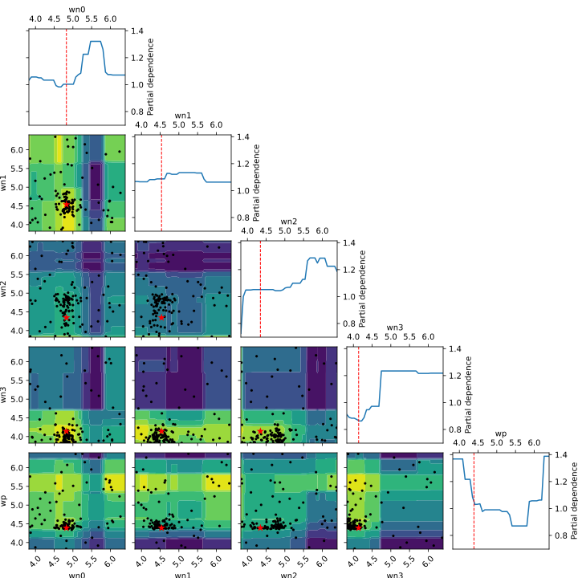

<h1 align="center">bAC²Eball</h1>

Using [Bayesian methods](https://scikit-optimize.github.io/) for hyper
parameter optimization with [AC²E](https://github.com/matthschw/ace) takes
about as long as nine innings.

<b align="center">Best Model</b>



| Description | Value       |
|-------------|-------------|
| optimzer    | gp_minimize |
| estimator   | GBRT        |
| generator   | sobol       |
| acquisitor  | PI          |
| wn0         | 0.000015    |
| wn1         | 0.000029    |
| wn2         | 0.000045    |
| wn3         | 0.000072    |
| wp          | 0.000041    |
| vs0         | 1.6602      |
| vs1         | 1.652853    |
| vs2         | 1.662488    |
| vs3         | 1.659937    |
| cost        | 0.021502    |

See [the report](./report.md) for a detailed comparison of algorithms offered
by scikit-optimize, on a real world example. 

These plots were generated by running `bace.hy`.

## Setup

The basic setup is as follows:

```hy
(optimizer :func                    design-objective
           :dimensions              design-space 
           :n-calls                 128
           :n-random-starts         32
           :base-estimator          estimator
           :initial-point-generator generator
           :acq-func                acquisitor
           :xi                      0.01
           :kappa                   1.96
           :random-state            666
           :n-jobs                  42
           :verbose                 True)
```

Where 
- `optimizer  ∈  [forest-minimize gbrt-minimize gp-minimize]` 
- `estimator  ∈  ["GP" "RF" "ET" "GBRT"]`
- `generator  ∈  ["random" "sobol" "halton" "hammersly" "lhs" "grid"]` 
- `acquisitor ∈  ["LCB" "EI" "PI"]` 

## Dependencies 

- [AC²E](https://github.com/matthschw/ace)
- [HAC²E](https://github.com/augustunderground/hace)

## WIP

- [ ] Vary `kappa` and `xi`
- [ ] Find way to benchmark `ps` variants
- [ ] Try optimizing amplifiers

## Design Objective Inverter Chain


Optimize the widths `[wn0, wn1, wn2, wn3, wp]` such that the switching voltages
`vsi = vdd / 2 = 1.65V` where `i ∈ [0,1,2,3]`.

### Design Space

```hy
(setv design-space 
  [ (space.Real 0.4e-6 150e-6 :name "wn0" :prior "normal")
    (space.Real 0.4e-6 150e-6 :name "wn1" :prior "normal")
    (space.Real 0.4e-6 150e-6 :name "wn2" :prior "normal")
    (space.Real 0.4e-6 150e-6 :name "wn3" :prior "normal")
    (space.Real 0.4e-6 150e-6 :name "wp"  :prior "normal") ])
```
