# Comparison

Detailed comparison of optimization algorithms.

<h4 align="center">forest_minimize-GP-random-LCB</h4>

```
optimizer     forest_minimize
estimator                  GP
generator              random
acquisitor                LCB
wn0                  0.000008
wn1                  0.000021
wn2                  0.000019
wn3                  0.000062
wp                   0.000024
vs0                  1.670866
vs1                  1.622723
vs2                  1.692429
vs3                  1.637521
cost                 0.062455
time_stamp      184637-211102
```

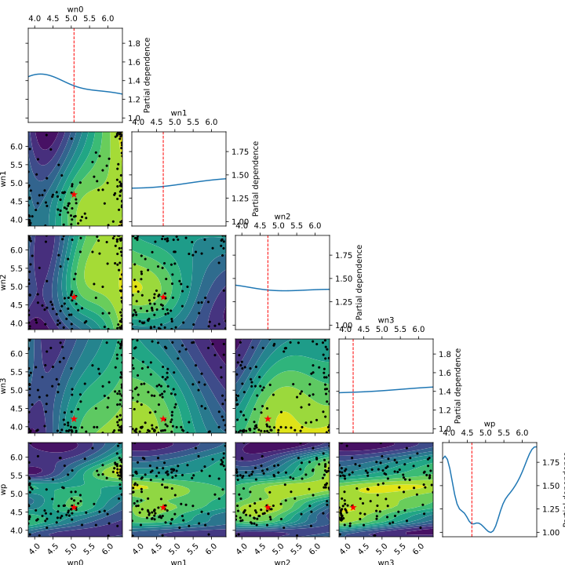


<h4 align="center">forest_minimize-GP-random-EI</h4>

```
optimizer     forest_minimize
estimator                  GP
generator              random
acquisitor                 EI
wn0                  0.000001
wn1                  0.000001
wn2                  0.000003
wn3                  0.000002
wp                   0.000002
vs0                  1.658643
vs1                  1.654954
vs2                  1.587793
vs3                   1.65238
cost                 0.047384
time_stamp      184747-211102
```

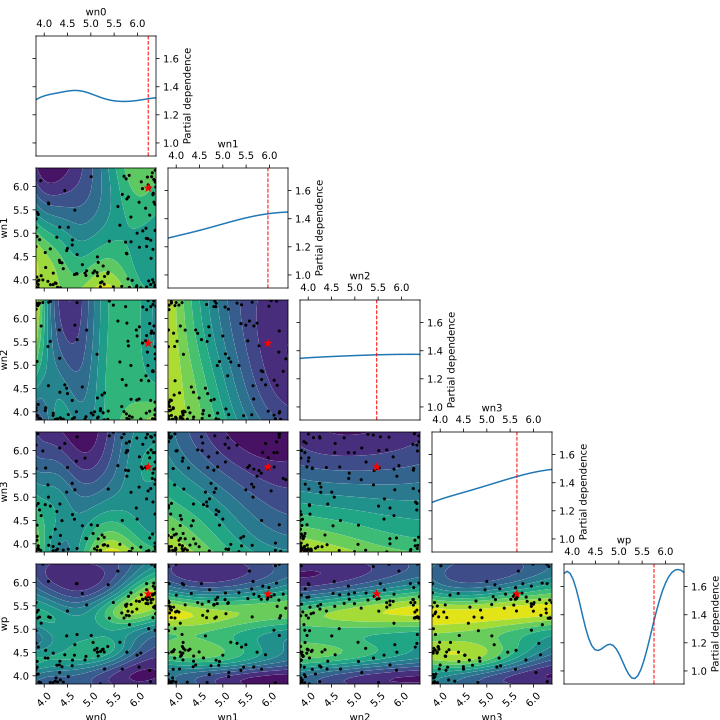


<h4 align="center">forest_minimize-GP-random-PI</h4>

```
optimizer     forest_minimize
estimator                  GP
generator              random
acquisitor                 PI
wn0                  0.000003
wn1                  0.000006
wn2                  0.000013
wn3                  0.000022
wp                   0.000008
vs0                  1.685658
vs1                  1.662379
vs2                  1.630455
vs3                  1.621537
cost                 0.058209
time_stamp      184851-211102
```

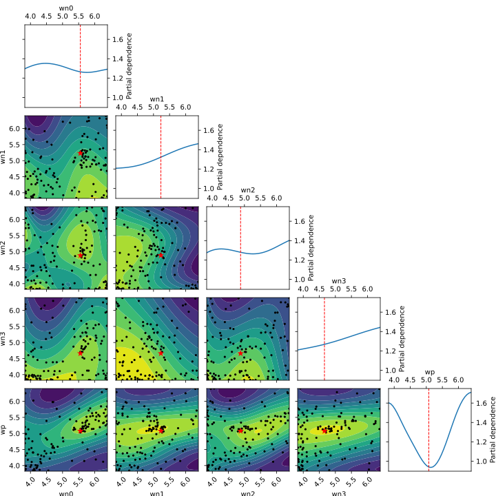


<h4 align="center">forest_minimize-GP-random-gp_hedge</h4>

```
optimizer     forest_minimize
estimator                  GP
generator              random
acquisitor           gp_hedge
wn0                  0.000016
wn1                  0.000028
wn2                  0.000045
wn3                  0.000148
wp                   0.000041
vs0                  1.638411
vs1                  1.650809
vs2                   1.65688
vs3                  1.601413
cost                  0.04113
time_stamp      184956-211102
```

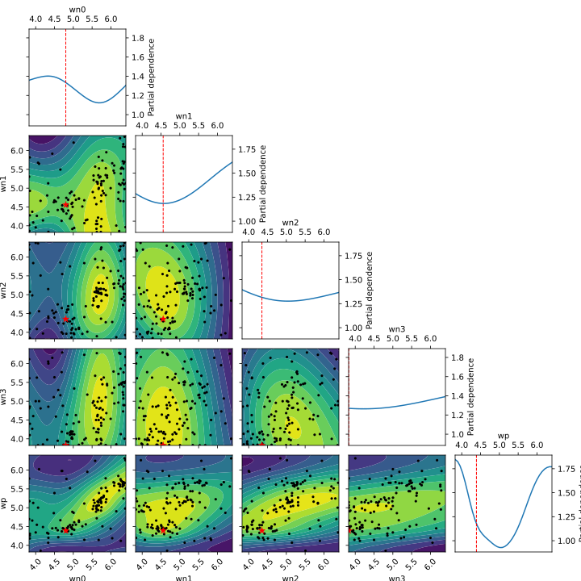


<h4 align="center">forest_minimize-GP-sobol-LCB</h4>

```
optimizer     forest_minimize
estimator                  GP
generator               sobol
acquisitor                LCB
wn0                  0.000012
wn1                  0.000023
wn2                  0.000053
wn3                  0.000079
wp                   0.000034
vs0                  1.667342
vs1                  1.659345
vs2                  1.627269
vs3                  1.626708
cost                 0.044066
time_stamp      185125-211102
```

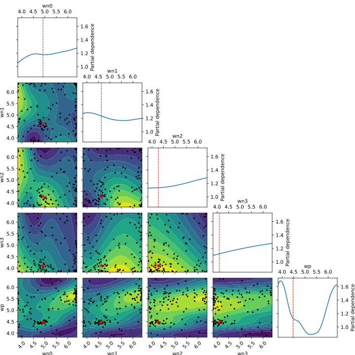


<h4 align="center">forest_minimize-GP-sobol-EI</h4>

```
optimizer     forest_minimize
estimator                  GP
generator               sobol
acquisitor                 EI
wn0                       0.0
wn1                  0.000001
wn2                  0.000002
wn3                  0.000004
wp                   0.000001
vs0                   1.70272
vs1                  1.648216
vs2                  1.651528
vs3                  1.615442
cost                 0.054903
time_stamp      185230-211102
```

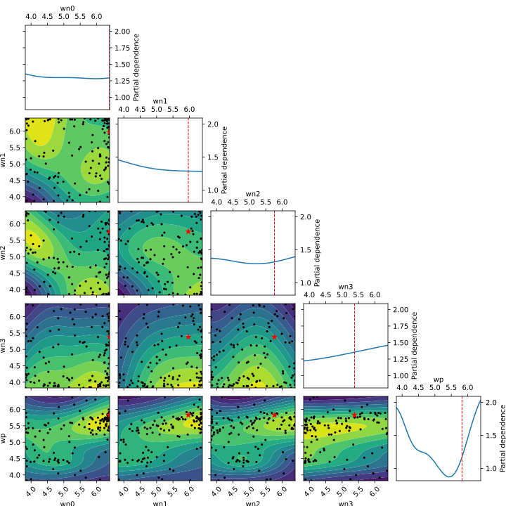


<h4 align="center">forest_minimize-GP-sobol-PI</h4>

```
optimizer     forest_minimize
estimator                  GP
generator               sobol
acquisitor                 PI
wn0                  0.000015
wn1                   0.00002
wn2                  0.000055
wn3                  0.000144
wp                   0.000039
vs0                  1.643688
vs1                  1.710294
vs2                  1.659062
vs3                  1.622548
cost                 0.062497
time_stamp      185335-211102
```

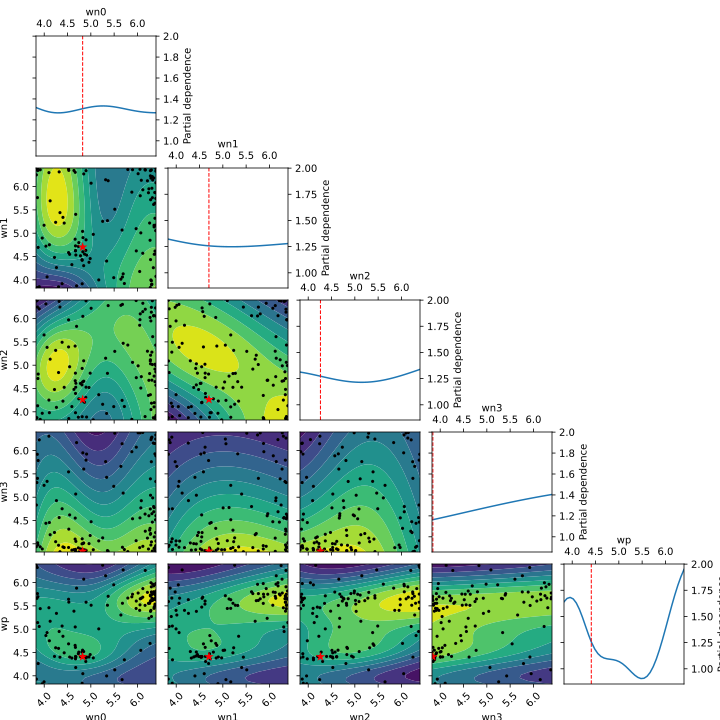


<h4 align="center">forest_minimize-GP-sobol-gp_hedge</h4>

```
optimizer     forest_minimize
estimator                  GP
generator               sobol
acquisitor           gp_hedge
wn0                  0.000019
wn1                  0.000031
wn2                  0.000056
wn3                  0.000105
wp                   0.000048
vs0                  1.631462
vs1                  1.657785
vs2                  1.650943
vs3                  1.635056
cost                 0.025582
time_stamp      185442-211102
```

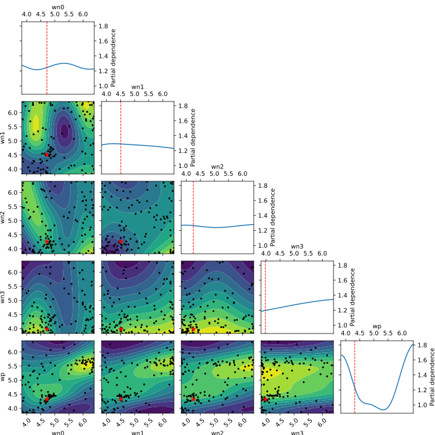


<h4 align="center">forest_minimize-GP-halton-LCB</h4>

```
optimizer     forest_minimize
estimator                  GP
generator              halton
acquisitor                LCB
wn0                   0.00001
wn1                  0.000059
wn2                  0.000063
wn3                  0.000143
wp                   0.000039
vs0                  1.786997
vs1                  1.634795
vs2                  1.661943
vs3                  1.636242
cost                  0.10782
time_stamp      185616-211102
```

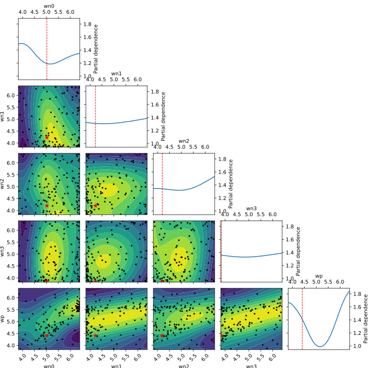


<h4 align="center">forest_minimize-GP-halton-EI</h4>

```
optimizer     forest_minimize
estimator                  GP
generator              halton
acquisitor                 EI
wn0                  0.000053
wn1                  0.000129
wn2                  0.000142
wn3                  0.000142
wp                   0.000143
vs0                  1.657455
vs1                  1.613379
vs2                  1.661578
vs3                   1.70987
cost                 0.070015
time_stamp      185717-211102
```

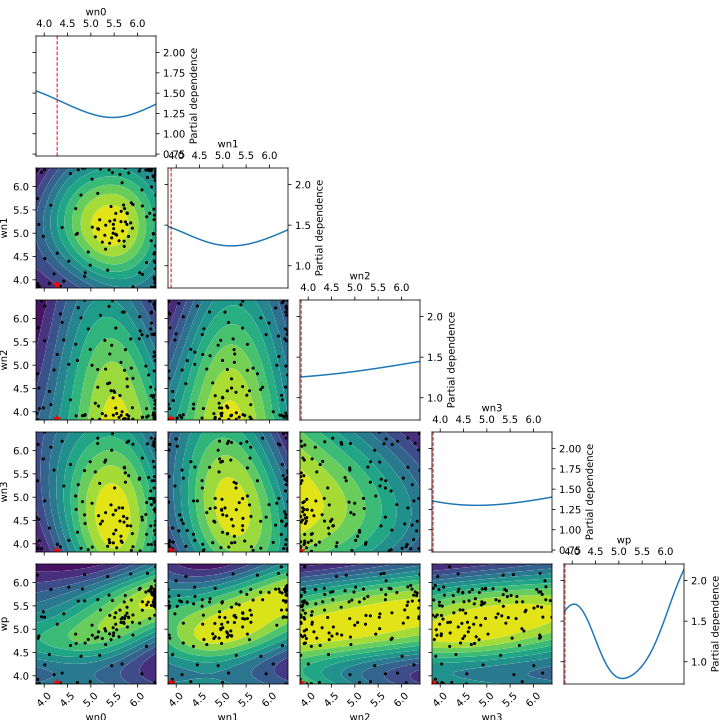


<h4 align="center">forest_minimize-GP-halton-PI</h4>

```
optimizer     forest_minimize
estimator                  GP
generator              halton
acquisitor                 PI
wn0                  0.000003
wn1                  0.000005
wn2                  0.000008
wn3                   0.00002
wp                   0.000009
vs0                  1.651611
vs1                  1.669799
vs2                  1.679718
vs3                  1.646288
cost                 0.033236
time_stamp      185822-211102
```

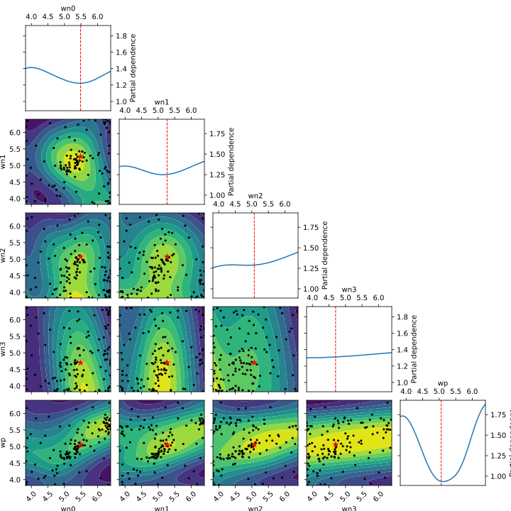


<h4 align="center">forest_minimize-GP-halton-gp_hedge</h4>

```
optimizer     forest_minimize
estimator                  GP
generator              halton
acquisitor           gp_hedge
wn0                  0.000006
wn1                  0.000008
wn2                  0.000012
wn3                   0.00003
wp                   0.000013
vs0                  1.605458
vs1                   1.65081
vs2                  1.677326
vs3                  1.634957
cost                 0.053164
time_stamp      185933-211102
```

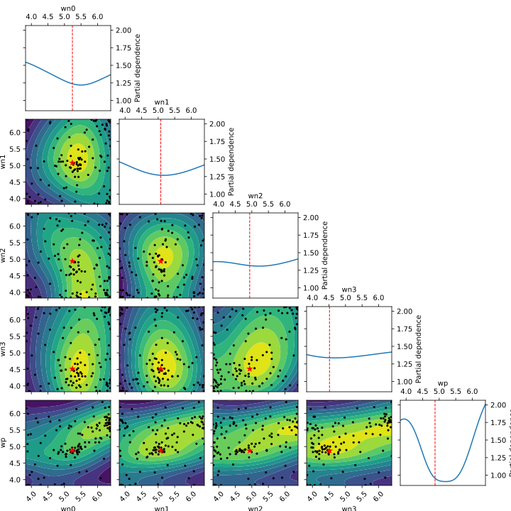


<h4 align="center">forest_minimize-GP-hammersly-LCB</h4>

```
optimizer     forest_minimize
estimator                  GP
generator           hammersly
acquisitor                LCB
wn0                  0.000013
wn1                  0.000029
wn2                  0.000047
wn3                  0.000113
wp                   0.000038
vs0                  1.681416
vs1                  1.655008
vs2                  1.656206
vs3                  1.623584
cost                 0.041846
time_stamp      190113-211102
```

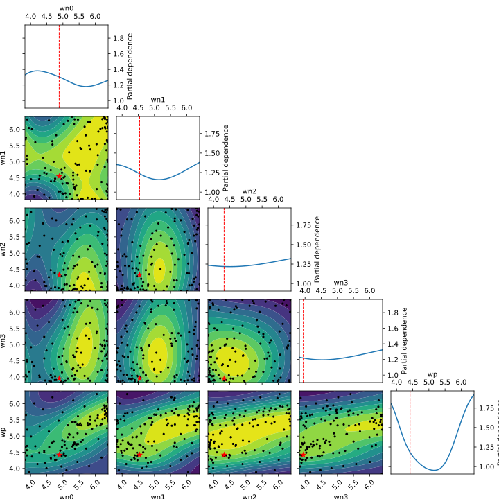


<h4 align="center">forest_minimize-GP-hammersly-EI</h4>

```
optimizer     forest_minimize
estimator                  GP
generator           hammersly
acquisitor                 EI
wn0                  0.000011
wn1                  0.000015
wn2                  0.000148
wn3                  0.000093
wp                   0.000033
vs0                  1.690632
vs1                  1.750339
vs2                  1.612066
vs3                  1.650334
cost                 0.108629
time_stamp      190231-211102
```

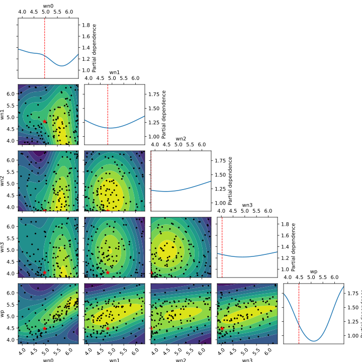


<h4 align="center">forest_minimize-GP-hammersly-PI</h4>

```
optimizer     forest_minimize
estimator                  GP
generator           hammersly
acquisitor                 PI
wn0                  0.000005
wn1                  0.000016
wn2                  0.000016
wn3                  0.000023
wp                   0.000015
vs0                  1.669493
vs1                  1.593141
vs2                  1.650403
vs3                  1.656698
cost                 0.050578
time_stamp      190343-211102
```

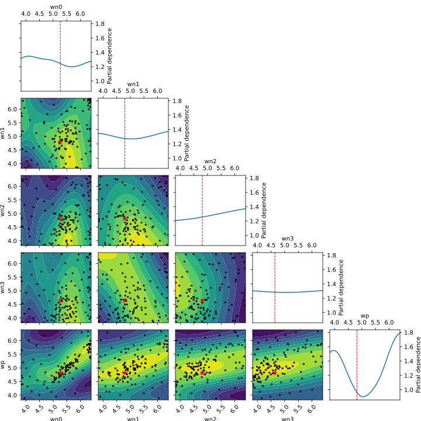


<h4 align="center">forest_minimize-GP-hammersly-gp_hedge</h4>

```
optimizer     forest_minimize
estimator                  GP
generator           hammersly
acquisitor           gp_hedge
wn0                  0.000015
wn1                  0.000022
wn2                  0.000046
wn3                  0.000132
wp                   0.000037
vs0                  1.638259
vs1                  1.675815
vs2                  1.653965
vs3                  1.609628
cost                 0.049632
time_stamp      190453-211102
```

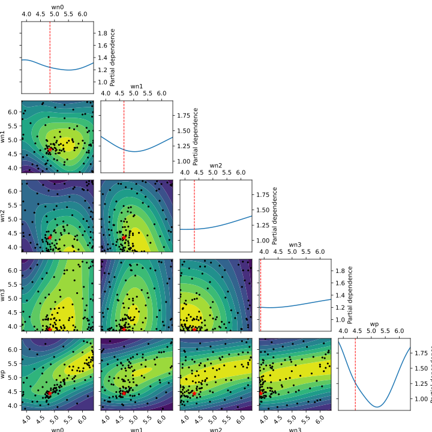


<h4 align="center">forest_minimize-GP-lhs-LCB</h4>

```
optimizer     forest_minimize
estimator                  GP
generator                 lhs
acquisitor                LCB
wn0                       0.0
wn1                  0.000001
wn2                  0.000001
wn3                  0.000003
wp                   0.000001
vs0                  1.649197
vs1                  1.653394
vs2                  1.768851
vs3                  1.676821
cost                 0.090829
time_stamp      190625-211102
```

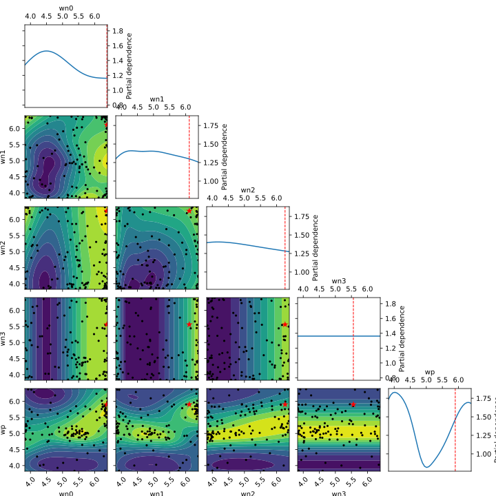


<h4 align="center">forest_minimize-GP-lhs-EI</h4>

```
optimizer     forest_minimize
estimator                  GP
generator                 lhs
acquisitor                 EI
wn0                       0.0
wn1                  0.000001
wn2                  0.000001
wn3                  0.000122
wp                   0.000001
vs0                  1.680379
vs1                  1.657436
vs2                   1.68672
vs3                  1.517847
cost                 0.125265
time_stamp      190731-211102
```

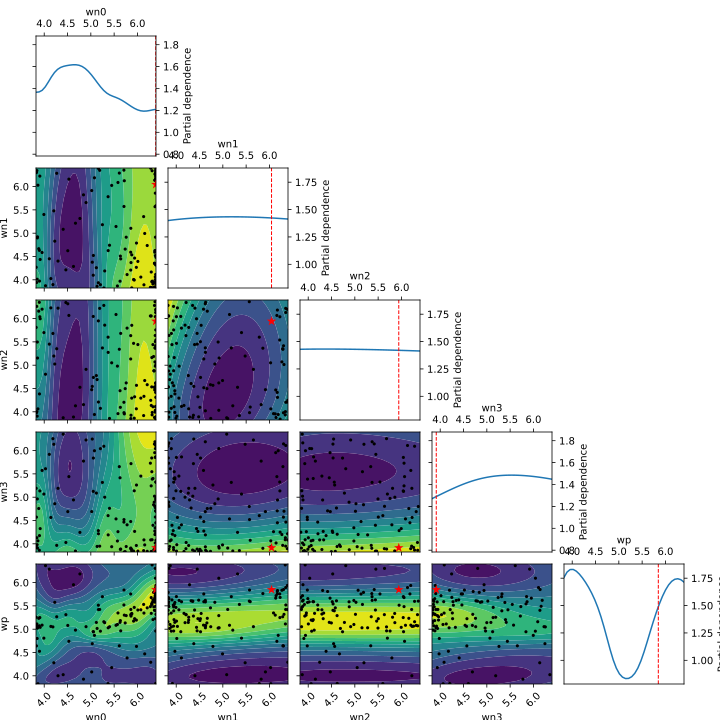


<h4 align="center">forest_minimize-GP-lhs-PI</h4>

```
optimizer     forest_minimize
estimator                  GP
generator                 lhs
acquisitor                 PI
wn0                  0.000005
wn1                  0.000013
wn2                  0.000023
wn3                  0.000032
wp                   0.000017
vs0                  1.708802
vs1                  1.666611
vs2                  1.660994
vs3                  1.666737
cost                 0.062511
time_stamp      190835-211102
```

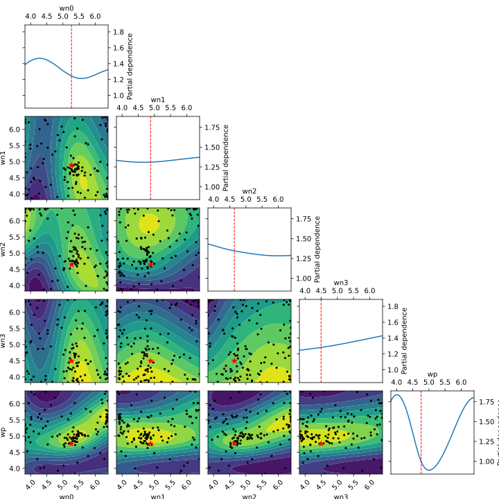


<h4 align="center">forest_minimize-GP-lhs-gp_hedge</h4>

```
optimizer     forest_minimize
estimator                  GP
generator                 lhs
acquisitor           gp_hedge
wn0                  0.000004
wn1                  0.000012
wn2                  0.000014
wn3                  0.000028
wp                   0.000013
vs0                  1.700815
vs1                  1.624941
vs2                  1.665156
vs3                   1.64201
cost                 0.060012
time_stamp      190946-211102
```

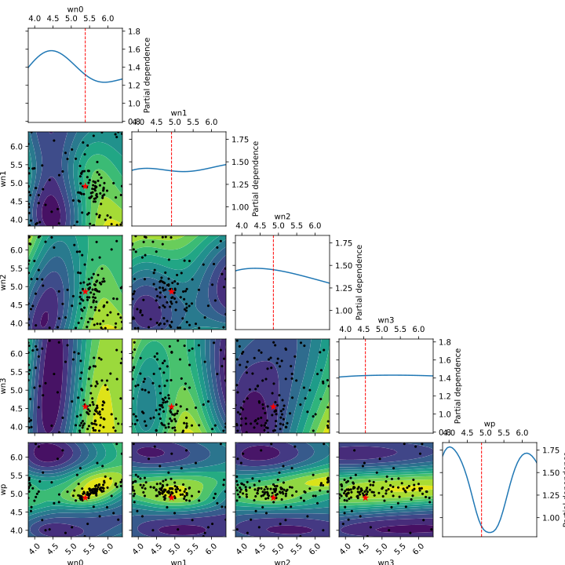


<h4 align="center">forest_minimize-GP-grid-LCB</h4>

```
optimizer     forest_minimize
estimator                  GP
generator                grid
acquisitor                LCB
wn0                  0.000012
wn1                  0.000026
wn2                  0.000044
wn3                  0.000043
wp                   0.000032
vs0                  1.649283
vs1                  1.623721
vs2                  1.621212
vs3                  1.663603
cost                 0.042052
time_stamp      191122-211102
```

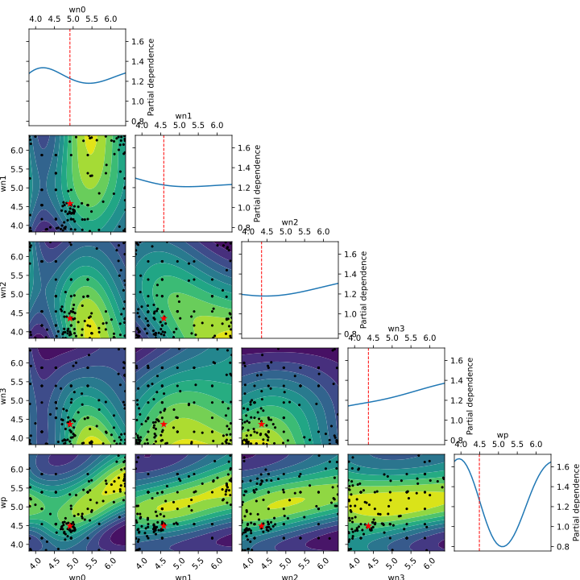


<h4 align="center">forest_minimize-GP-grid-EI</h4>

```
optimizer     forest_minimize
estimator                  GP
generator                grid
acquisitor                 EI
wn0                  0.000012
wn1                  0.000026
wn2                  0.000044
wn3                  0.000043
wp                   0.000032
vs0                  1.649283
vs1                  1.623721
vs2                  1.621212
vs3                  1.663603
cost                 0.042052
time_stamp      191229-211102
```

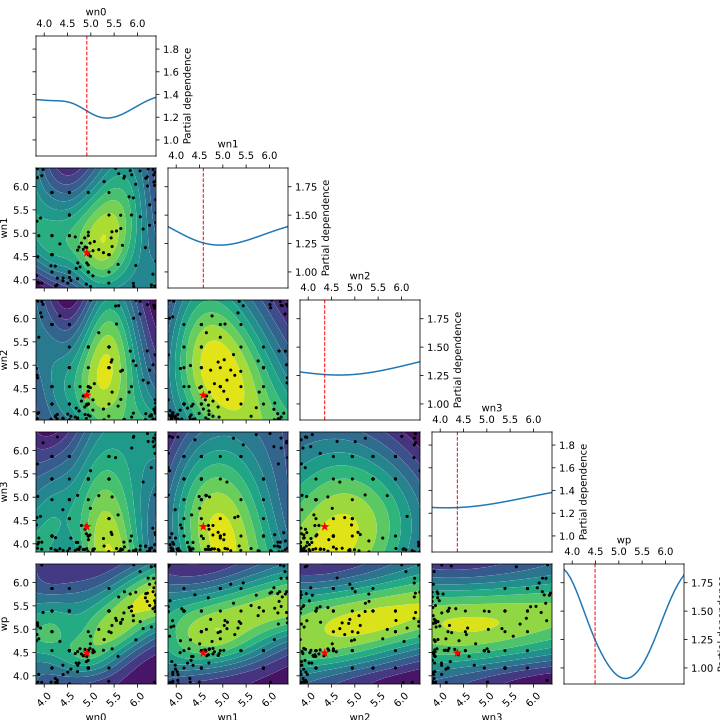


<h4 align="center">forest_minimize-GP-grid-PI</h4>

```
optimizer     forest_minimize
estimator                  GP
generator                grid
acquisitor                 PI
wn0                   0.00001
wn1                  0.000027
wn2                  0.000033
wn3                  0.000038
wp                   0.000029
vs0                  1.676142
vs1                  1.619337
vs2                  1.651184
vs3                  1.679255
cost                 0.052875
time_stamp      191338-211102
```

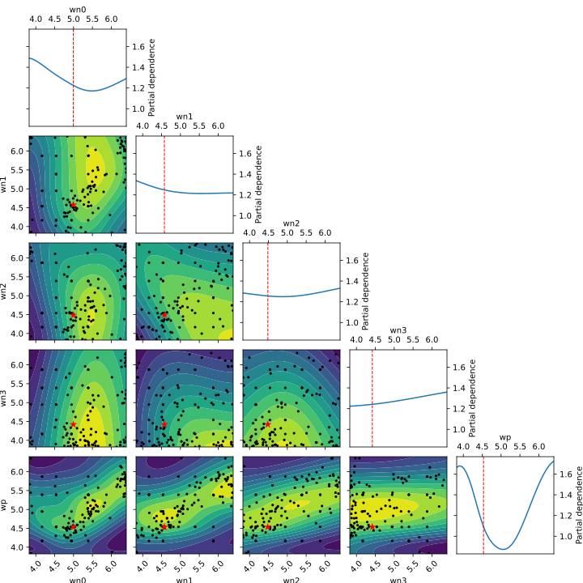


<h4 align="center">forest_minimize-GP-grid-gp_hedge</h4>

```
optimizer     forest_minimize
estimator                  GP
generator                grid
acquisitor           gp_hedge
wn0                   0.00001
wn1                  0.000027
wn2                  0.000033
wn3                  0.000038
wp                   0.000029
vs0                  1.676142
vs1                  1.619337
vs2                  1.651184
vs3                  1.679255
cost                 0.052875
time_stamp      191446-211102
```

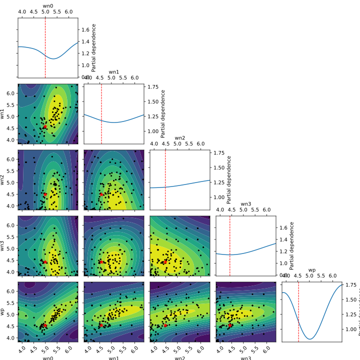


<h4 align="center">forest_minimize-RF-random-LCB</h4>

```
optimizer     forest_minimize
estimator                  RF
generator              random
acquisitor                LCB
wn0                       0.0
wn1                  0.000021
wn2                  0.000036
wn3                  0.000026
wp                   0.000003
vs0                  1.903793
vs1                  1.660202
vs2                  1.651655
vs3                  1.662352
cost                 0.168486
time_stamp      191613-211102
```

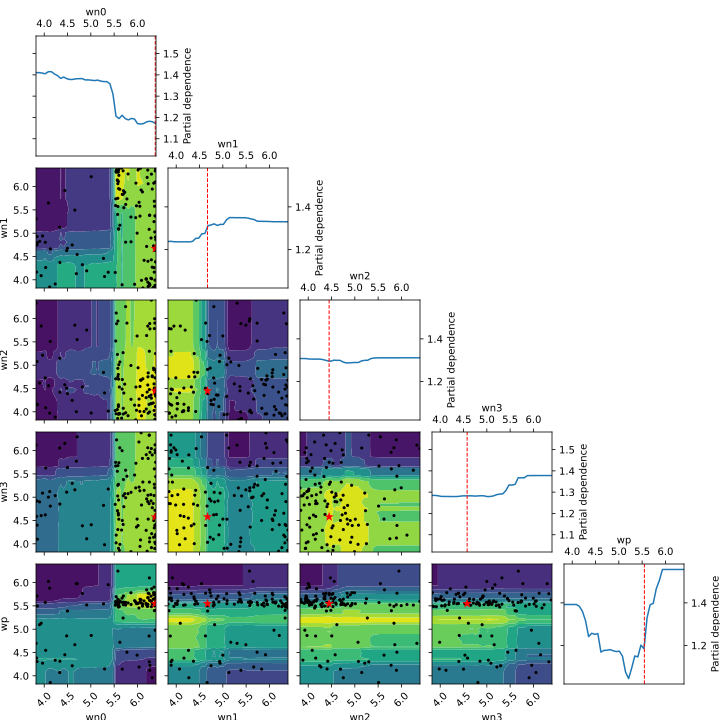


<h4 align="center">forest_minimize-RF-random-EI</h4>

```
optimizer     forest_minimize
estimator                  RF
generator              random
acquisitor                 EI
wn0                  0.000027
wn1                  0.000057
wn2                  0.000136
wn3                  0.000029
wp                   0.000076
vs0                  1.676564
vs1                  1.656663
vs2                  1.618301
vs3                  1.843505
cost                 0.156625
time_stamp      192313-211102
```

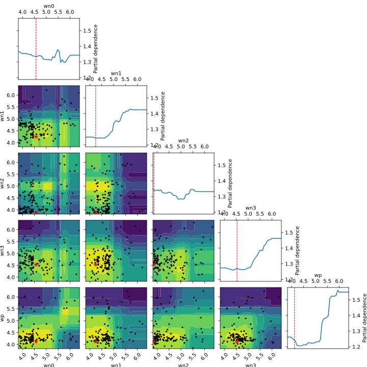


<h4 align="center">forest_minimize-RF-random-PI</h4>

```
optimizer     forest_minimize
estimator                  RF
generator              random
acquisitor                 PI
wn0                  0.000001
wn1                  0.000002
wn2                  0.000001
wn3                  0.000004
wp                   0.000002
vs0                  1.617005
vs1                  1.558194
vs2                  1.717776
vs3                  1.645242
cost                 0.119597
time_stamp      193003-211102
```

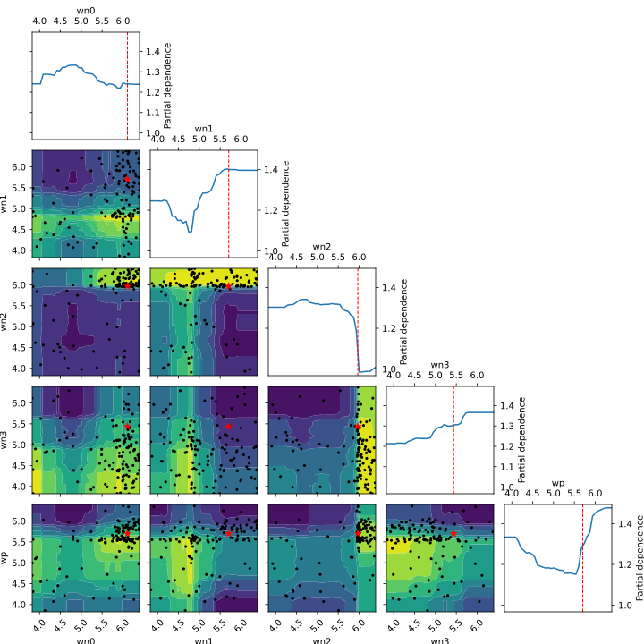


<h4 align="center">forest_minimize-RF-random-gp_hedge</h4>

```
optimizer     forest_minimize
estimator                  RF
generator              random
acquisitor           gp_hedge
wn0                  0.000033
wn1                  0.000075
wn2                  0.000063
wn3                  0.000132
wp                   0.000074
vs0                  1.595869
vs1                  1.555706
vs2                  1.646858
vs3                  1.621359
cost                 0.109217
time_stamp      193700-211102
```

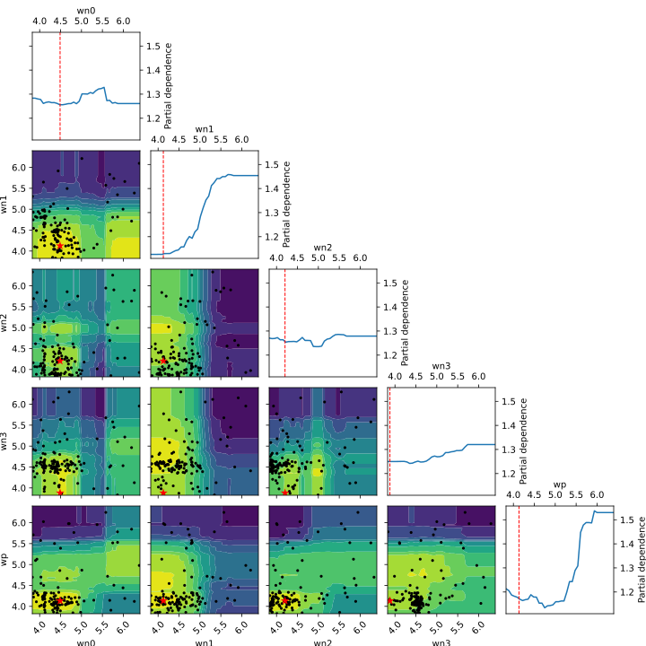


<h4 align="center">forest_minimize-RF-sobol-LCB</h4>

```
optimizer     forest_minimize
estimator                  RF
generator               sobol
acquisitor                LCB
wn0                  0.000007
wn1                  0.000014
wn2                  0.000093
wn3                  0.000039
wp                   0.000019
vs0                  1.659628
vs1                  1.646006
vs2                  1.528616
vs3                  1.605778
cost                 0.108623
time_stamp      194434-211102
```

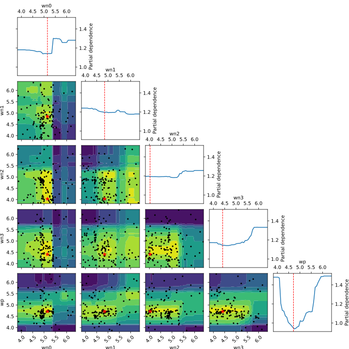


<h4 align="center">forest_minimize-RF-sobol-EI</h4>

```
optimizer     forest_minimize
estimator                  RF
generator               sobol
acquisitor                 EI
wn0                  0.000011
wn1                   0.00003
wn2                  0.000065
wn3                   0.00006
wp                   0.000034
vs0                  1.712912
vs1                  1.646757
vs2                  1.619771
vs3                  1.655593
cost                 0.061804
time_stamp      195137-211102
```

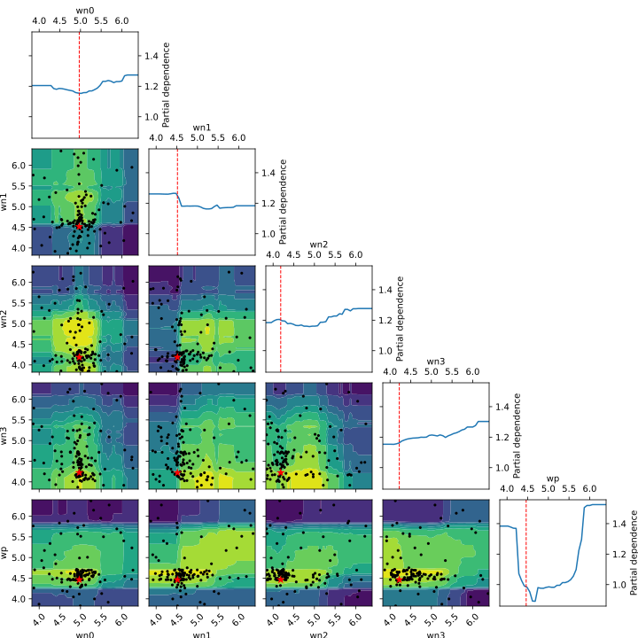


<h4 align="center">forest_minimize-RF-sobol-PI</h4>

```
optimizer     forest_minimize
estimator                  RF
generator               sobol
acquisitor                 PI
wn0                  0.000013
wn1                  0.000029
wn2                  0.000047
wn3                  0.000113
wp                   0.000038
vs0                  1.681416
vs1                  1.655008
vs2                  1.656206
vs3                  1.623584
cost                 0.041846
time_stamp      195842-211102
```

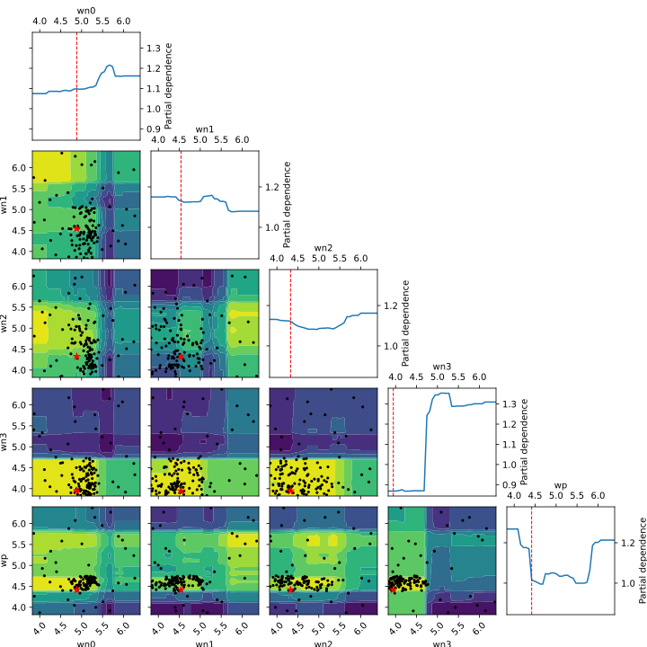


<h4 align="center">forest_minimize-RF-sobol-gp_hedge</h4>

```
optimizer     forest_minimize
estimator                  RF
generator               sobol
acquisitor           gp_hedge
wn0                  0.000015
wn1                   0.00002
wn2                  0.000055
wn3                  0.000144
wp                   0.000039
vs0                  1.643688
vs1                  1.710294
vs2                  1.659062
vs3                  1.622548
cost                 0.062497
time_stamp      200545-211102
```

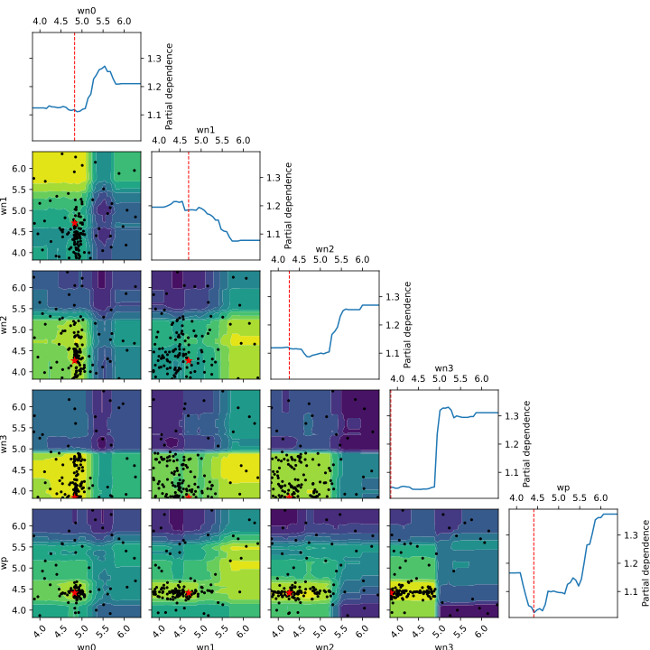


<h4 align="center">forest_minimize-RF-halton-LCB</h4>

```
optimizer     forest_minimize
estimator                  RF
generator              halton
acquisitor                LCB
wn0                  0.000001
wn1                  0.000004
wn2                  0.000028
wn3                  0.000137
wp                   0.000005
vs0                  1.804348
vs1                   1.72537
vs2                  1.627941
vs3                  1.590122
cost                 0.188882
time_stamp      201400-211102
```

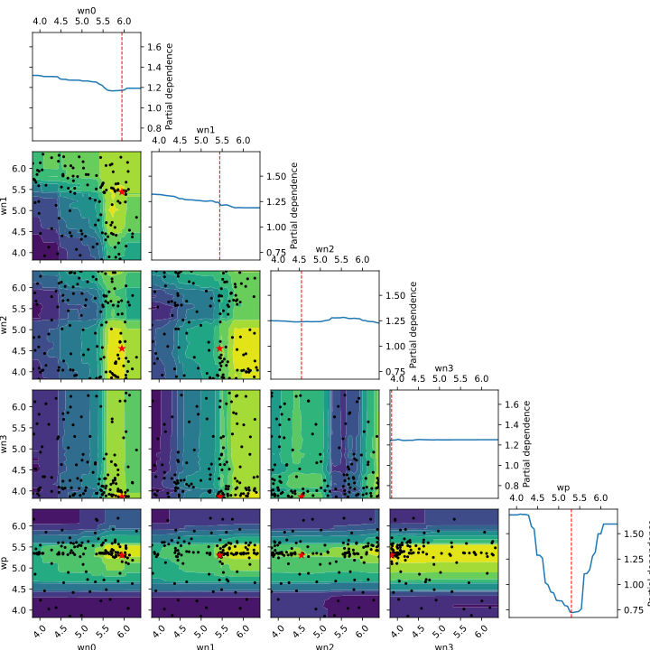


<h4 align="center">forest_minimize-RF-halton-EI</h4>

```
optimizer     forest_minimize
estimator                  RF
generator              halton
acquisitor                 EI
wn0                  0.000001
wn1                  0.000005
wn2                  0.000111
wn3                  0.000141
wp                   0.000004
vs0                  1.877852
vs1                  1.720446
vs2                  1.630243
vs3                   1.62743
cost                 0.206439
time_stamp      202102-211102
```

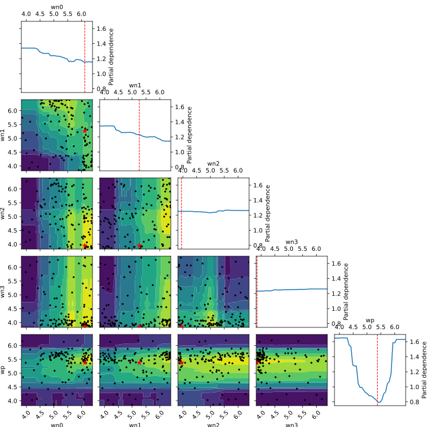


<h4 align="center">forest_minimize-RF-halton-PI</h4>

```
optimizer     forest_minimize
estimator                  RF
generator              halton
acquisitor                 PI
wn0                  0.000003
wn1                  0.000005
wn2                  0.000008
wn3                   0.00002
wp                   0.000009
vs0                  1.651611
vs1                  1.669799
vs2                  1.679718
vs3                  1.646288
cost                 0.033236
time_stamp      202825-211102
```

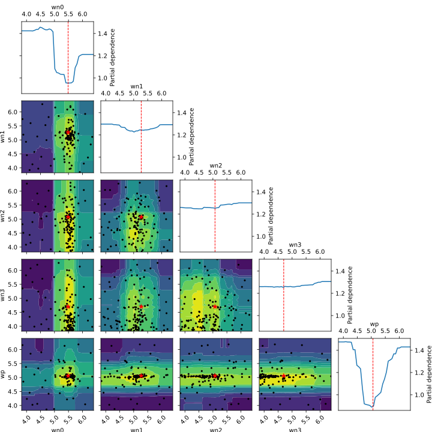


<h4 align="center">forest_minimize-RF-halton-gp_hedge</h4>

```
optimizer     forest_minimize
estimator                  RF
generator              halton
acquisitor           gp_hedge
wn0                  0.000002
wn1                  0.000022
wn2                  0.000003
wn3                  0.000005
wp                   0.000005
vs0                  1.699334
vs1                  1.453892
vs2                  1.688404
vs3                  1.694429
cost                 0.198955
time_stamp      203536-211102
```

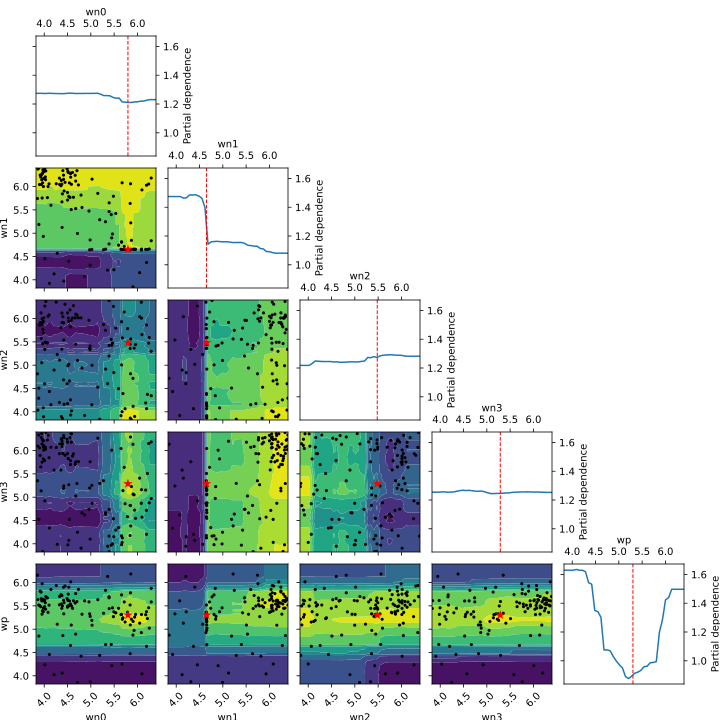


<h4 align="center">forest_minimize-RF-hammersly-LCB</h4>

```
optimizer     forest_minimize
estimator                  RF
generator           hammersly
acquisitor                LCB
wn0                  0.000006
wn1                  0.000015
wn2                  0.000016
wn3                  0.000023
wp                   0.000016
vs0                  1.633715
vs1                  1.585429
vs2                  1.636372
vs3                  1.645942
cost                 0.059722
time_stamp      204400-211102
```


<h4 align="center">forest_minimize-RF-hammersly-EI</h4>

```
optimizer     forest_minimize
estimator                  RF
generator           hammersly
acquisitor                 EI
wn0                  0.000004
wn1                  0.000007
wn2                  0.000009
wn3                  0.000052
wp                    0.00001
vs0                  1.665933
vs1                   1.66267
vs2                  1.698743
vs3                  1.609099
cost                 0.071665
time_stamp      205113-211102
```

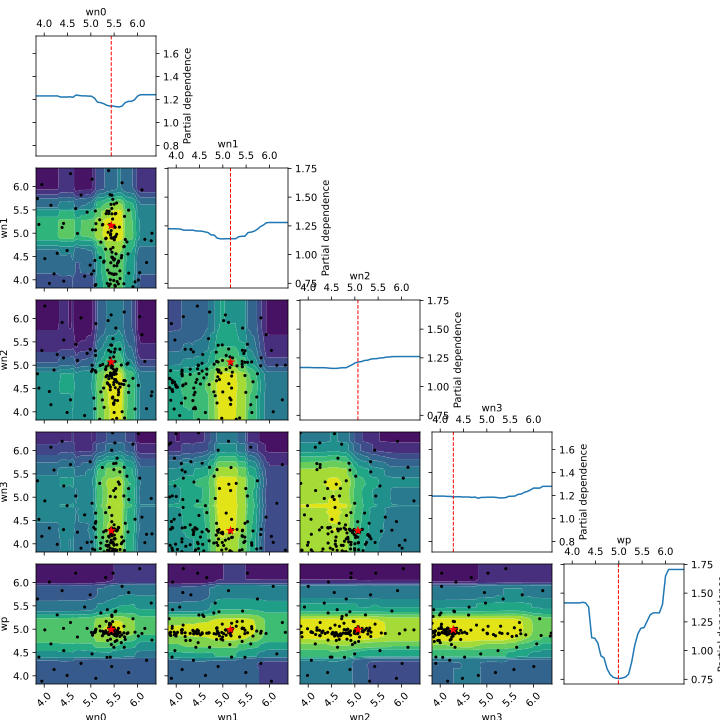


<h4 align="center">forest_minimize-RF-hammersly-PI</h4>

```
optimizer     forest_minimize
estimator                  RF
generator           hammersly
acquisitor                 PI
wn0                  0.000004
wn1                  0.000011
wn2                  0.000013
wn3                  0.000045
wp                   0.000011
vs0                  1.674478
vs1                  1.604209
vs2                  1.640439
vs3                  1.579891
cost                 0.090872
time_stamp      205844-211102
```

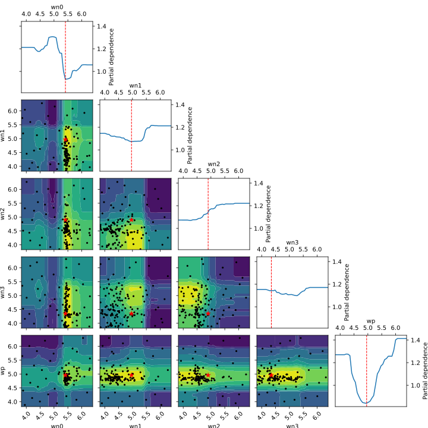


<h4 align="center">forest_minimize-RF-hammersly-gp_hedge</h4>

```
optimizer     forest_minimize
estimator                  RF
generator           hammersly
acquisitor           gp_hedge
wn0                       0.0
wn1                  0.000008
wn2                  0.000019
wn3                  0.000008
wp                   0.000003
vs0                   1.85927
vs1                  1.646468
vs2                   1.62204
vs3                   1.66825
cost                 0.156978
time_stamp      210610-211102
```


<h4 align="center">forest_minimize-RF-lhs-LCB</h4>

```
optimizer     forest_minimize
estimator                  RF
generator                 lhs
acquisitor                LCB
wn0                  0.000001
wn1                  0.000033
wn2                  0.000001
wn3                  0.000004
wp                   0.000002
vs0                  1.727457
vs1                  1.407581
vs2                  1.736955
vs3                  1.649724
cost                 0.246732
time_stamp      211451-211102
```

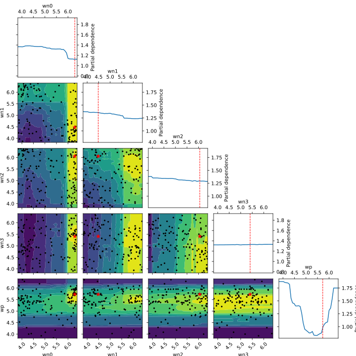


<h4 align="center">forest_minimize-RF-lhs-EI</h4>

```
optimizer     forest_minimize
estimator                  RF
generator                 lhs
acquisitor                 EI
wn0                  0.000005
wn1                  0.000021
wn2                  0.000039
wn3                  0.000144
wp                   0.000018
vs0                  1.773255
vs1                  1.646796
vs2                  1.633277
vs3                  1.587307
cost                 0.124773
time_stamp      212208-211102
```

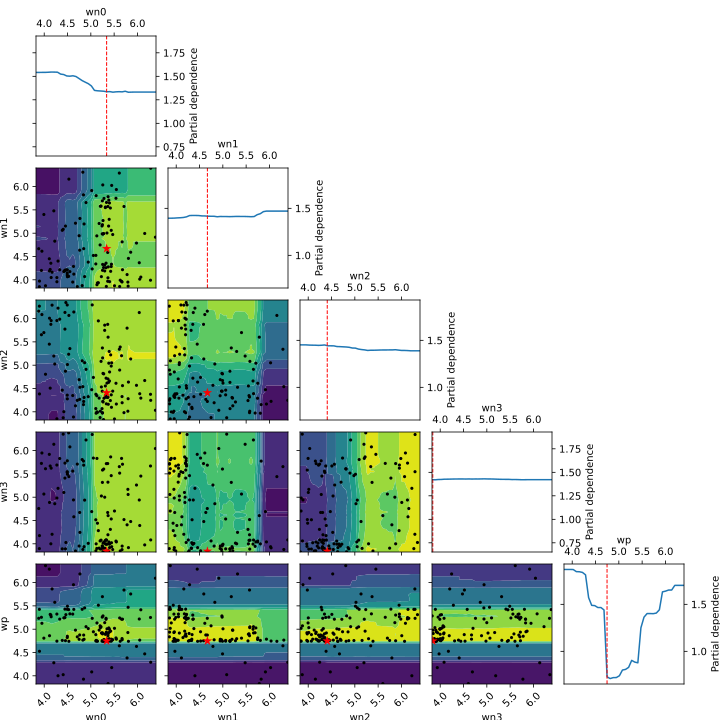


<h4 align="center">forest_minimize-RF-lhs-PI</h4>

```
optimizer     forest_minimize
estimator                  RF
generator                 lhs
acquisitor                 PI
wn0                  0.000001
wn1                  0.000024
wn2                  0.000014
wn3                  0.000025
wp                   0.000003
vs0                  1.891783
vs1                  1.644959
vs2                  1.670801
vs3                  1.659841
cost                 0.168161
time_stamp      212918-211102
```

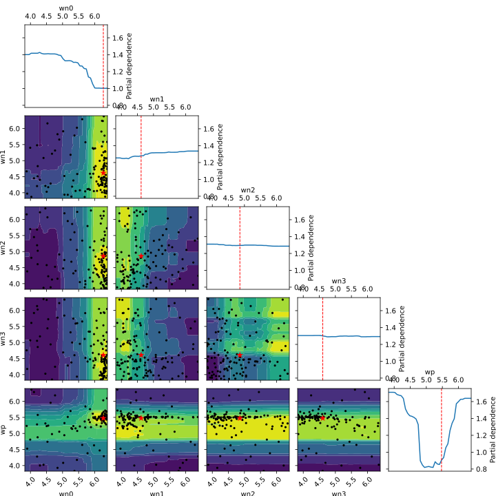


<h4 align="center">forest_minimize-RF-lhs-gp_hedge</h4>

```
optimizer     forest_minimize
estimator                  RF
generator                 lhs
acquisitor           gp_hedge
wn0                  0.000001
wn1                  0.000014
wn2                  0.000008
wn3                  0.000007
wp                   0.000004
vs0                  1.806453
vs1                  1.586633
vs2                  1.644535
vs3                  1.675004
cost                 0.151691
time_stamp      213643-211102
```

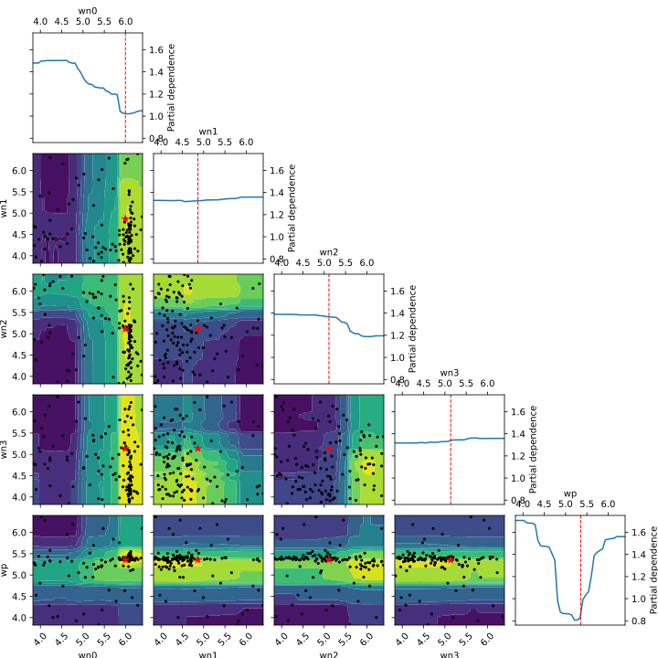


<h4 align="center">forest_minimize-RF-grid-LCB</h4>

```
optimizer     forest_minimize
estimator                  RF
generator                grid
acquisitor                LCB
wn0                  0.000011
wn1                  0.000029
wn2                  0.000029
wn3                  0.000068
wp                   0.000029
vs0                  1.635566
vs1                  1.579743
vs2                  1.639847
vs3                  1.604662
cost                 0.084959
time_stamp      214539-211102
```

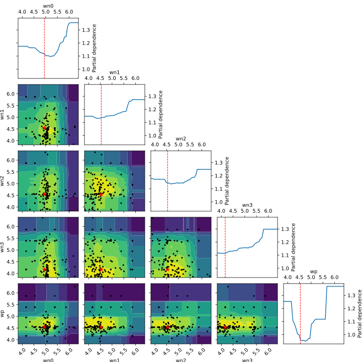


<h4 align="center">forest_minimize-RF-grid-EI</h4>

```
optimizer     forest_minimize
estimator                  RF
generator                grid
acquisitor                 EI
wn0                  0.000012
wn1                  0.000018
wn2                  0.000041
wn3                  0.000068
wp                    0.00003
vs0                  1.626371
vs1                  1.663618
vs2                  1.631195
vs3                  1.624231
cost                 0.049588
time_stamp      215312-211102
```

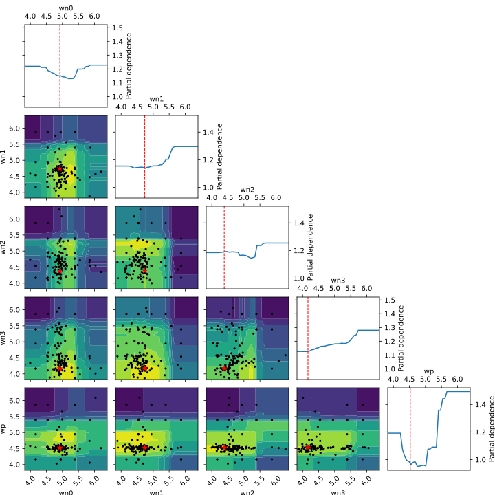


<h4 align="center">forest_minimize-RF-grid-PI</h4>

```
optimizer     forest_minimize
estimator                  RF
generator                grid
acquisitor                 PI
wn0                  0.000004
wn1                  0.000008
wn2                  0.000011
wn3                  0.000055
wp                   0.000012
vs0                   1.67123
vs1                  1.658396
vs2                  1.678833
vs3                  1.603357
cost                 0.063699
time_stamp      220057-211102
```

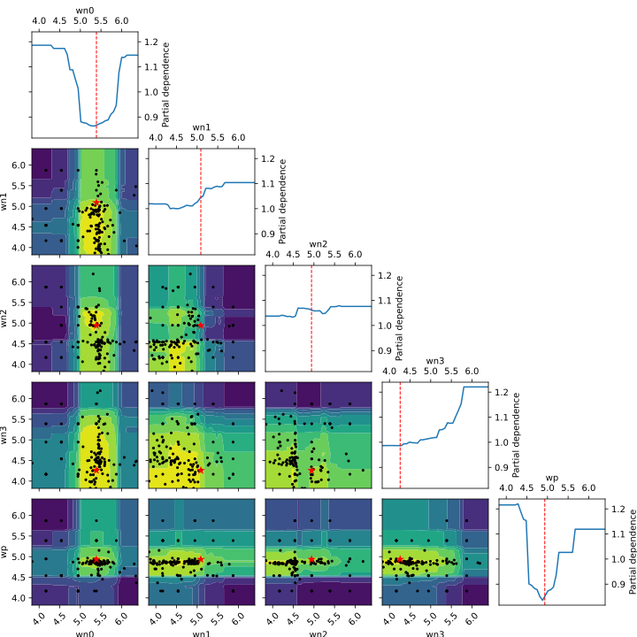


<h4 align="center">forest_minimize-RF-grid-gp_hedge</h4>

```
optimizer     forest_minimize
estimator                  RF
generator                grid
acquisitor           gp_hedge
wn0                  0.000012
wn1                  0.000018
wn2                  0.000041
wn3                  0.000068
wp                    0.00003
vs0                  1.626371
vs1                  1.663618
vs2                  1.631195
vs3                  1.624231
cost                 0.049588
time_stamp      220840-211102
```

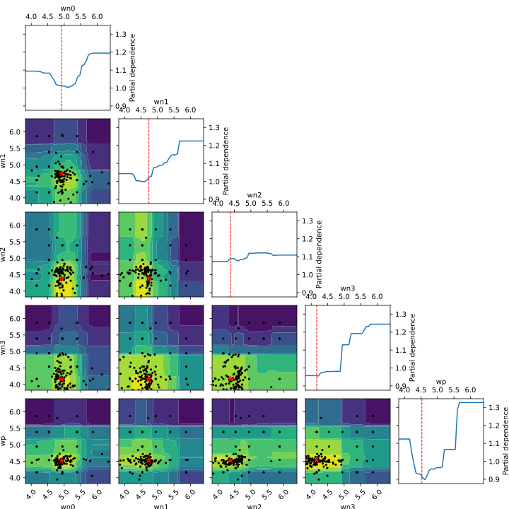


<h4 align="center">forest_minimize-ET-random-LCB</h4>

```
optimizer     forest_minimize
estimator                  ET
generator              random
acquisitor                LCB
wn0                   0.00001
wn1                  0.000046
wn2                  0.000021
wn3                  0.000087
wp                   0.000026
vs0                  1.629138
vs1                  1.489797
vs2                  1.647402
vs3                  1.563239
cost                 0.163893
time_stamp      221750-211102
```

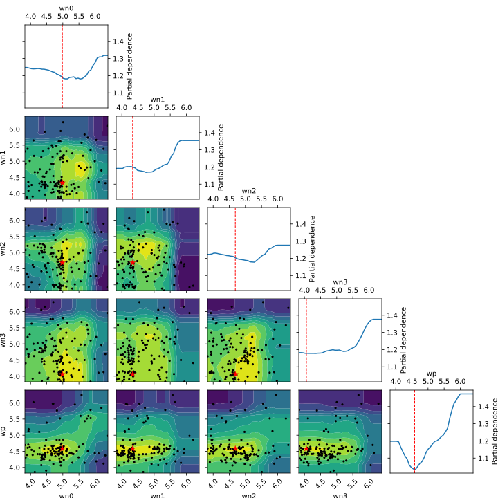


<h4 align="center">forest_minimize-ET-random-EI</h4>

```
optimizer     forest_minimize
estimator                  ET
generator              random
acquisitor                 EI
wn0                  0.000015
wn1                  0.000034
wn2                  0.000028
wn3                  0.000097
wp                   0.000041
vs0                  1.653631
vs1                  1.626447
vs2                  1.715951
vs3                  1.655023
cost                  0.05949
time_stamp      222537-211102
```

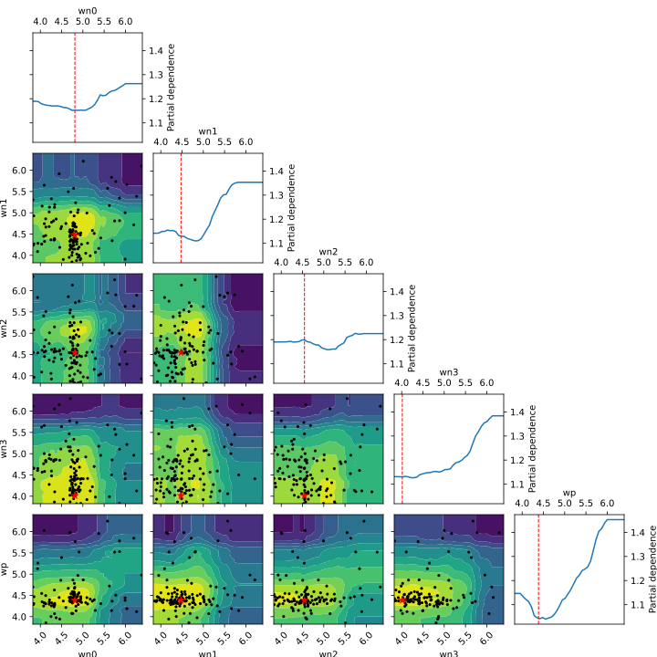


<h4 align="center">forest_minimize-ET-random-PI</h4>

```
optimizer     forest_minimize
estimator                  ET
generator              random
acquisitor                 PI
wn0                  0.000001
wn1                  0.000002
wn2                  0.000004
wn3                  0.000007
wp                   0.000003
vs0                   1.57631
vs1                  1.618409
vs2                  1.594028
vs3                  1.578501
cost                 0.141062
time_stamp      223305-211102
```

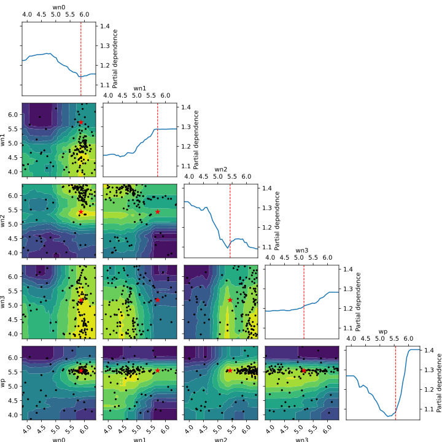


<h4 align="center">forest_minimize-ET-random-gp_hedge</h4>

```
optimizer     forest_minimize
estimator                  ET
generator              random
acquisitor           gp_hedge
wn0                  0.000001
wn1                  0.000089
wn2                  0.000053
wn3                  0.000036
wp                   0.000006
vs0                  1.887359
vs1                  1.621005
vs2                  1.637611
vs3                  1.654258
cost                 0.171516
time_stamp      224050-211102
```

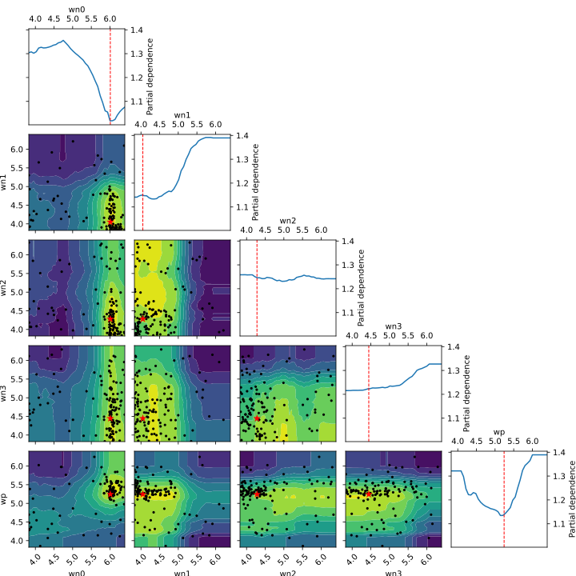


<h4 align="center">forest_minimize-ET-sobol-LCB</h4>

```
optimizer     forest_minimize
estimator                  ET
generator               sobol
acquisitor                LCB
wn0                       0.0
wn1                  0.000001
wn2                  0.000002
wn3                  0.000001
wp                   0.000001
vs0                  1.657091
vs1                  1.664682
vs2                  1.607844
vs3                  1.679344
cost                 0.056529
time_stamp      224933-211102
```

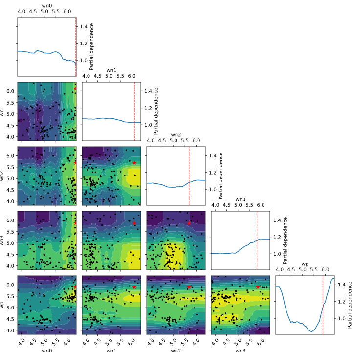


<h4 align="center">forest_minimize-ET-sobol-EI</h4>

```
optimizer     forest_minimize
estimator                  ET
generator               sobol
acquisitor                 EI
wn0                  0.000017
wn1                  0.000021
wn2                  0.000056
wn3                  0.000136
wp                   0.000046
vs0                  1.656905
vs1                  1.739195
vs2                   1.69459
vs3                  1.663047
cost                 0.093174
time_stamp      225713-211102
```

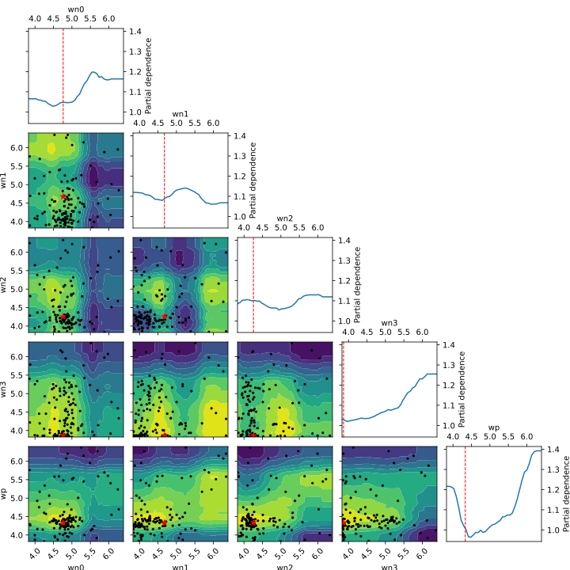


<h4 align="center">forest_minimize-ET-sobol-PI</h4>

```
optimizer     forest_minimize
estimator                  ET
generator               sobol
acquisitor                 PI
wn0                  0.000012
wn1                  0.000026
wn2                  0.000093
wn3                  0.000068
wp                   0.000036
vs0                  1.688155
vs1                  1.663205
vs2                  1.593324
vs3                  1.640958
cost                 0.070957
time_stamp      230453-211102
```

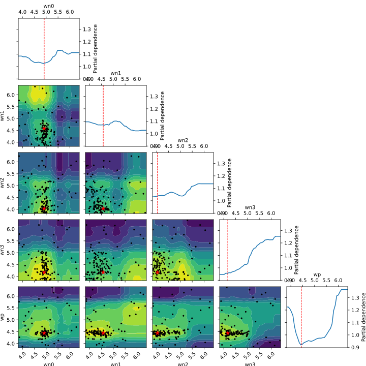


<h4 align="center">forest_minimize-ET-sobol-gp_hedge</h4>

```
optimizer     forest_minimize
estimator                  ET
generator               sobol
acquisitor           gp_hedge
wn0                  0.000009
wn1                  0.000022
wn2                  0.000028
wn3                  0.000051
wp                   0.000028
vs0                  1.689203
vs1                  1.653638
vs2                  1.681769
vs3                  1.670727
cost                  0.05778
time_stamp      231235-211102
```

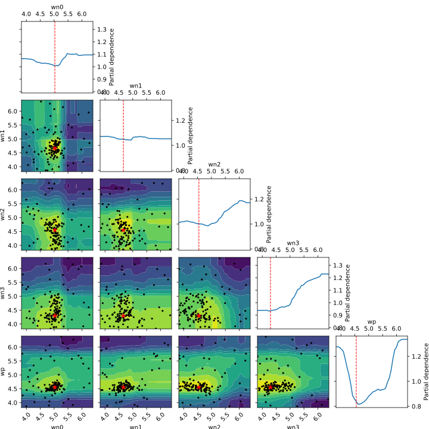


<h4 align="center">forest_minimize-ET-halton-LCB</h4>

```
optimizer     forest_minimize
estimator                  ET
generator              halton
acquisitor                LCB
wn0                  0.000001
wn1                  0.000001
wn2                  0.000003
wn3                  0.000047
wp                   0.000002
vs0                  1.743697
vs1                   1.68472
vs2                  1.645101
vs3                  1.554541
cost                 0.138652
time_stamp      232204-211102
```

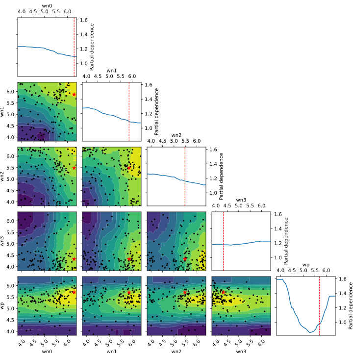


<h4 align="center">forest_minimize-ET-halton-EI</h4>

```
optimizer     forest_minimize
estimator                  ET
generator              halton
acquisitor                 EI
wn0                       0.0
wn1                  0.000007
wn2                  0.000011
wn3                  0.000023
wp                   0.000003
vs0                  1.870021
vs1                  1.658638
vs2                  1.655668
vs3                  1.638629
cost                 0.148908
time_stamp      232957-211102
```

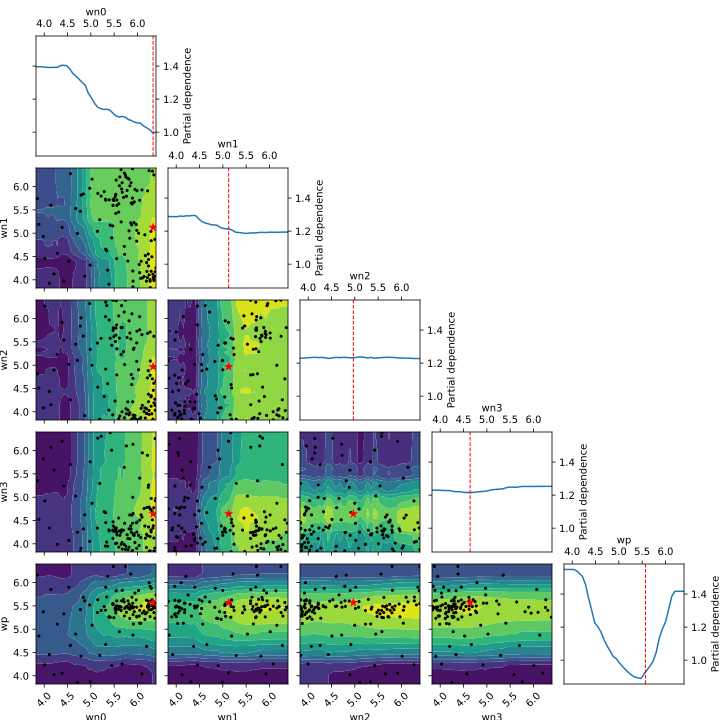


<h4 align="center">forest_minimize-ET-halton-PI</h4>

```
optimizer     forest_minimize
estimator                  ET
generator              halton
acquisitor                 PI
wn0                  0.000002
wn1                  0.000003
wn2                  0.000007
wn3                  0.000007
wp                   0.000004
vs0                       1.6
vs1                  1.651105
vs2                  1.587378
vs3                  1.630486
cost                 0.080752
time_stamp      233747-211102
```

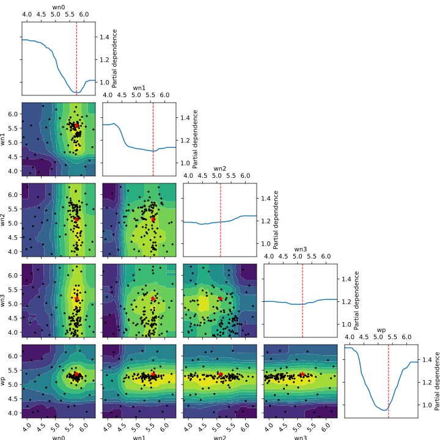


<h4 align="center">forest_minimize-ET-halton-gp_hedge</h4>

```
optimizer     forest_minimize
estimator                  ET
generator              halton
acquisitor           gp_hedge
wn0                  0.000001
wn1                  0.000001
wn2                  0.000002
wn3                  0.000003
wp                   0.000002
vs0                   1.64097
vs1                  1.625564
vs2                  1.675478
vs3                  1.650369
cost                 0.035947
time_stamp      234546-211102
```

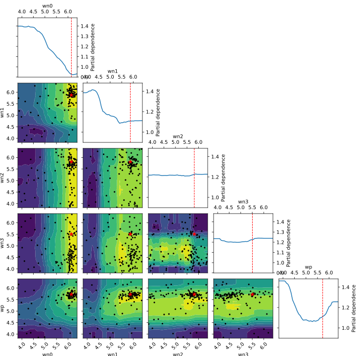


<h4 align="center">forest_minimize-ET-hammersly-LCB</h4>

```
optimizer     forest_minimize
estimator                  ET
generator           hammersly
acquisitor                LCB
wn0                  0.000003
wn1                  0.000023
wn2                   0.00003
wn3                  0.000051
wp                   0.000016
vs0                  1.821753
vs1                  1.664487
vs2                   1.67435
vs3                  1.664836
cost                 0.136622
time_stamp      235447-211102
```

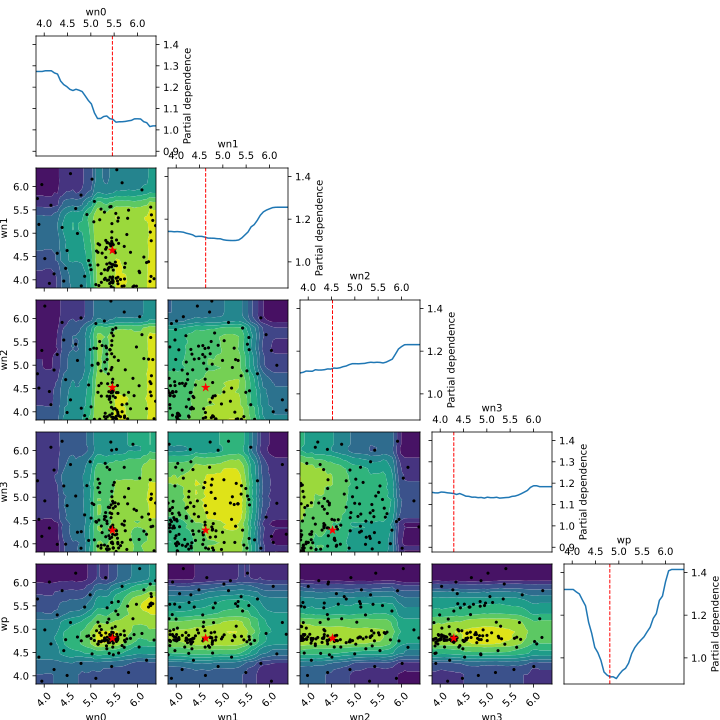


<h4 align="center">forest_minimize-ET-hammersly-EI</h4>

```
optimizer     forest_minimize
estimator                  ET
generator           hammersly
acquisitor                 EI
wn0                  0.000005
wn1                  0.000017
wn2                  0.000018
wn3                   0.00003
wp                   0.000015
vs0                  1.714992
vs1                  1.616247
vs2                  1.654997
vs3                  1.648683
cost                 0.063672
time_stamp      000225-211103
```

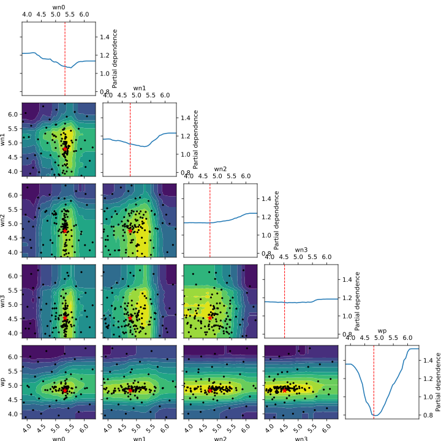


<h4 align="center">forest_minimize-ET-hammersly-PI</h4>

```
optimizer     forest_minimize
estimator                  ET
generator           hammersly
acquisitor                 PI
wn0                   0.00001
wn1                   0.00002
wn2                  0.000016
wn3                  0.000092
wp                   0.000028
vs0                  1.661398
vs1                  1.655359
vs2                  1.754715
vs3                  1.662118
cost                 0.080964
time_stamp      001019-211103
```

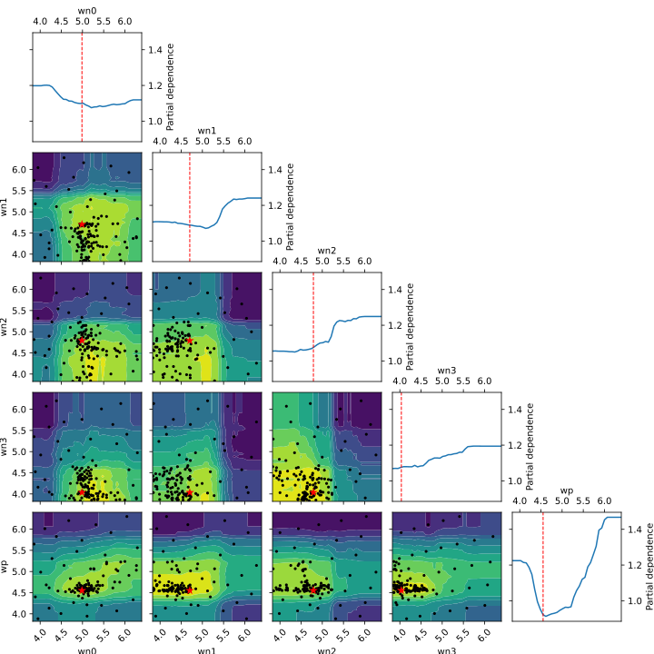


<h4 align="center">forest_minimize-ET-hammersly-gp_hedge</h4>

```
optimizer     forest_minimize
estimator                  ET
generator           hammersly
acquisitor           gp_hedge
wn0                  0.000006
wn1                  0.000014
wn2                  0.000014
wn3                  0.000042
wp                   0.000015
vs0                  1.648902
vs1                   1.60375
vs2                  1.658869
vs3                  1.606859
cost                 0.060217
time_stamp      001813-211103
```

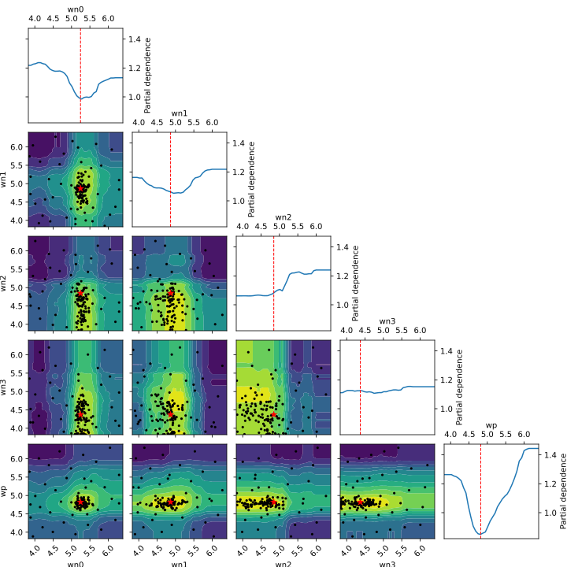


<h4 align="center">forest_minimize-ET-lhs-LCB</h4>

```
optimizer     forest_minimize
estimator                  ET
generator                 lhs
acquisitor                LCB
wn0                  0.000001
wn1                  0.000004
wn2                  0.000016
wn3                  0.000008
wp                   0.000004
vs0                  1.756661
vs1                  1.674466
vs2                  1.599183
vs3                  1.658868
cost                 0.115644
time_stamp      002728-211103
```


<h4 align="center">forest_minimize-ET-lhs-EI</h4>

```
optimizer     forest_minimize
estimator                  ET
generator                 lhs
acquisitor                 EI
wn0                  0.000007
wn1                  0.000007
wn2                   0.00012
wn3                  0.000057
wp                   0.000019
vs0                  1.644522
vs1                  1.789772
vs2                  1.613094
vs3                  1.657746
cost                 0.115092
time_stamp      003508-211103
```

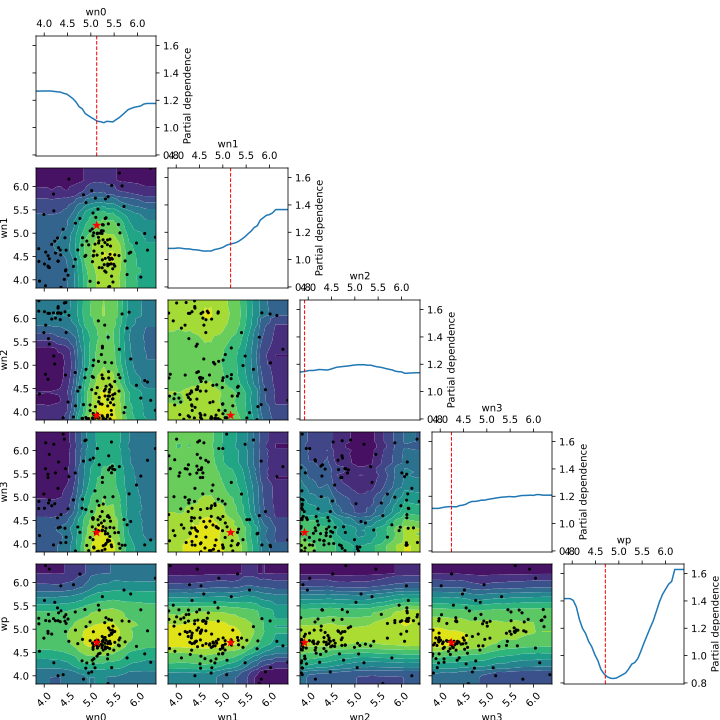


<h4 align="center">forest_minimize-ET-lhs-PI</h4>

```
optimizer     forest_minimize
estimator                  ET
generator                 lhs
acquisitor                 PI
wn0                  0.000009
wn1                   0.00003
wn2                  0.000018
wn3                  0.000001
wp                   0.000011
vs0                  1.693963
vs1                   1.67529
vs2                  1.682704
vs3                  2.019254
cost                 0.285583
time_stamp      004325-211103
```

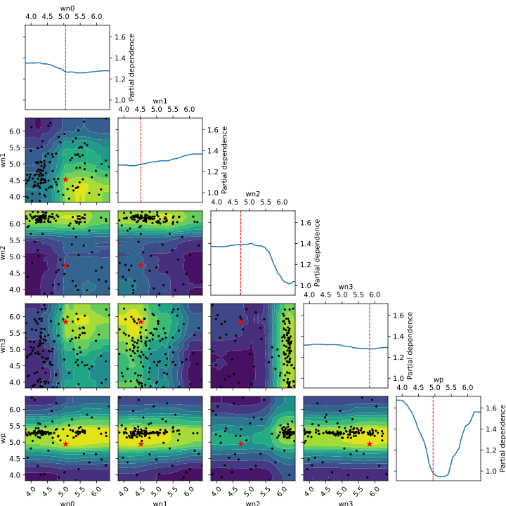


<h4 align="center">forest_minimize-ET-lhs-gp_hedge</h4>

```
optimizer     forest_minimize
estimator                  ET
generator                 lhs
acquisitor           gp_hedge
wn0                  0.000002
wn1                  0.000012
wn2                  0.000007
wn3                  0.000008
wp                   0.000006
vs0                  1.727479
vs1                  1.542423
vs2                  1.628533
vs3                  1.656358
cost                 0.129018
time_stamp      005129-211103
```


<h4 align="center">forest_minimize-ET-grid-LCB</h4>

```
optimizer     forest_minimize
estimator                  ET
generator                grid
acquisitor                LCB
wn0                  0.000011
wn1                  0.000029
wn2                  0.000029
wn3                  0.000068
wp                   0.000029
vs0                  1.635566
vs1                  1.579743
vs2                  1.639847
vs3                  1.604662
cost                 0.084959
time_stamp      010117-211103
```

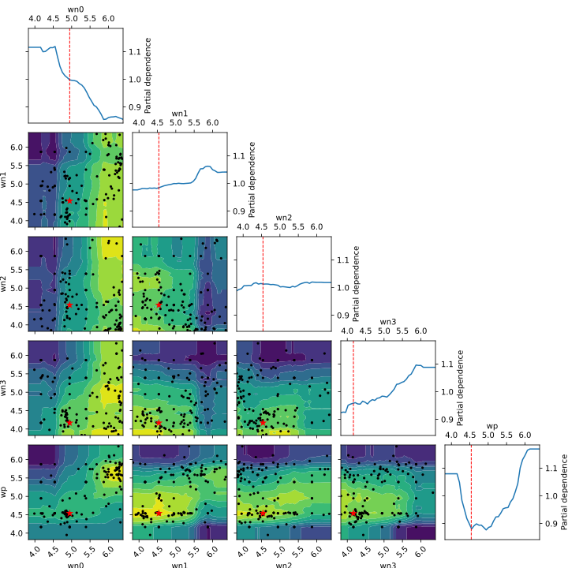


<h4 align="center">forest_minimize-ET-grid-EI</h4>

```
optimizer     forest_minimize
estimator                  ET
generator                grid
acquisitor                 EI
wn0                  0.000015
wn1                  0.000029
wn2                  0.000045
wn3                  0.000072
wp                   0.000041
vs0                    1.6602
vs1                  1.652853
vs2                  1.662488
vs3                  1.659937
cost                 0.021502
time_stamp      010911-211103
```

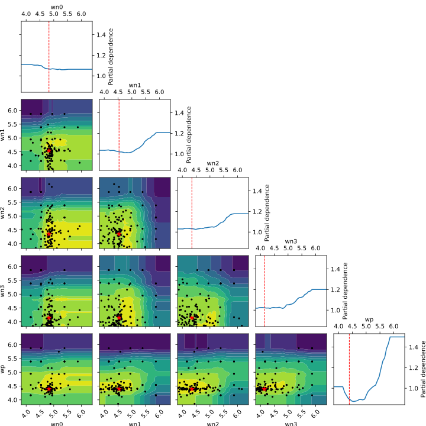


<h4 align="center">forest_minimize-ET-grid-PI</h4>

```
optimizer     forest_minimize
estimator                  ET
generator                grid
acquisitor                 PI
wn0                  0.000012
wn1                  0.000026
wn2                  0.000044
wn3                  0.000043
wp                   0.000032
vs0                  1.649283
vs1                  1.623721
vs2                  1.621212
vs3                  1.663603
cost                 0.042052
time_stamp      011716-211103
```

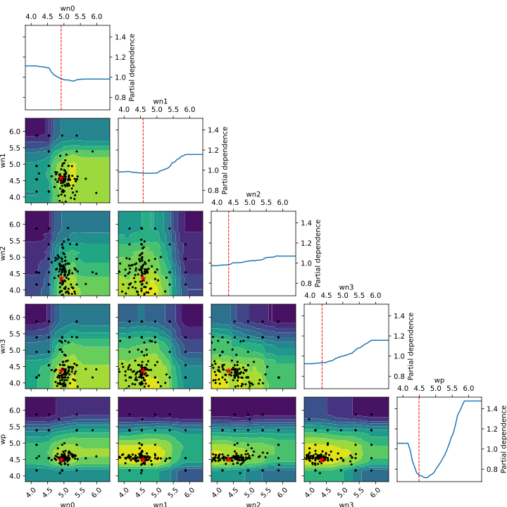


<h4 align="center">forest_minimize-ET-grid-gp_hedge</h4>

```
optimizer     forest_minimize
estimator                  ET
generator                grid
acquisitor           gp_hedge
wn0                  0.000019
wn1                  0.000031
wn2                  0.000056
wn3                  0.000105
wp                   0.000048
vs0                  1.631462
vs1                  1.657785
vs2                  1.650943
vs3                  1.635056
cost                 0.025582
time_stamp      012520-211103
```

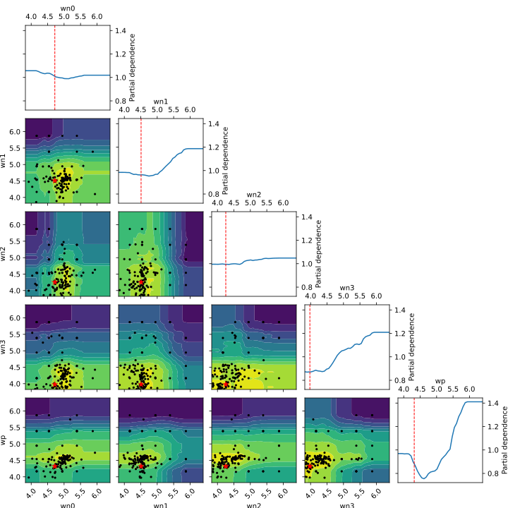


<h4 align="center">forest_minimize-GBRT-random-LCB</h4>

```
optimizer     forest_minimize
estimator                GBRT
generator              random
acquisitor                LCB
wn0                       0.0
wn1                  0.000009
wn2                  0.000005
wn3                  0.000103
wp                   0.000003
vs0                  1.893733
vs1                  1.677592
vs2                  1.719704
vs3                  1.644474
cost                 0.210033
time_stamp      013526-211103
```

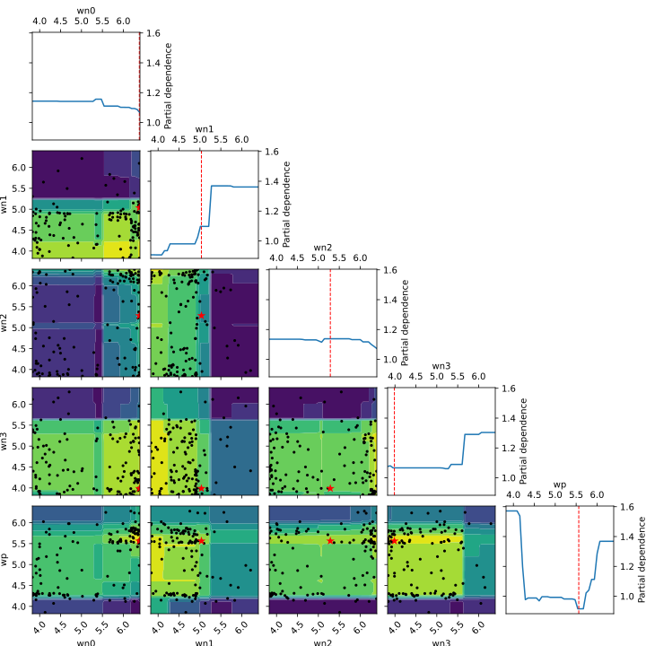


<h4 align="center">forest_minimize-GBRT-random-EI</h4>

```
optimizer     forest_minimize
estimator                GBRT
generator              random
acquisitor                 EI
wn0                  0.000001
wn1                  0.000022
wn2                  0.000074
wn3                  0.000009
wp                   0.000004
vs0                  1.882772
vs1                  1.640654
vs2                    1.6149
vs3                  1.692458
cost                 0.193743
time_stamp      013624-211103
```

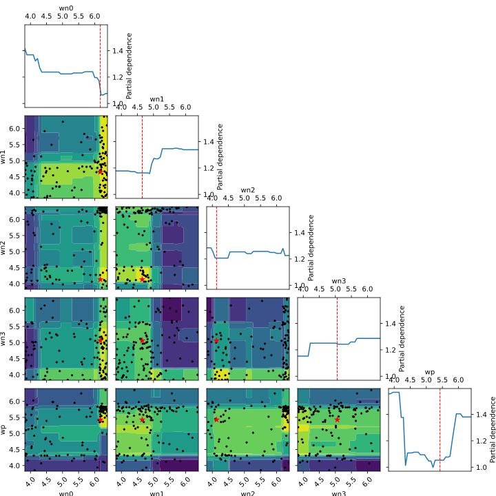


<h4 align="center">forest_minimize-GBRT-random-PI</h4>

```
optimizer     forest_minimize
estimator                GBRT
generator              random
acquisitor                 PI
wn0                       0.0
wn1                  0.000011
wn2                  0.000014
wn3                  0.000006
wp                   0.000003
vs0                  1.876032
vs1                  1.646285
vs2                  1.648598
vs3                  1.698965
cost                 0.169766
time_stamp      013733-211103
```

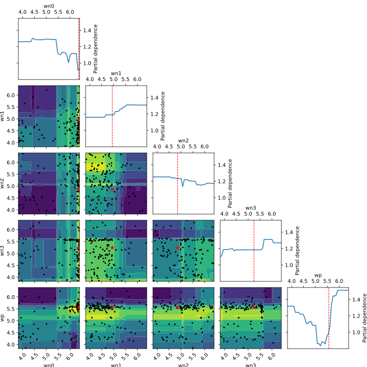


<h4 align="center">forest_minimize-GBRT-random-gp_hedge</h4>

```
optimizer     forest_minimize
estimator                GBRT
generator              random
acquisitor           gp_hedge
wn0                  0.000135
wn1                  0.000019
wn2                  0.000054
wn3                  0.000106
wp                   0.000058
vs0                  1.160184
vs1                  1.718863
vs2                  1.654058
vs3                   1.63537
cost                 0.349919
time_stamp      013837-211103
```

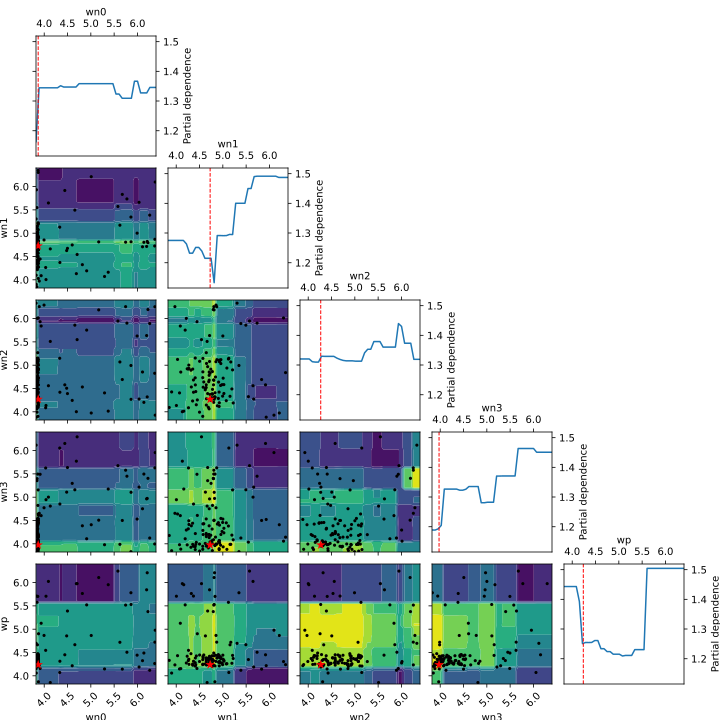


<h4 align="center">forest_minimize-GBRT-sobol-LCB</h4>

```
optimizer     forest_minimize
estimator                GBRT
generator               sobol
acquisitor                LCB
wn0                  0.000018
wn1                  0.000016
wn2                  0.000025
wn3                  0.000069
wp                   0.000037
vs0                  1.564201
vs1                  1.715712
vs2                  1.734948
vs3                  1.691441
cost                 0.168424
time_stamp      013943-211103
```

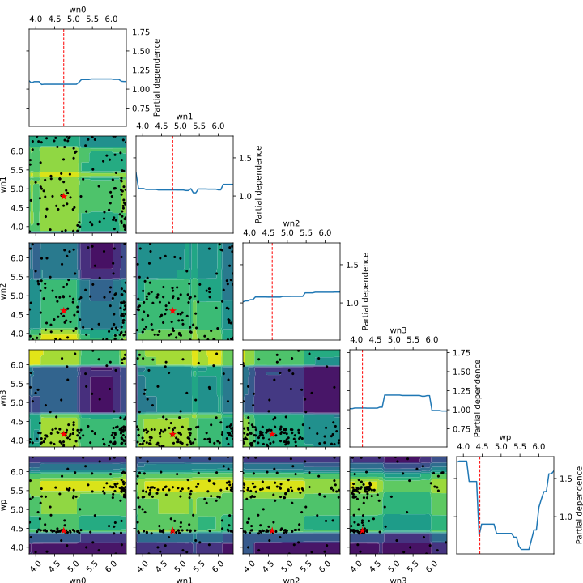


<h4 align="center">forest_minimize-GBRT-sobol-EI</h4>

```
optimizer     forest_minimize
estimator                GBRT
generator               sobol
acquisitor                 EI
wn0                       0.0
wn1                   0.00002
wn2                  0.000072
wn3                  0.000077
wp                   0.000003
vs0                  1.906891
vs1                  1.666983
vs2                  1.642136
vs3                  1.642424
cost                 0.175342
time_stamp      014046-211103
```

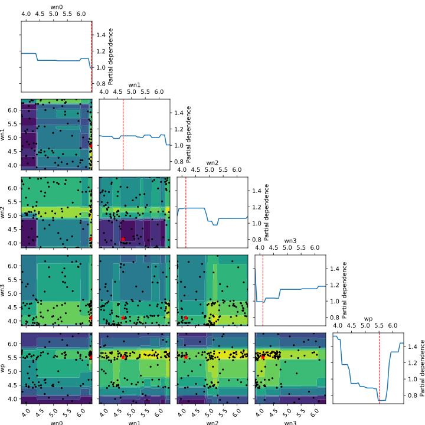


<h4 align="center">forest_minimize-GBRT-sobol-PI</h4>

```
optimizer     forest_minimize
estimator                GBRT
generator               sobol
acquisitor                 PI
wn0                  0.000015
wn1                  0.000029
wn2                  0.000045
wn3                  0.000072
wp                   0.000041
vs0                    1.6602
vs1                  1.652853
vs2                  1.662488
vs3                  1.659937
cost                 0.021502
time_stamp      014203-211103
```

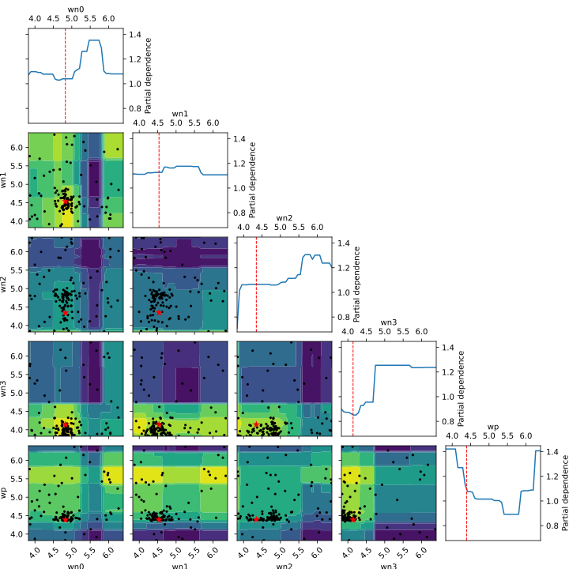


<h4 align="center">forest_minimize-GBRT-sobol-gp_hedge</h4>

```
optimizer     forest_minimize
estimator                GBRT
generator               sobol
acquisitor           gp_hedge
wn0                  0.000013
wn1                  0.000031
wn2                  0.000022
wn3                  0.000115
wp                   0.000036
vs0                  1.670652
vs1                    1.6289
vs2                  1.739087
vs3                  1.651085
cost                 0.079954
time_stamp      014304-211103
```

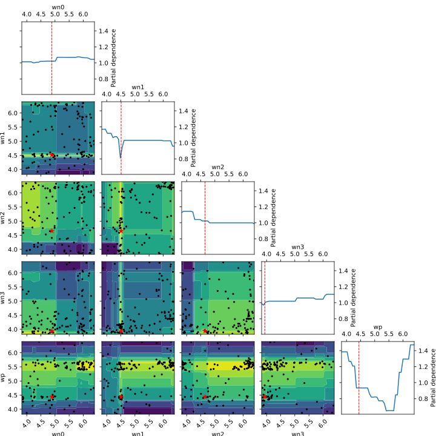


<h4 align="center">forest_minimize-GBRT-halton-LCB</h4>

```
optimizer     forest_minimize
estimator                GBRT
generator              halton
acquisitor                LCB
wn0                       0.0
wn1                  0.000004
wn2                  0.000012
wn3                  0.000021
wp                   0.000002
vs0                   1.83977
vs1                  1.667644
vs2                  1.626964
vs3                   1.61448
cost                 0.161194
time_stamp      014423-211103
```

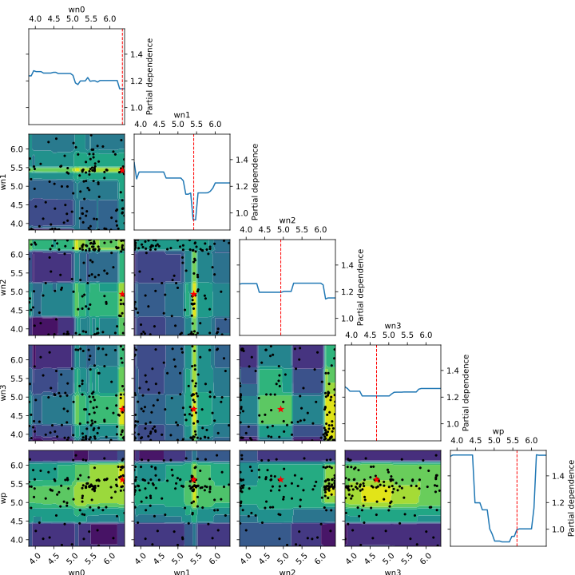


<h4 align="center">forest_minimize-GBRT-halton-EI</h4>

```
optimizer     forest_minimize
estimator                GBRT
generator              halton
acquisitor                 EI
wn0                       0.0
wn1                  0.000003
wn2                  0.000002
wn3                  0.000006
wp                   0.000002
vs0                  1.788006
vs1                  1.620096
vs2                   1.71157
vs3                  1.655148
cost                 0.142199
time_stamp      014524-211103
```

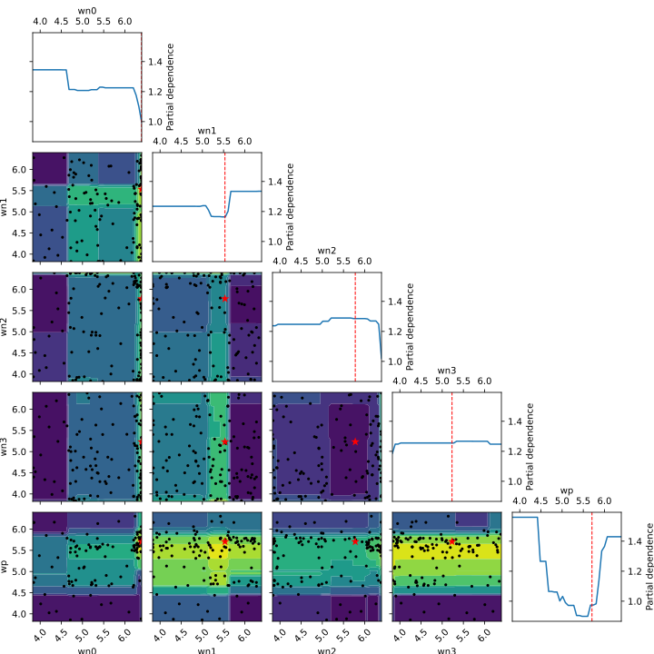


<h4 align="center">forest_minimize-GBRT-halton-PI</h4>

```
optimizer     forest_minimize
estimator                GBRT
generator              halton
acquisitor                 PI
wn0                       0.0
wn1                  0.000004
wn2                  0.000005
wn3                  0.000009
wp                   0.000002
vs0                  1.840418
vs1                  1.662093
vs2                  1.671056
vs3                  1.660173
cost                 0.141661
time_stamp      014642-211103
```

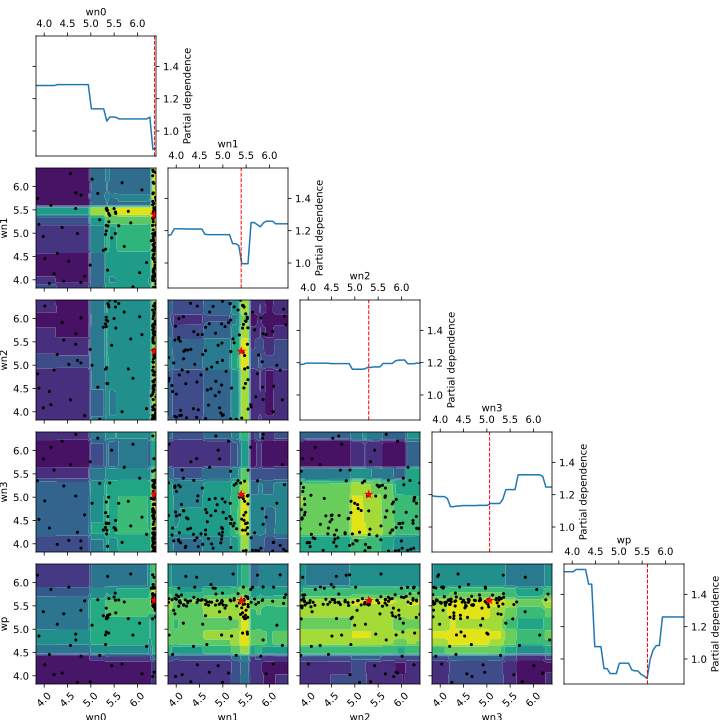


<h4 align="center">forest_minimize-GBRT-halton-gp_hedge</h4>

```
optimizer     forest_minimize
estimator                GBRT
generator              halton
acquisitor           gp_hedge
wn0                  0.000007
wn1                  0.000011
wn2                  0.000024
wn3                  0.000089
wp                   0.000021
vs0                  1.708445
vs1                  1.722029
vs2                   1.69987
vs3                  1.646523
cost                 0.111406
time_stamp      014758-211103
```


<h4 align="center">forest_minimize-GBRT-hammersly-LCB</h4>

```
optimizer     forest_minimize
estimator                GBRT
generator           hammersly
acquisitor                LCB
wn0                   0.00002
wn1                  0.000056
wn2                  0.000145
wn3                  0.000058
wp                   0.000054
vs0                  1.643292
vs1                    1.5787
vs2                  1.530724
vs3                  1.652036
cost                   0.1208
time_stamp      014938-211103
```

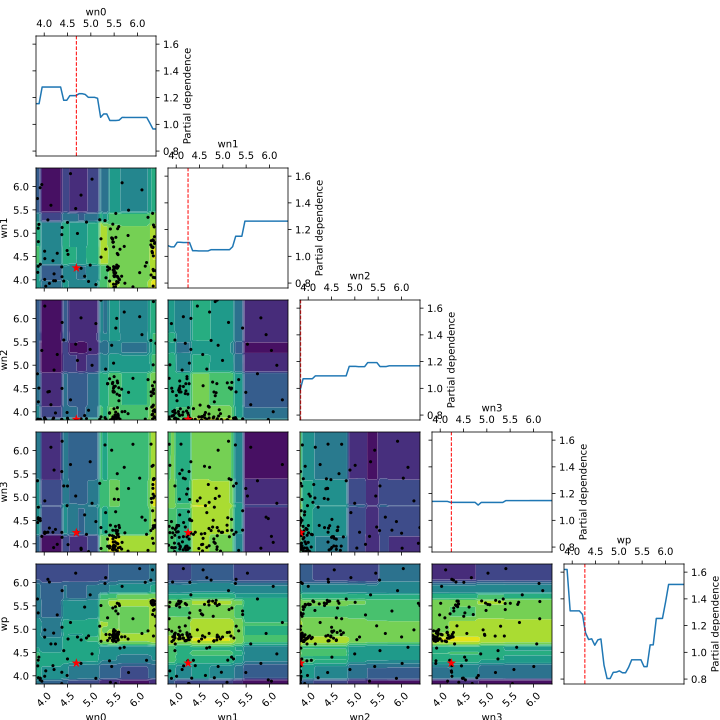


<h4 align="center">forest_minimize-GBRT-hammersly-EI</h4>

```
optimizer     forest_minimize
estimator                GBRT
generator           hammersly
acquisitor                 EI
wn0                  0.000004
wn1                   0.00001
wn2                  0.000031
wn3                    0.0001
wp                   0.000014
vs0                  1.719672
vs1                  1.685683
vs2                  1.625267
vs3                  1.583473
cost                 0.119161
time_stamp      015043-211103
```

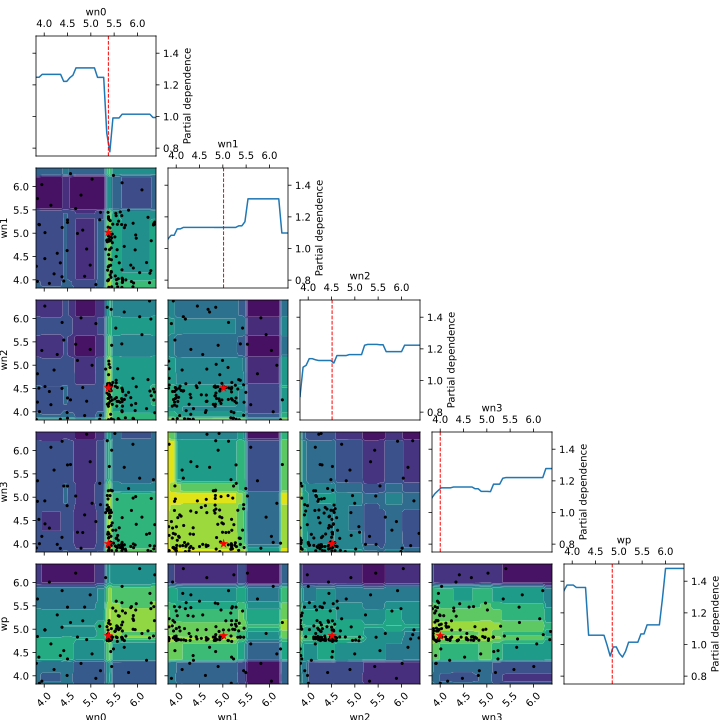


<h4 align="center">forest_minimize-GBRT-hammersly-PI</h4>

```
optimizer     forest_minimize
estimator                GBRT
generator           hammersly
acquisitor                 PI
wn0                  0.000006
wn1                  0.000005
wn2                  0.000019
wn3                  0.000043
wp                   0.000015
vs0                  1.647206
vs1                  1.777742
vs2                  1.702119
vs3                  1.677029
cost                 0.127081
time_stamp      015144-211103
```

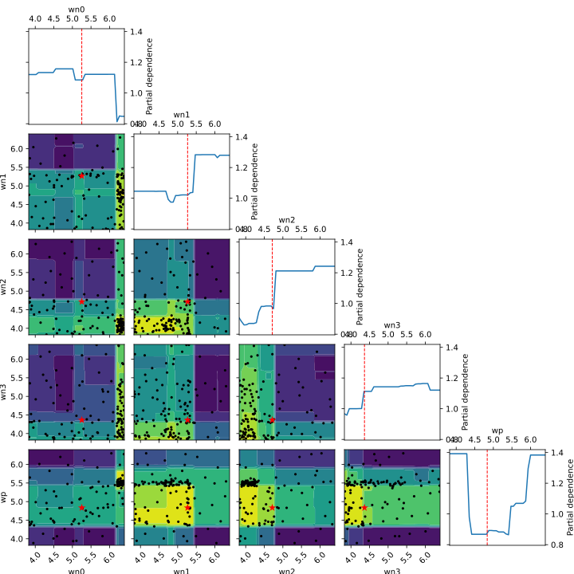


<h4 align="center">forest_minimize-GBRT-hammersly-gp_hedge</h4>

```
optimizer     forest_minimize
estimator                GBRT
generator           hammersly
acquisitor           gp_hedge
wn0                  0.000001
wn1                  0.000015
wn2                  0.000027
wn3                   0.00005
wp                   0.000004
vs0                  1.873573
vs1                   1.65005
vs2                  1.638334
vs3                  1.627146
cost                 0.156451
time_stamp      015305-211103
```

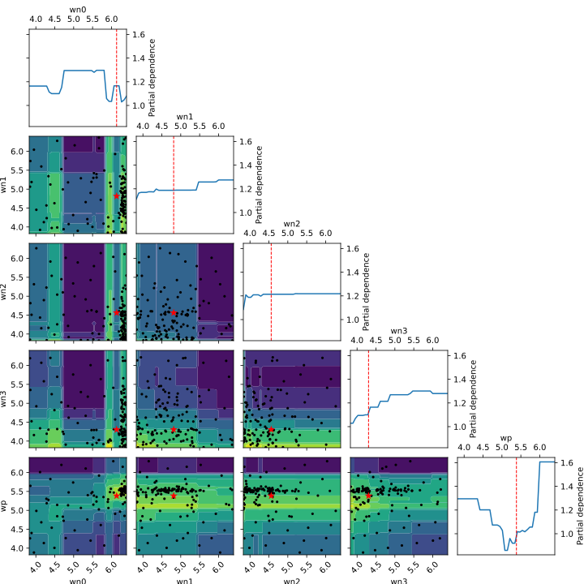


<h4 align="center">forest_minimize-GBRT-lhs-LCB</h4>

```
optimizer     forest_minimize
estimator                GBRT
generator                 lhs
acquisitor                LCB
wn0                       0.0
wn1                  0.000137
wn2                   0.00001
wn3                  0.000002
wp                   0.000003
vs0                  1.865529
vs1                  1.562675
vs2                  1.639219
vs3                  1.764066
cost                 0.259213
time_stamp      015428-211103
```

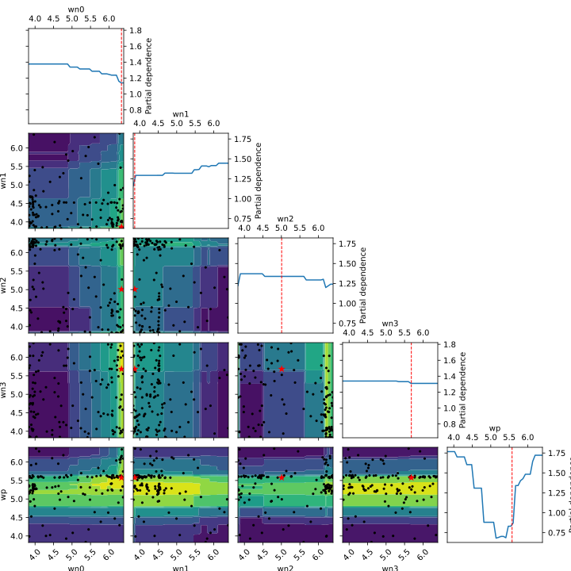


<h4 align="center">forest_minimize-GBRT-lhs-EI</h4>

```
optimizer     forest_minimize
estimator                GBRT
generator                 lhs
acquisitor                 EI
wn0                  0.000135
wn1                  0.000124
wn2                  0.000126
wn3                  0.000001
wp                   0.000009
vs0                  1.671372
vs1                  1.671463
vs2                  1.671465
vs3                  2.024777
cost                 0.266107
time_stamp      015548-211103
```

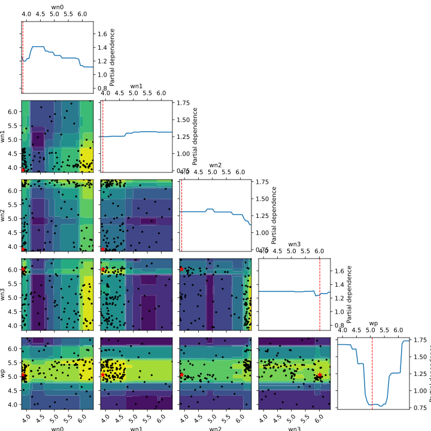


<h4 align="center">forest_minimize-GBRT-lhs-PI</h4>

```
optimizer     forest_minimize
estimator                GBRT
generator                 lhs
acquisitor                 PI
wn0                  0.000001
wn1                  0.000038
wn2                   0.00003
wn3                  0.000044
wp                   0.000005
vs0                  1.878081
vs1                  1.627985
vs2                   1.64217
vs3                  1.636893
cost                 0.164263
time_stamp      015645-211103
```

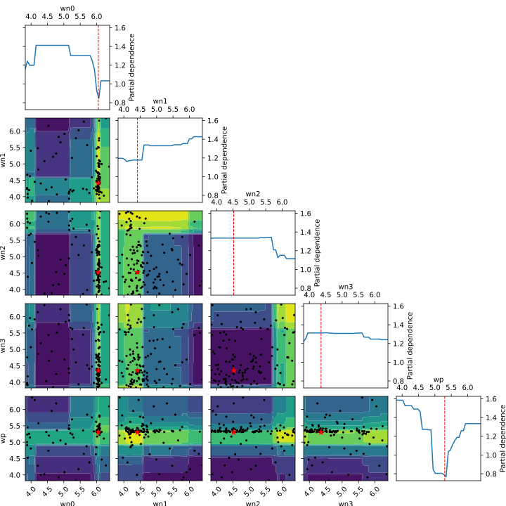


<h4 align="center">forest_minimize-GBRT-lhs-gp_hedge</h4>

```
optimizer     forest_minimize
estimator                GBRT
generator                 lhs
acquisitor           gp_hedge
wn0                       0.0
wn1                  0.000009
wn2                  0.000011
wn3                   0.00004
wp                   0.000003
vs0                  1.876139
vs1                  1.654991
vs2                  1.656818
vs3                  1.626914
cost                 0.158203
time_stamp      015814-211103
```

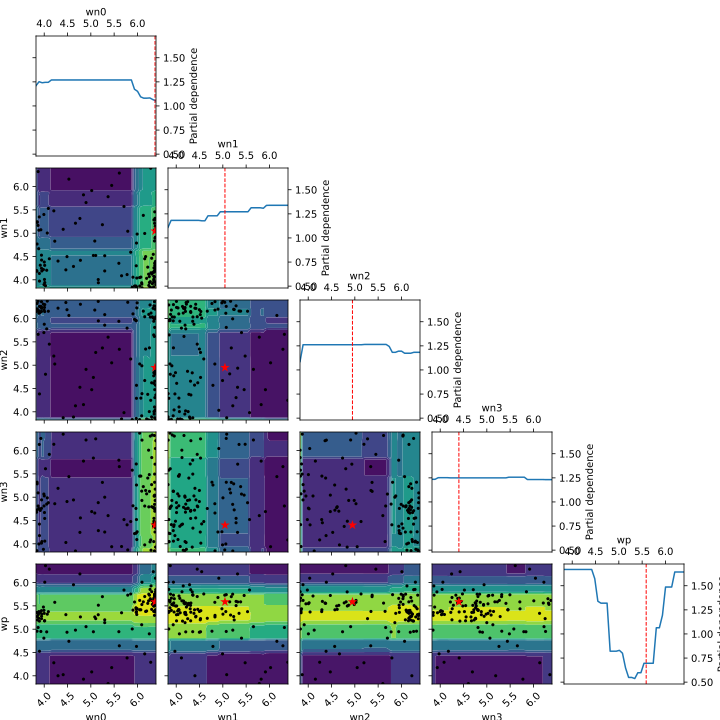


<h4 align="center">forest_minimize-GBRT-grid-LCB</h4>

```
optimizer     forest_minimize
estimator                GBRT
generator                grid
acquisitor                LCB
wn0                  0.000009
wn1                  0.000021
wn2                  0.000021
wn3                   0.00005
wp                   0.000025
vs0                    1.6722
vs1                  1.627583
vs2                  1.693507
vs3                   1.65807
cost                   0.0583
time_stamp      015947-211103
```


<h4 align="center">forest_minimize-GBRT-grid-EI</h4>

```
optimizer     forest_minimize
estimator                GBRT
generator                grid
acquisitor                 EI
wn0                  0.000007
wn1                  0.000018
wn2                  0.000037
wn3                  0.000052
wp                   0.000022
vs0                  1.726123
vs1                   1.66817
vs2                  1.642903
vs3                  1.646694
cost                 0.063452
time_stamp      020127-211103
```

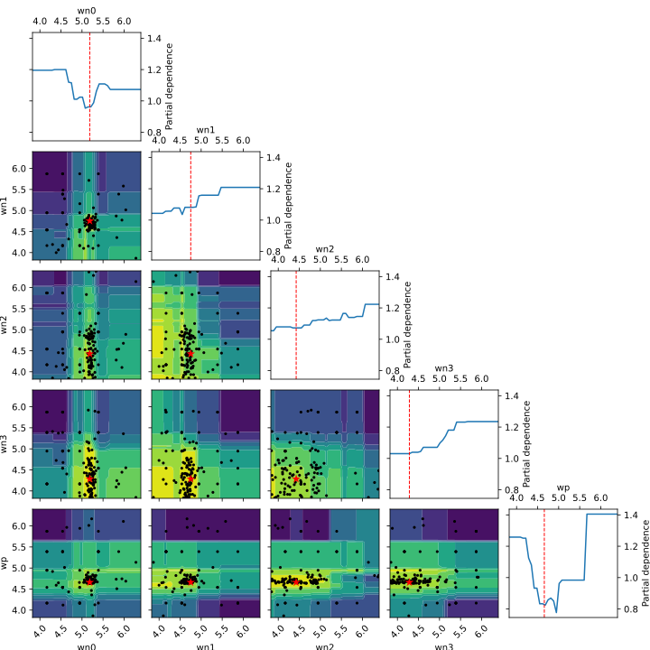


<h4 align="center">forest_minimize-GBRT-grid-PI</h4>

```
optimizer     forest_minimize
estimator                GBRT
generator                grid
acquisitor                 PI
wn0                  0.000012
wn1                  0.000026
wn2                  0.000044
wn3                  0.000043
wp                   0.000032
vs0                  1.649283
vs1                  1.623721
vs2                  1.621212
vs3                  1.663603
cost                 0.042052
time_stamp      020243-211103
```


<h4 align="center">forest_minimize-GBRT-grid-gp_hedge</h4>

```
optimizer     forest_minimize
estimator                GBRT
generator                grid
acquisitor           gp_hedge
wn0                  0.000009
wn1                  0.000018
wn2                  0.000028
wn3                   0.00008
wp                   0.000027
vs0                  1.677332
vs1                  1.669319
vs2                  1.679007
vs3                  1.635128
cost                 0.054867
time_stamp      020407-211103
```

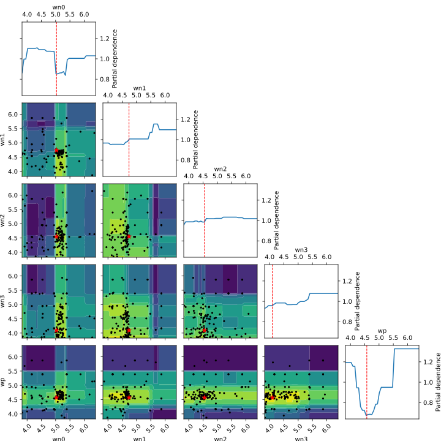


<h4 align="center">gbrt_minimize-GP-random-LCB</h4>

```
optimizer     gbrt_minimize
estimator                GP
generator            random
acquisitor              LCB
wn0                0.000008
wn1                0.000021
wn2                0.000019
wn3                0.000062
wp                 0.000024
vs0                1.670866
vs1                1.622723
vs2                1.692429
vs3                1.637521
cost               0.062455
time_stamp    020508-211103
```

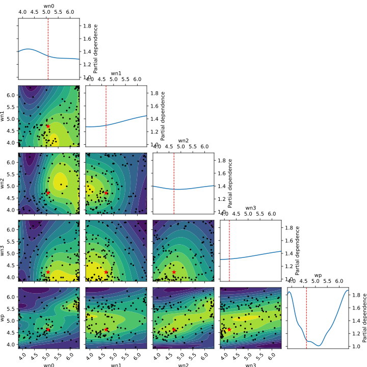


<h4 align="center">gbrt_minimize-GP-random-EI</h4>

```
optimizer     gbrt_minimize
estimator                GP
generator            random
acquisitor               EI
wn0                0.000001
wn1                0.000001
wn2                0.000003
wn3                0.000002
wp                 0.000002
vs0                1.658643
vs1                1.654954
vs2                1.587793
vs3                 1.65238
cost               0.047384
time_stamp    020648-211103
```

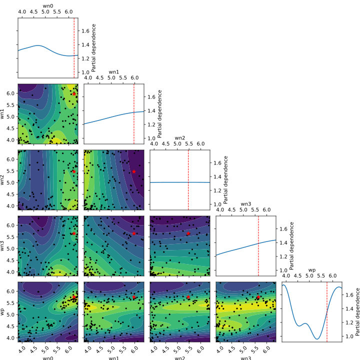


<h4 align="center">gbrt_minimize-GP-random-PI</h4>

```
optimizer     gbrt_minimize
estimator                GP
generator            random
acquisitor               PI
wn0                0.000003
wn1                0.000006
wn2                0.000013
wn3                0.000022
wp                 0.000008
vs0                1.685658
vs1                1.662379
vs2                1.630455
vs3                1.621537
cost               0.058209
time_stamp    020817-211103
```

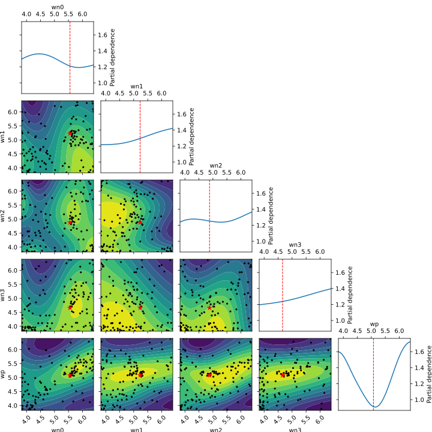


<h4 align="center">gbrt_minimize-GP-random-gp_hedge</h4>

```
optimizer     gbrt_minimize
estimator                GP
generator            random
acquisitor         gp_hedge
wn0                0.000016
wn1                0.000028
wn2                0.000045
wn3                0.000148
wp                 0.000041
vs0                1.638411
vs1                1.650809
vs2                 1.65688
vs3                1.601413
cost                0.04113
time_stamp    020950-211103
```

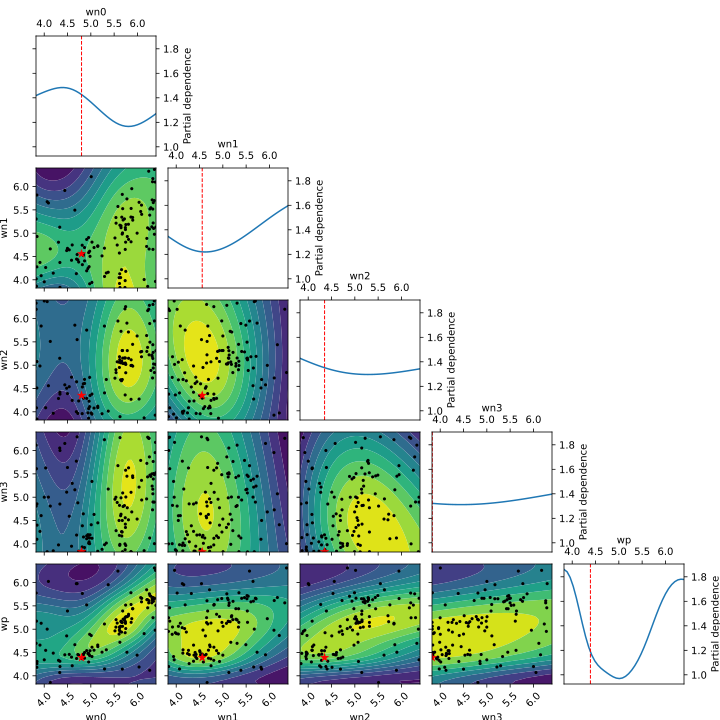


<h4 align="center">gbrt_minimize-GP-sobol-LCB</h4>

```
optimizer     gbrt_minimize
estimator                GP
generator             sobol
acquisitor              LCB
wn0                0.000012
wn1                0.000023
wn2                0.000053
wn3                0.000079
wp                 0.000034
vs0                1.667342
vs1                1.659345
vs2                1.627269
vs3                1.626708
cost               0.044066
time_stamp    021129-211103
```

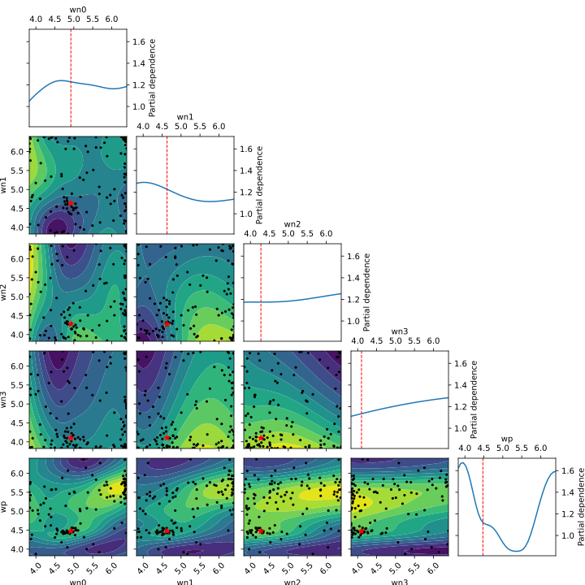


<h4 align="center">gbrt_minimize-GP-sobol-EI</h4>

```
optimizer     gbrt_minimize
estimator                GP
generator             sobol
acquisitor               EI
wn0                     0.0
wn1                0.000001
wn2                0.000002
wn3                0.000004
wp                 0.000001
vs0                 1.70272
vs1                1.648216
vs2                1.651528
vs3                1.615442
cost               0.054903
time_stamp    021247-211103
```

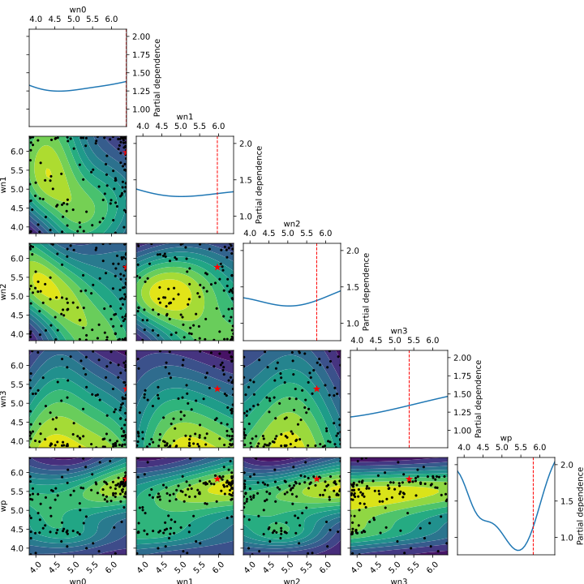


<h4 align="center">gbrt_minimize-GP-sobol-PI</h4>

```
optimizer     gbrt_minimize
estimator                GP
generator             sobol
acquisitor               PI
wn0                0.000015
wn1                 0.00002
wn2                0.000055
wn3                0.000144
wp                 0.000039
vs0                1.643688
vs1                1.710294
vs2                1.659062
vs3                1.622548
cost               0.062497
time_stamp    021436-211103
```

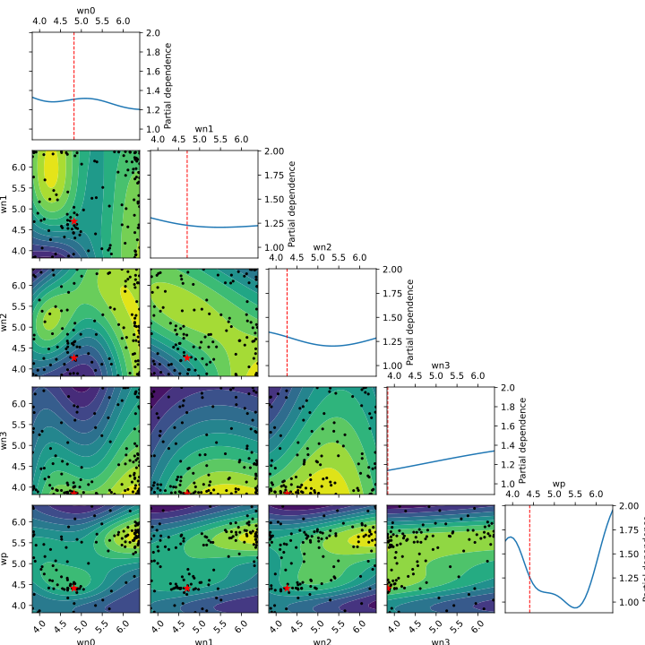


<h4 align="center">gbrt_minimize-GP-sobol-gp_hedge</h4>

```
optimizer     gbrt_minimize
estimator                GP
generator             sobol
acquisitor         gp_hedge
wn0                0.000019
wn1                0.000031
wn2                0.000056
wn3                0.000105
wp                 0.000048
vs0                1.631462
vs1                1.657785
vs2                1.650943
vs3                1.635056
cost               0.025582
time_stamp    021614-211103
```

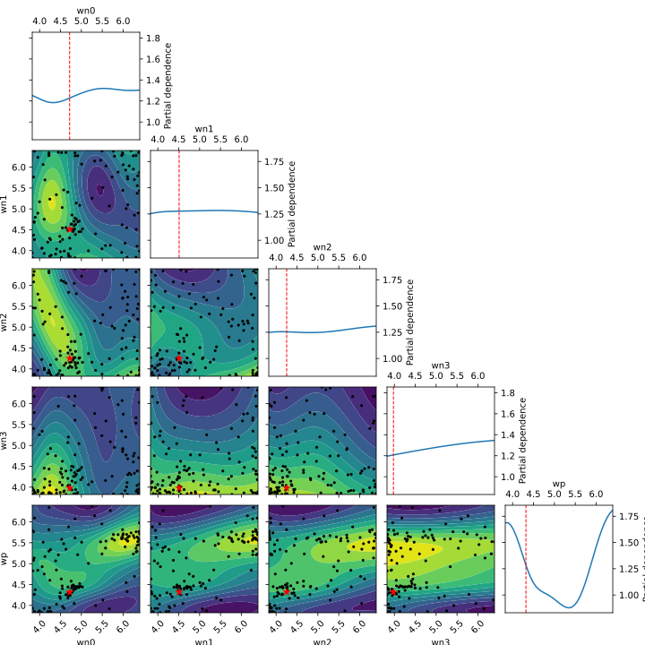


<h4 align="center">gbrt_minimize-GP-halton-LCB</h4>

```
optimizer     gbrt_minimize
estimator                GP
generator            halton
acquisitor              LCB
wn0                 0.00001
wn1                0.000059
wn2                0.000063
wn3                0.000143
wp                 0.000039
vs0                1.786997
vs1                1.634795
vs2                1.661943
vs3                1.636242
cost                0.10782
time_stamp    021811-211103
```

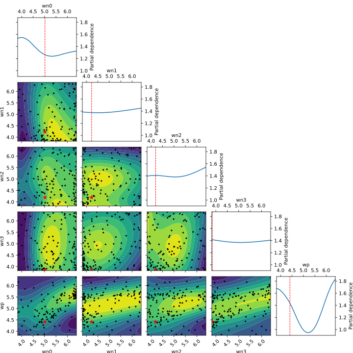


<h4 align="center">gbrt_minimize-GP-halton-EI</h4>

```
optimizer     gbrt_minimize
estimator                GP
generator            halton
acquisitor               EI
wn0                0.000053
wn1                0.000129
wn2                0.000142
wn3                0.000142
wp                 0.000143
vs0                1.657455
vs1                1.613379
vs2                1.661578
vs3                 1.70987
cost               0.070015
time_stamp    021935-211103
```

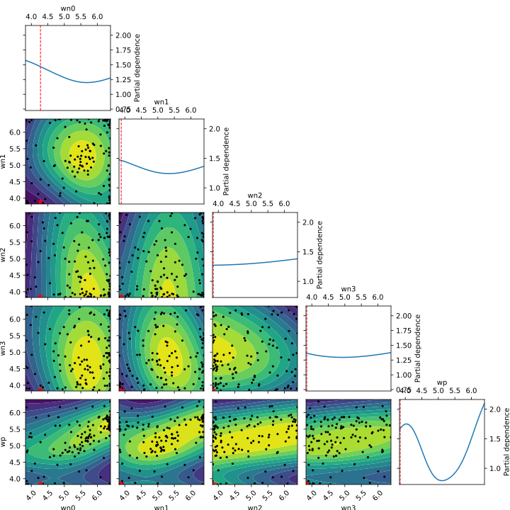


<h4 align="center">gbrt_minimize-GP-halton-PI</h4>

```
optimizer     gbrt_minimize
estimator                GP
generator            halton
acquisitor               PI
wn0                0.000003
wn1                0.000005
wn2                0.000008
wn3                 0.00002
wp                 0.000009
vs0                1.651611
vs1                1.669799
vs2                1.679718
vs3                1.646288
cost               0.033236
time_stamp    022048-211103
```

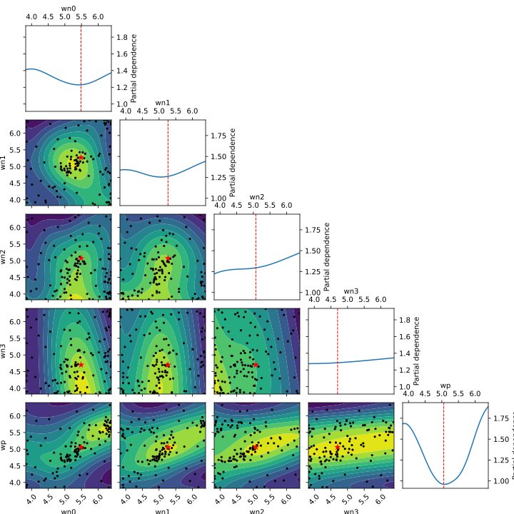


<h4 align="center">gbrt_minimize-GP-halton-gp_hedge</h4>

```
optimizer     gbrt_minimize
estimator                GP
generator            halton
acquisitor         gp_hedge
wn0                0.000006
wn1                0.000008
wn2                0.000012
wn3                 0.00003
wp                 0.000013
vs0                1.605458
vs1                 1.65081
vs2                1.677326
vs3                1.634957
cost               0.053164
time_stamp    022208-211103
```

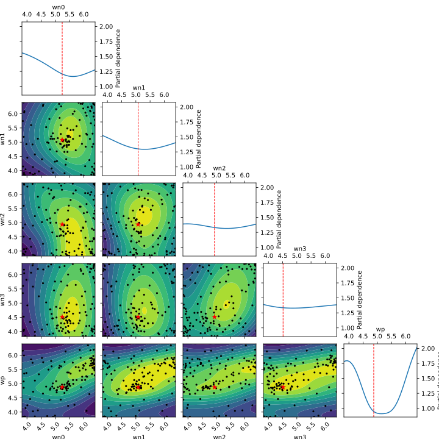


<h4 align="center">gbrt_minimize-GP-hammersly-LCB</h4>

```
optimizer     gbrt_minimize
estimator                GP
generator         hammersly
acquisitor              LCB
wn0                0.000013
wn1                0.000029
wn2                0.000047
wn3                0.000113
wp                 0.000038
vs0                1.681416
vs1                1.655008
vs2                1.656206
vs3                1.623584
cost               0.041846
time_stamp    022417-211103
```

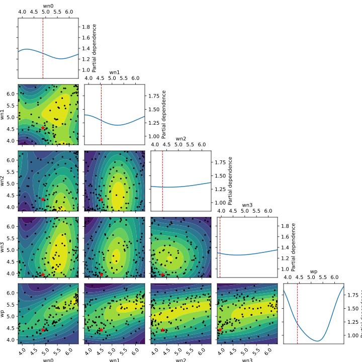


<h4 align="center">gbrt_minimize-GP-hammersly-EI</h4>

```
optimizer     gbrt_minimize
estimator                GP
generator         hammersly
acquisitor               EI
wn0                0.000011
wn1                0.000015
wn2                0.000148
wn3                0.000093
wp                 0.000033
vs0                1.690632
vs1                1.750339
vs2                1.612066
vs3                1.650334
cost               0.108629
time_stamp    022555-211103
```

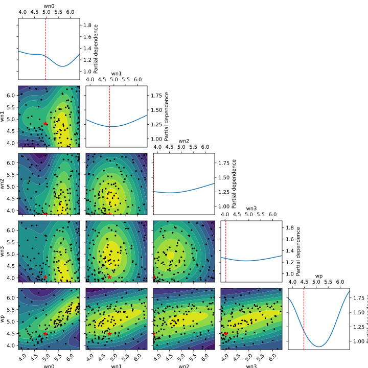


<h4 align="center">gbrt_minimize-GP-hammersly-PI</h4>

```
optimizer     gbrt_minimize
estimator                GP
generator         hammersly
acquisitor               PI
wn0                0.000005
wn1                0.000016
wn2                0.000016
wn3                0.000023
wp                 0.000015
vs0                1.669493
vs1                1.593141
vs2                1.650403
vs3                1.656698
cost               0.050578
time_stamp    022723-211103
```


<h4 align="center">gbrt_minimize-GP-hammersly-gp_hedge</h4>

```
optimizer     gbrt_minimize
estimator                GP
generator         hammersly
acquisitor         gp_hedge
wn0                0.000015
wn1                0.000022
wn2                0.000046
wn3                0.000132
wp                 0.000037
vs0                1.638259
vs1                1.675815
vs2                1.653965
vs3                1.609628
cost               0.049632
time_stamp    022901-211103
```

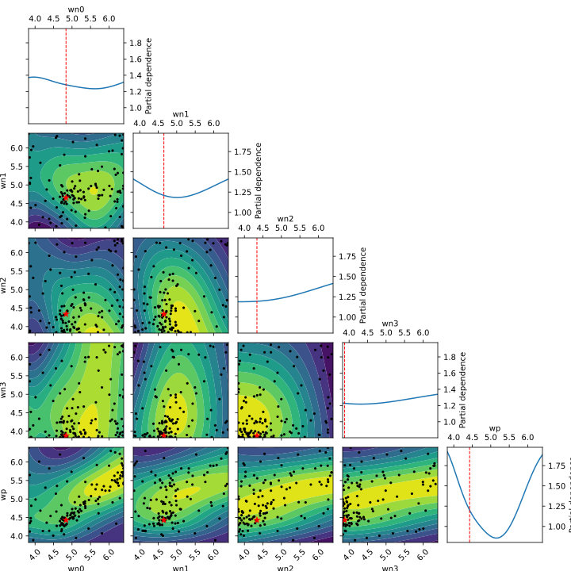


<h4 align="center">gbrt_minimize-GP-lhs-LCB</h4>

```
optimizer     gbrt_minimize
estimator                GP
generator               lhs
acquisitor              LCB
wn0                     0.0
wn1                0.000001
wn2                0.000001
wn3                0.000003
wp                 0.000001
vs0                1.649197
vs1                1.653394
vs2                1.768851
vs3                1.676821
cost               0.090829
time_stamp    023042-211103
```

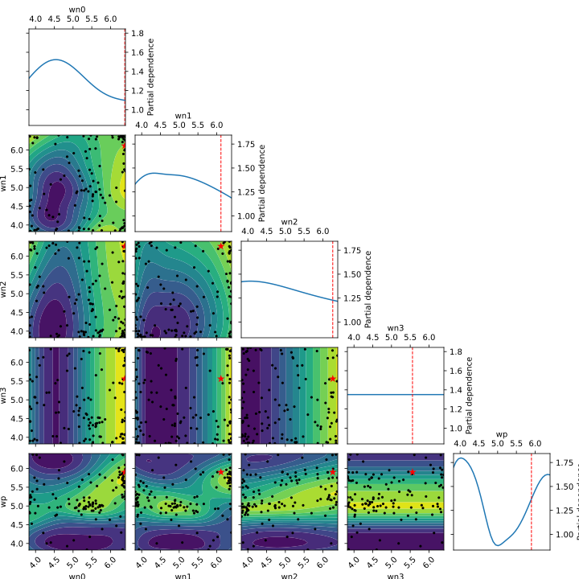


<h4 align="center">gbrt_minimize-GP-lhs-EI</h4>

```
optimizer     gbrt_minimize
estimator                GP
generator               lhs
acquisitor               EI
wn0                     0.0
wn1                0.000001
wn2                0.000001
wn3                0.000122
wp                 0.000001
vs0                1.680379
vs1                1.657436
vs2                 1.68672
vs3                1.517847
cost               0.125265
time_stamp    023202-211103
```

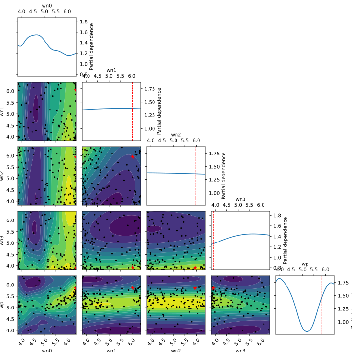


<h4 align="center">gbrt_minimize-GP-lhs-PI</h4>

```
optimizer     gbrt_minimize
estimator                GP
generator               lhs
acquisitor               PI
wn0                0.000005
wn1                0.000013
wn2                0.000023
wn3                0.000032
wp                 0.000017
vs0                1.708802
vs1                1.666611
vs2                1.660994
vs3                1.666737
cost               0.062511
time_stamp    023348-211103
```

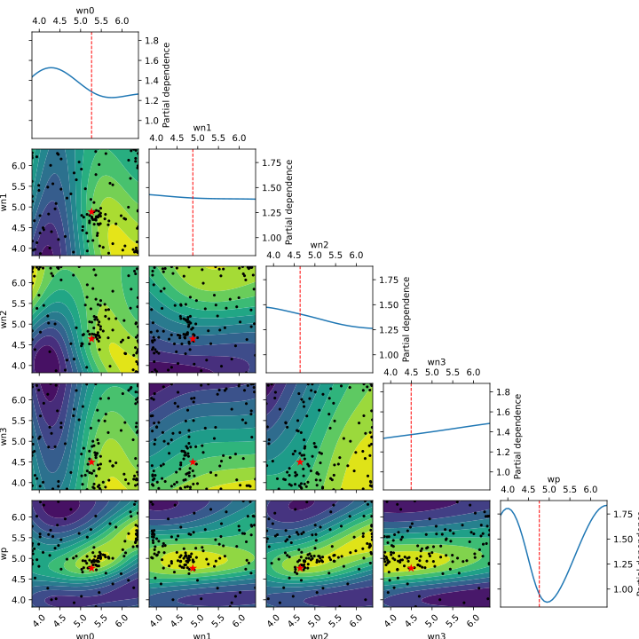


<h4 align="center">gbrt_minimize-GP-lhs-gp_hedge</h4>

```
optimizer     gbrt_minimize
estimator                GP
generator               lhs
acquisitor         gp_hedge
wn0                0.000004
wn1                0.000012
wn2                0.000014
wn3                0.000028
wp                 0.000013
vs0                1.700815
vs1                1.624941
vs2                1.665156
vs3                 1.64201
cost               0.060012
time_stamp    023533-211103
```

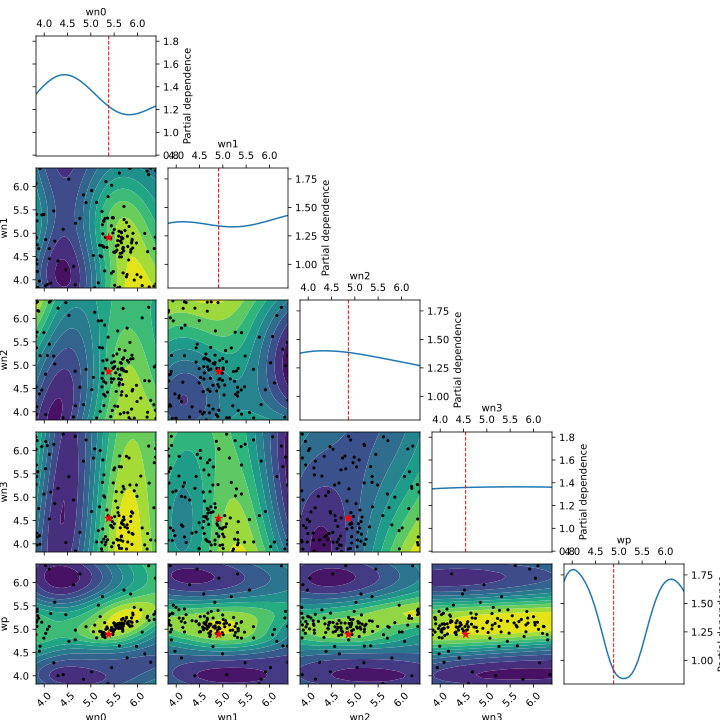


<h4 align="center">gbrt_minimize-GP-grid-LCB</h4>

```
optimizer     gbrt_minimize
estimator                GP
generator              grid
acquisitor              LCB
wn0                0.000012
wn1                0.000026
wn2                0.000044
wn3                0.000043
wp                 0.000032
vs0                1.649283
vs1                1.623721
vs2                1.621212
vs3                1.663603
cost               0.042052
time_stamp    023739-211103
```

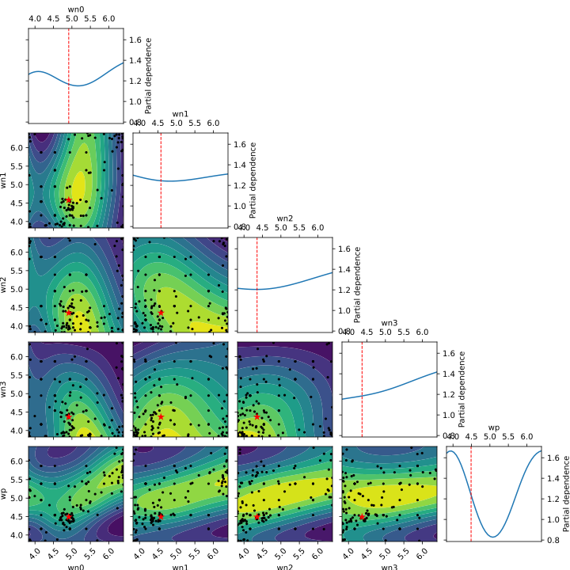


<h4 align="center">gbrt_minimize-GP-grid-EI</h4>

```
optimizer     gbrt_minimize
estimator                GP
generator              grid
acquisitor               EI
wn0                0.000012
wn1                0.000026
wn2                0.000044
wn3                0.000043
wp                 0.000032
vs0                1.649283
vs1                1.623721
vs2                1.621212
vs3                1.663603
cost               0.042052
time_stamp    023919-211103
```

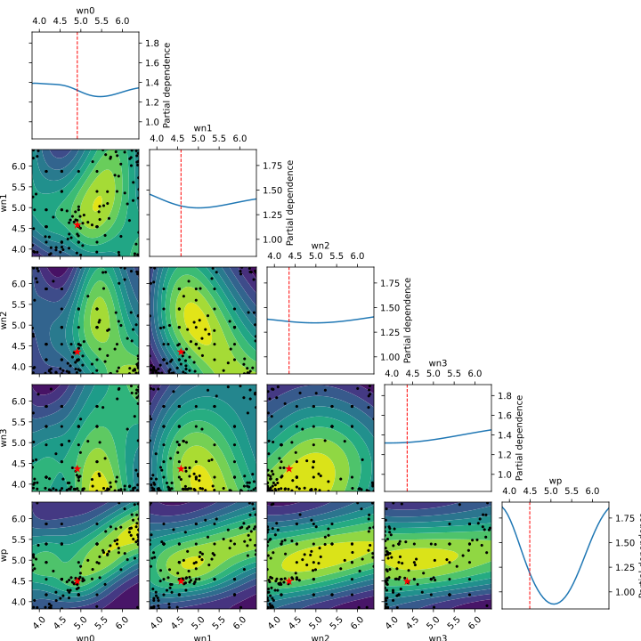


<h4 align="center">gbrt_minimize-GP-grid-PI</h4>

```
optimizer     gbrt_minimize
estimator                GP
generator              grid
acquisitor               PI
wn0                 0.00001
wn1                0.000027
wn2                0.000033
wn3                0.000038
wp                 0.000029
vs0                1.676142
vs1                1.619337
vs2                1.651184
vs3                1.679255
cost               0.052875
time_stamp    024033-211103
```

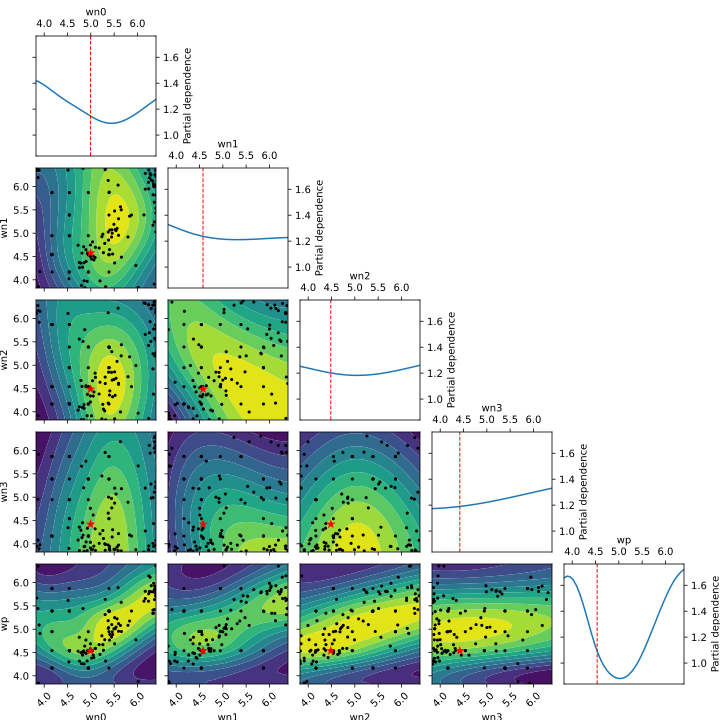


<h4 align="center">gbrt_minimize-GP-grid-gp_hedge</h4>

```
optimizer     gbrt_minimize
estimator                GP
generator              grid
acquisitor         gp_hedge
wn0                 0.00001
wn1                0.000027
wn2                0.000033
wn3                0.000038
wp                 0.000029
vs0                1.676142
vs1                1.619337
vs2                1.651184
vs3                1.679255
cost               0.052875
time_stamp    024151-211103
```

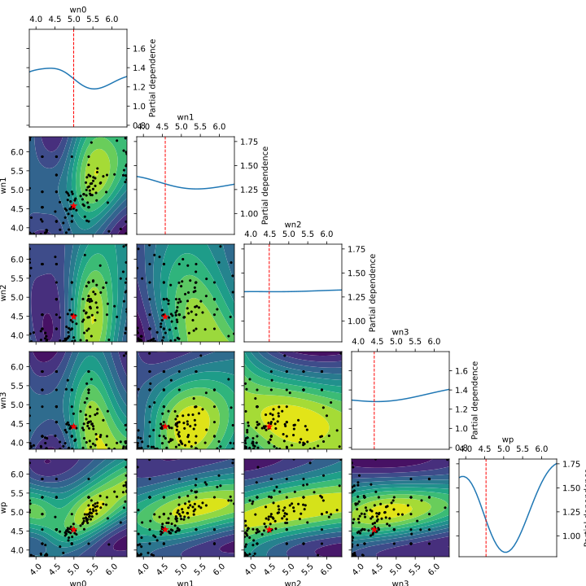


<h4 align="center">gbrt_minimize-RF-random-LCB</h4>

```
optimizer     gbrt_minimize
estimator                RF
generator            random
acquisitor              LCB
wn0                     0.0
wn1                0.000021
wn2                0.000036
wn3                0.000026
wp                 0.000003
vs0                1.903793
vs1                1.660202
vs2                1.651655
vs3                1.662352
cost               0.168486
time_stamp    024412-211103
```

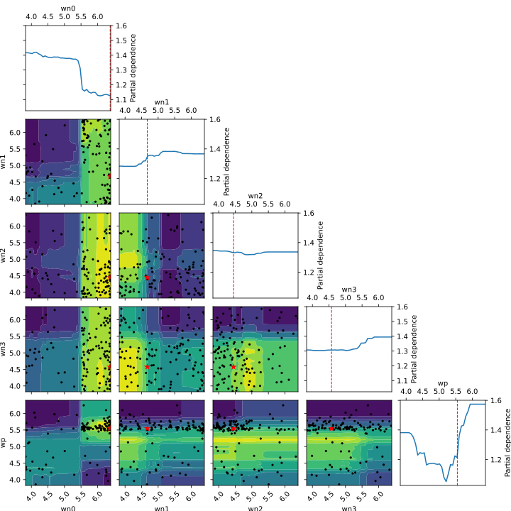


<h4 align="center">gbrt_minimize-RF-random-EI</h4>

```
optimizer     gbrt_minimize
estimator                RF
generator            random
acquisitor               EI
wn0                0.000027
wn1                0.000057
wn2                0.000136
wn3                0.000029
wp                 0.000076
vs0                1.676564
vs1                1.656663
vs2                1.618301
vs3                1.843505
cost               0.156625
time_stamp    024628-211103
```

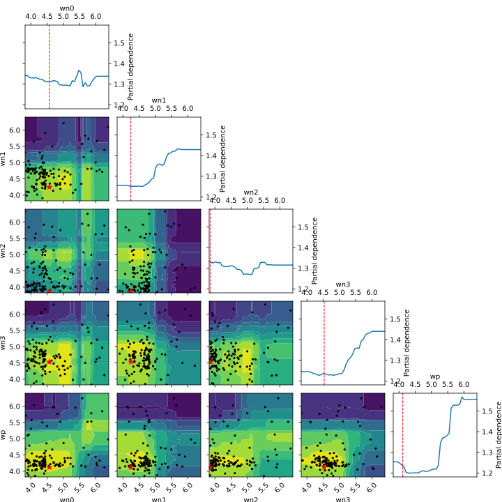


<h4 align="center">gbrt_minimize-RF-random-PI</h4>

```
optimizer     gbrt_minimize
estimator                RF
generator            random
acquisitor               PI
wn0                0.000001
wn1                0.000002
wn2                0.000001
wn3                0.000004
wp                 0.000002
vs0                1.617005
vs1                1.558194
vs2                1.717776
vs3                1.645242
cost               0.119597
time_stamp    024854-211103
```

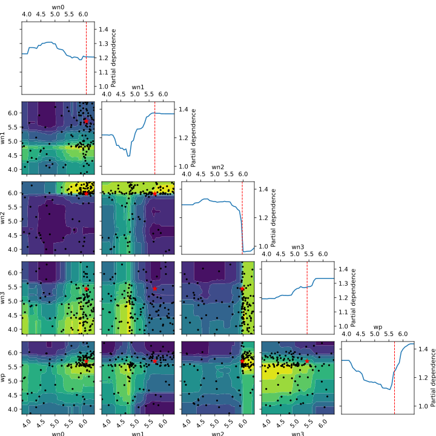


<h4 align="center">gbrt_minimize-RF-random-gp_hedge</h4>

```
optimizer     gbrt_minimize
estimator                RF
generator            random
acquisitor         gp_hedge
wn0                0.000033
wn1                0.000075
wn2                0.000063
wn3                0.000132
wp                 0.000074
vs0                1.595869
vs1                1.555706
vs2                1.646858
vs3                1.621359
cost               0.109217
time_stamp    025131-211103
```

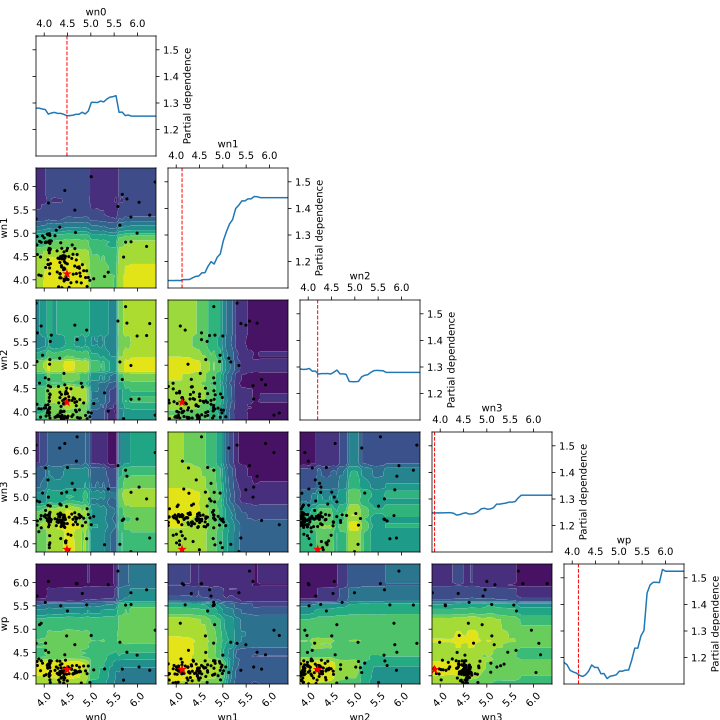


<h4 align="center">gbrt_minimize-RF-sobol-LCB</h4>

```
optimizer     gbrt_minimize
estimator                RF
generator             sobol
acquisitor              LCB
wn0                0.000007
wn1                0.000014
wn2                0.000093
wn3                0.000039
wp                 0.000019
vs0                1.659628
vs1                1.646006
vs2                1.528616
vs3                1.605778
cost               0.108623
time_stamp    025356-211103
```

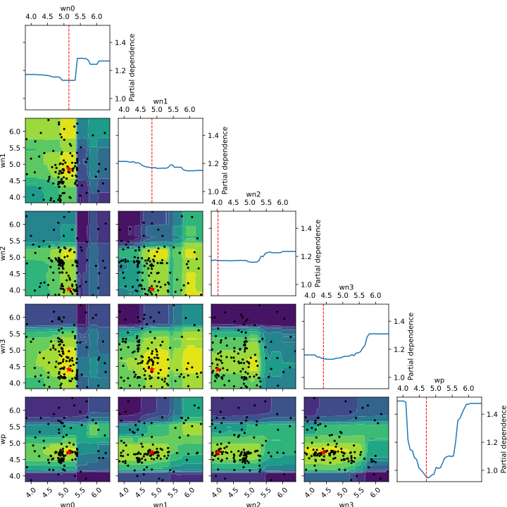


<h4 align="center">gbrt_minimize-RF-sobol-EI</h4>

```
optimizer     gbrt_minimize
estimator                RF
generator             sobol
acquisitor               EI
wn0                0.000011
wn1                 0.00003
wn2                0.000065
wn3                 0.00006
wp                 0.000034
vs0                1.712912
vs1                1.646757
vs2                1.619771
vs3                1.655593
cost               0.061804
time_stamp    025558-211103
```

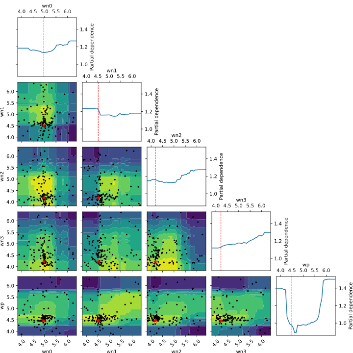


<h4 align="center">gbrt_minimize-RF-sobol-PI</h4>

```
optimizer     gbrt_minimize
estimator                RF
generator             sobol
acquisitor               PI
wn0                0.000013
wn1                0.000029
wn2                0.000047
wn3                0.000113
wp                 0.000038
vs0                1.681416
vs1                1.655008
vs2                1.656206
vs3                1.623584
cost               0.041846
time_stamp    025825-211103
```

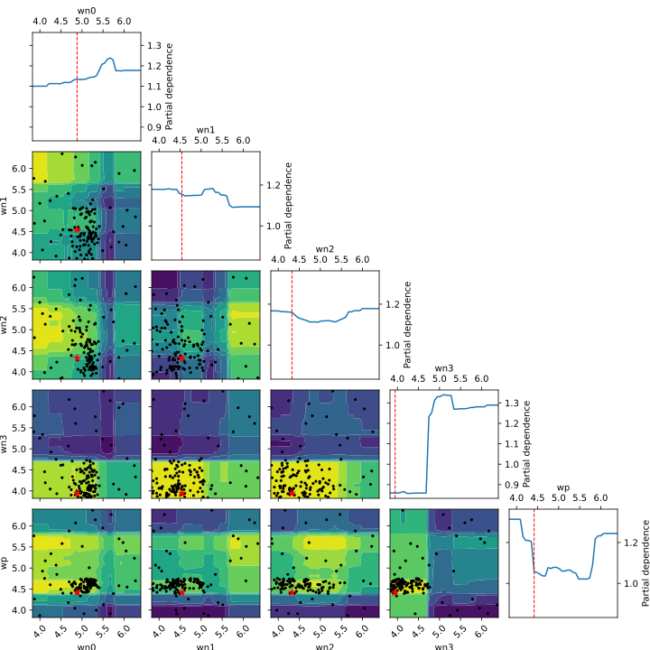


<h4 align="center">gbrt_minimize-RF-sobol-gp_hedge</h4>

```
optimizer     gbrt_minimize
estimator                RF
generator             sobol
acquisitor         gp_hedge
wn0                0.000015
wn1                 0.00002
wn2                0.000055
wn3                0.000144
wp                 0.000039
vs0                1.643688
vs1                1.710294
vs2                1.659062
vs3                1.622548
cost               0.062497
time_stamp    030030-211103
```

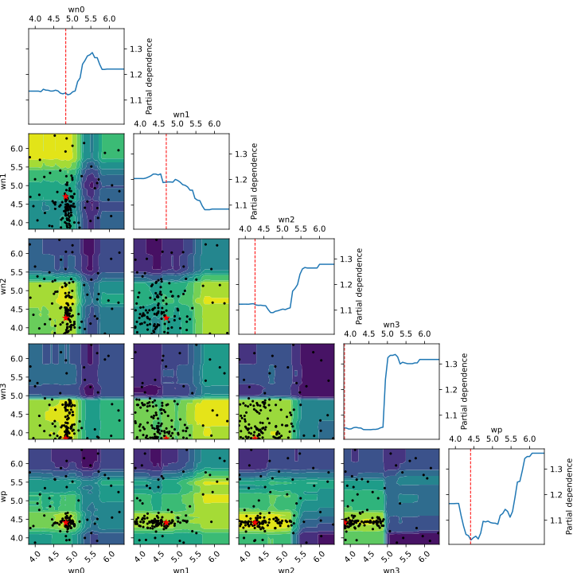


<h4 align="center">gbrt_minimize-RF-halton-LCB</h4>

```
optimizer     gbrt_minimize
estimator                RF
generator            halton
acquisitor              LCB
wn0                0.000001
wn1                0.000004
wn2                0.000028
wn3                0.000137
wp                 0.000005
vs0                1.804348
vs1                 1.72537
vs2                1.627941
vs3                1.590122
cost               0.188882
time_stamp    030312-211103
```

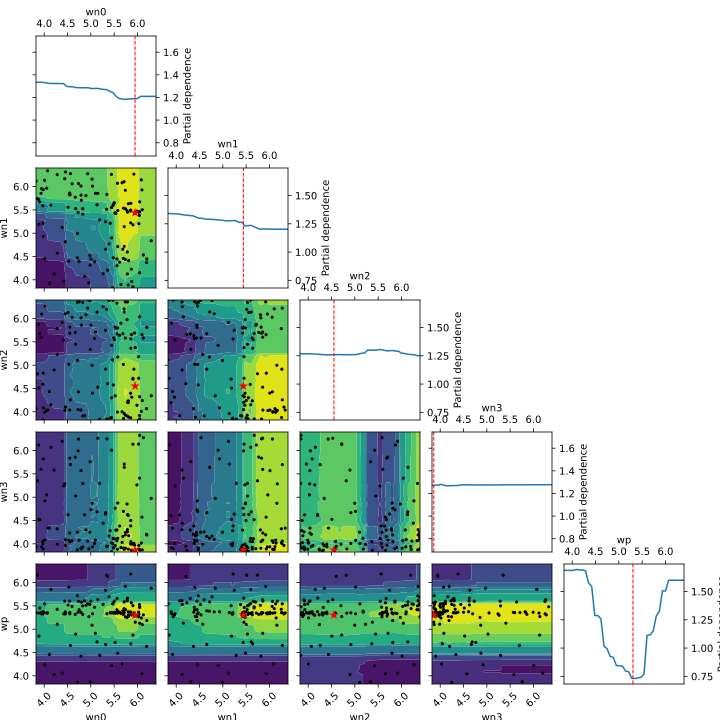


<h4 align="center">gbrt_minimize-RF-halton-EI</h4>

```
optimizer     gbrt_minimize
estimator                RF
generator            halton
acquisitor               EI
wn0                0.000001
wn1                0.000005
wn2                0.000111
wn3                0.000141
wp                 0.000004
vs0                1.877852
vs1                1.720446
vs2                1.630243
vs3                 1.62743
cost               0.206439
time_stamp    030520-211103
```

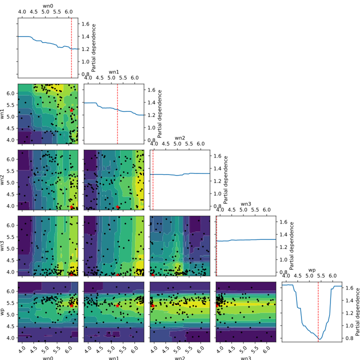


<h4 align="center">gbrt_minimize-RF-halton-PI</h4>

```
optimizer     gbrt_minimize
estimator                RF
generator            halton
acquisitor               PI
wn0                0.000003
wn1                0.000005
wn2                0.000008
wn3                 0.00002
wp                 0.000009
vs0                1.651611
vs1                1.669799
vs2                1.679718
vs3                1.646288
cost               0.033236
time_stamp    030750-211103
```

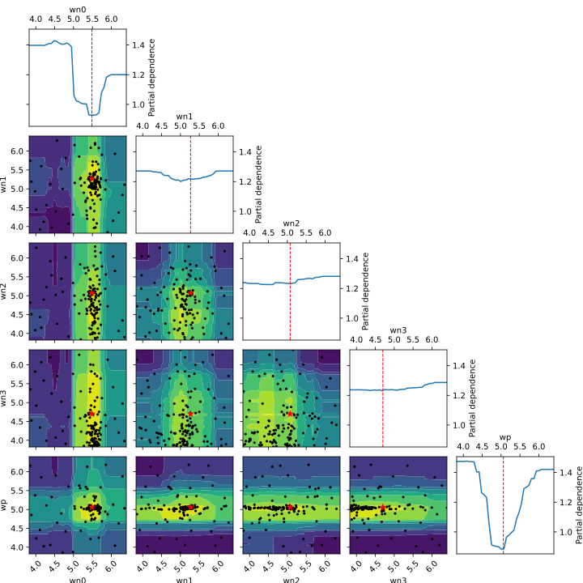


<h4 align="center">gbrt_minimize-RF-halton-gp_hedge</h4>

```
optimizer     gbrt_minimize
estimator                RF
generator            halton
acquisitor         gp_hedge
wn0                0.000002
wn1                0.000022
wn2                0.000003
wn3                0.000005
wp                 0.000005
vs0                1.699334
vs1                1.453892
vs2                1.688404
vs3                1.694429
cost               0.198955
time_stamp    030952-211103
```

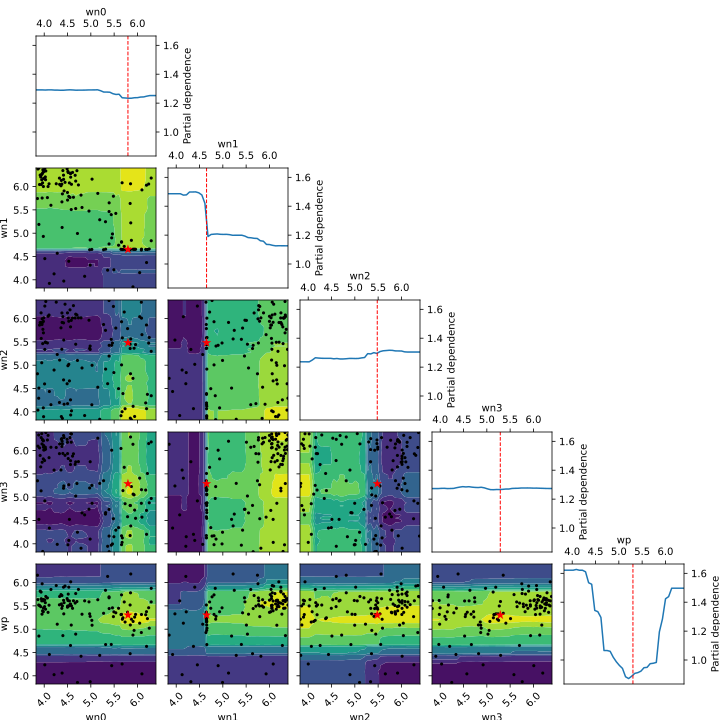


<h4 align="center">gbrt_minimize-RF-hammersly-LCB</h4>

```
optimizer     gbrt_minimize
estimator                RF
generator         hammersly
acquisitor              LCB
wn0                0.000006
wn1                0.000015
wn2                0.000016
wn3                0.000023
wp                 0.000016
vs0                1.633715
vs1                1.585429
vs2                1.636372
vs3                1.645942
cost               0.059722
time_stamp    031244-211103
```

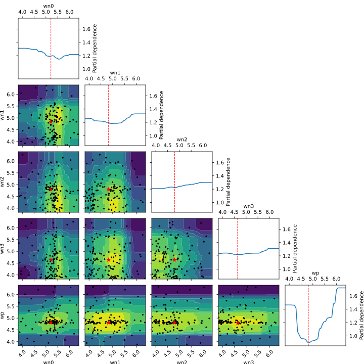


<h4 align="center">gbrt_minimize-RF-hammersly-EI</h4>

```
optimizer     gbrt_minimize
estimator                RF
generator         hammersly
acquisitor               EI
wn0                0.000004
wn1                0.000007
wn2                0.000009
wn3                0.000052
wp                  0.00001
vs0                1.665933
vs1                 1.66267
vs2                1.698743
vs3                1.609099
cost               0.071665
time_stamp    031509-211103
```

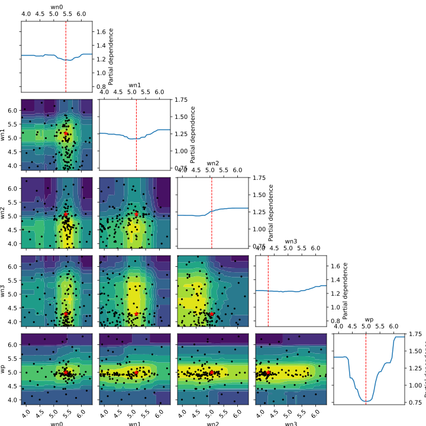


<h4 align="center">gbrt_minimize-RF-hammersly-PI</h4>

```
optimizer     gbrt_minimize
estimator                RF
generator         hammersly
acquisitor               PI
wn0                0.000004
wn1                0.000011
wn2                0.000013
wn3                0.000045
wp                 0.000011
vs0                1.674478
vs1                1.604209
vs2                1.640439
vs3                1.579891
cost               0.090872
time_stamp    031734-211103
```

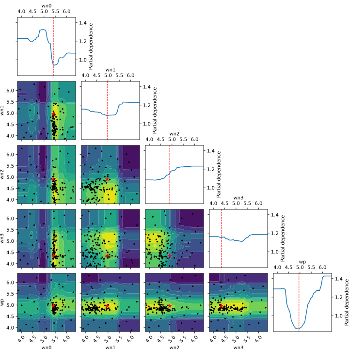


<h4 align="center">gbrt_minimize-RF-hammersly-gp_hedge</h4>

```
optimizer     gbrt_minimize
estimator                RF
generator         hammersly
acquisitor         gp_hedge
wn0                     0.0
wn1                0.000008
wn2                0.000019
wn3                0.000008
wp                 0.000003
vs0                 1.85927
vs1                1.646468
vs2                 1.62204
vs3                 1.66825
cost               0.156978
time_stamp    031959-211103
```

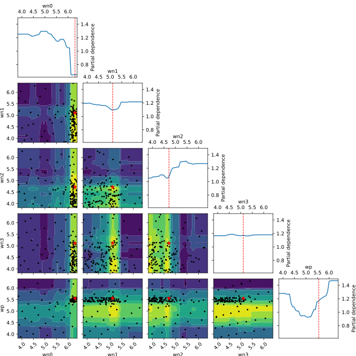


<h4 align="center">gbrt_minimize-RF-lhs-LCB</h4>

```
optimizer     gbrt_minimize
estimator                RF
generator               lhs
acquisitor              LCB
wn0                0.000001
wn1                0.000033
wn2                0.000001
wn3                0.000004
wp                 0.000002
vs0                1.727457
vs1                1.407581
vs2                1.736955
vs3                1.649724
cost               0.246732
time_stamp    032238-211103
```


<h4 align="center">gbrt_minimize-RF-lhs-EI</h4>

```
optimizer     gbrt_minimize
estimator                RF
generator               lhs
acquisitor               EI
wn0                0.000005
wn1                0.000021
wn2                0.000039
wn3                0.000144
wp                 0.000018
vs0                1.773255
vs1                1.646796
vs2                1.633277
vs3                1.587307
cost               0.124773
time_stamp    032501-211103
```

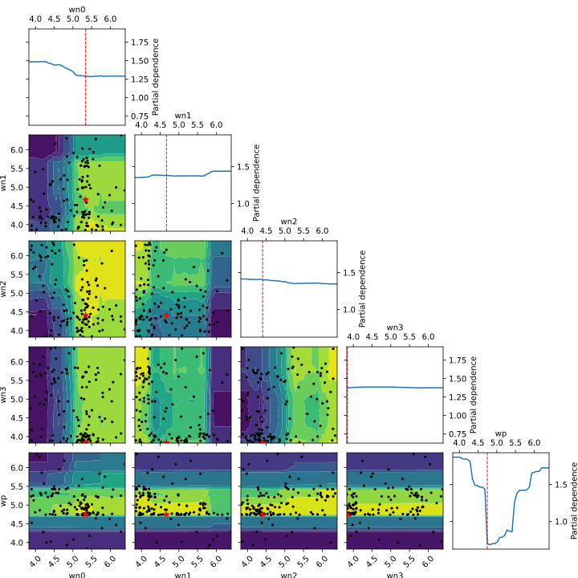


<h4 align="center">gbrt_minimize-RF-lhs-PI</h4>

```
optimizer     gbrt_minimize
estimator                RF
generator               lhs
acquisitor               PI
wn0                0.000001
wn1                0.000024
wn2                0.000014
wn3                0.000025
wp                 0.000003
vs0                1.891783
vs1                1.644959
vs2                1.670801
vs3                1.659841
cost               0.168161
time_stamp    032705-211103
```

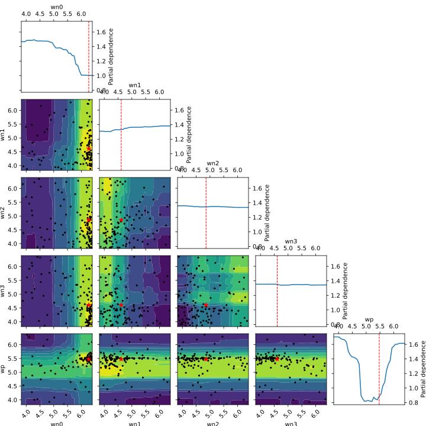


<h4 align="center">gbrt_minimize-RF-lhs-gp_hedge</h4>

```
optimizer     gbrt_minimize
estimator                RF
generator               lhs
acquisitor         gp_hedge
wn0                0.000001
wn1                0.000014
wn2                0.000008
wn3                0.000007
wp                 0.000004
vs0                1.806453
vs1                1.586633
vs2                1.644535
vs3                1.675004
cost               0.151691
time_stamp    032931-211103
```

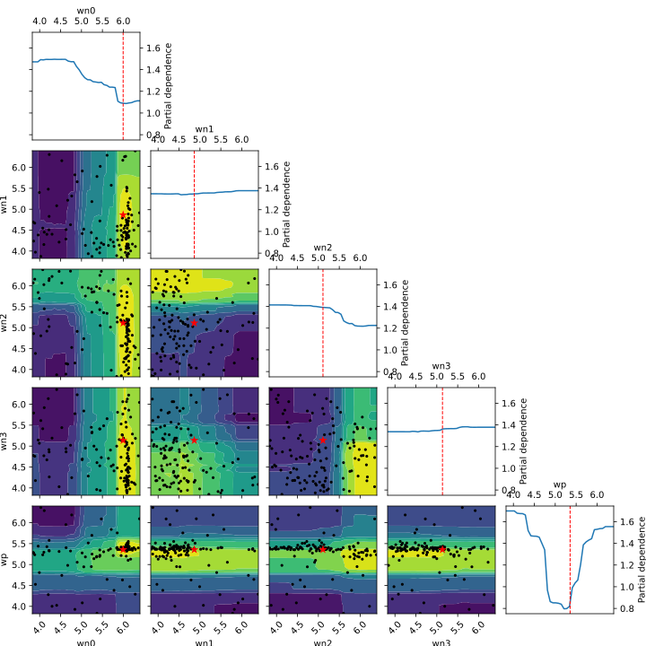


<h4 align="center">gbrt_minimize-RF-grid-LCB</h4>

```
optimizer     gbrt_minimize
estimator                RF
generator              grid
acquisitor              LCB
wn0                0.000011
wn1                0.000029
wn2                0.000029
wn3                0.000068
wp                 0.000029
vs0                1.635566
vs1                1.579743
vs2                1.639847
vs3                1.604662
cost               0.084959
time_stamp    033149-211103
```

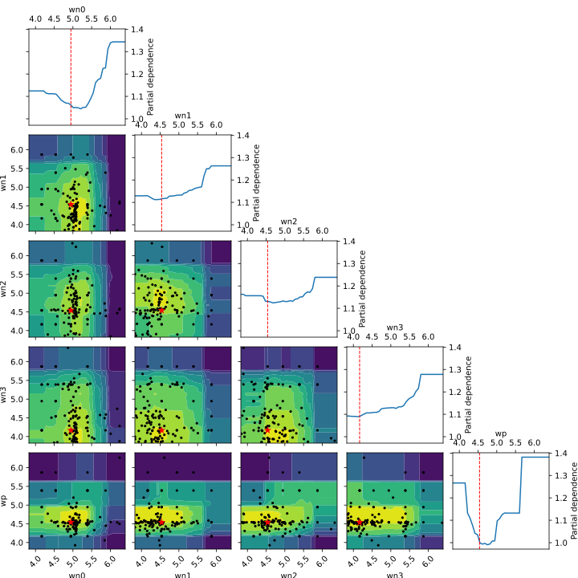


<h4 align="center">gbrt_minimize-RF-grid-EI</h4>

```
optimizer     gbrt_minimize
estimator                RF
generator              grid
acquisitor               EI
wn0                0.000012
wn1                0.000018
wn2                0.000041
wn3                0.000068
wp                  0.00003
vs0                1.626371
vs1                1.663618
vs2                1.631195
vs3                1.624231
cost               0.049588
time_stamp    033416-211103
```

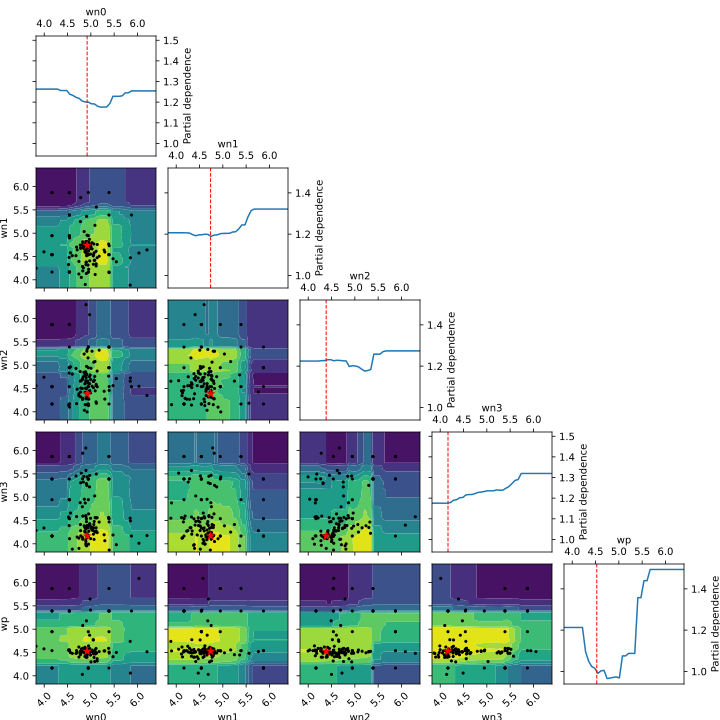


<h4 align="center">gbrt_minimize-RF-grid-PI</h4>

```
optimizer     gbrt_minimize
estimator                RF
generator              grid
acquisitor               PI
wn0                0.000004
wn1                0.000008
wn2                0.000011
wn3                0.000055
wp                 0.000012
vs0                 1.67123
vs1                1.658396
vs2                1.678833
vs3                1.603357
cost               0.063699
time_stamp    033644-211103
```

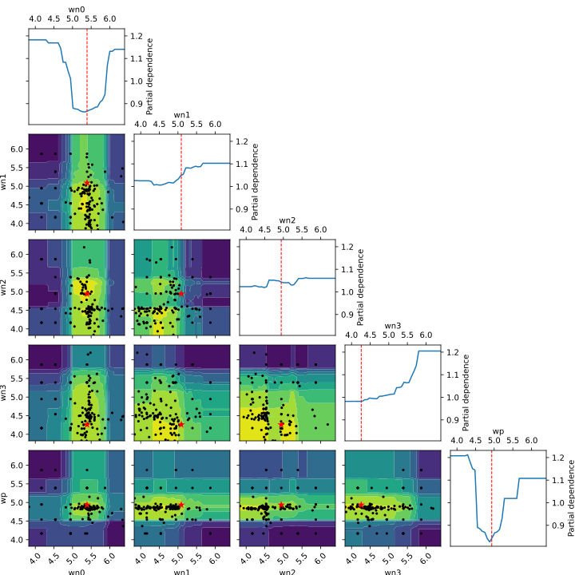


<h4 align="center">gbrt_minimize-RF-grid-gp_hedge</h4>

```
optimizer     gbrt_minimize
estimator                RF
generator              grid
acquisitor         gp_hedge
wn0                0.000012
wn1                0.000018
wn2                0.000041
wn3                0.000068
wp                  0.00003
vs0                1.626371
vs1                1.663618
vs2                1.631195
vs3                1.624231
cost               0.049588
time_stamp    033911-211103
```

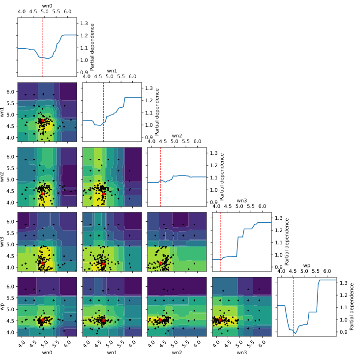


<h4 align="center">gbrt_minimize-ET-random-LCB</h4>

```
optimizer     gbrt_minimize
estimator                ET
generator            random
acquisitor              LCB
wn0                 0.00001
wn1                0.000046
wn2                0.000021
wn3                0.000087
wp                 0.000026
vs0                1.629138
vs1                1.489797
vs2                1.647402
vs3                1.563239
cost               0.163893
time_stamp    034147-211103
```


<h4 align="center">gbrt_minimize-ET-random-EI</h4>

```
optimizer     gbrt_minimize
estimator                ET
generator            random
acquisitor               EI
wn0                0.000015
wn1                0.000034
wn2                0.000028
wn3                0.000097
wp                 0.000041
vs0                1.653631
vs1                1.626447
vs2                1.715951
vs3                1.655023
cost                0.05949
time_stamp    034416-211103
```

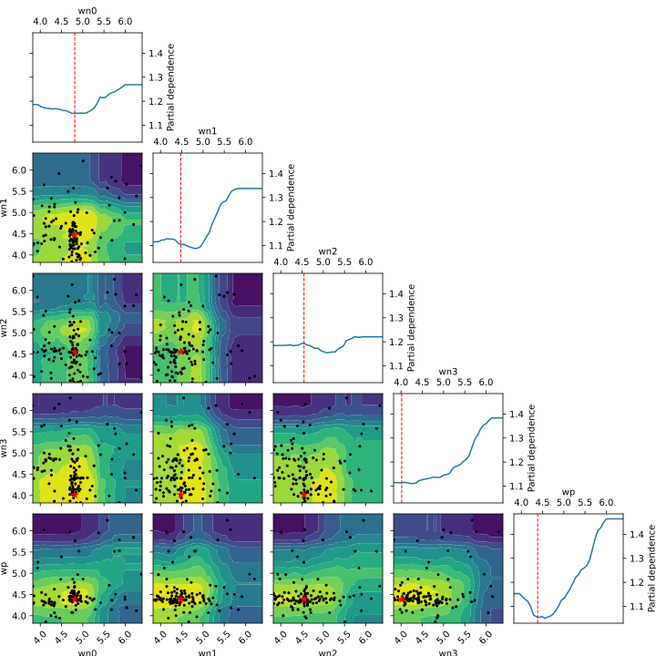


<h4 align="center">gbrt_minimize-ET-random-PI</h4>

```
optimizer     gbrt_minimize
estimator                ET
generator            random
acquisitor               PI
wn0                0.000001
wn1                0.000002
wn2                0.000004
wn3                0.000007
wp                 0.000003
vs0                 1.57631
vs1                1.618409
vs2                1.594028
vs3                1.578501
cost               0.141062
time_stamp    034620-211103
```

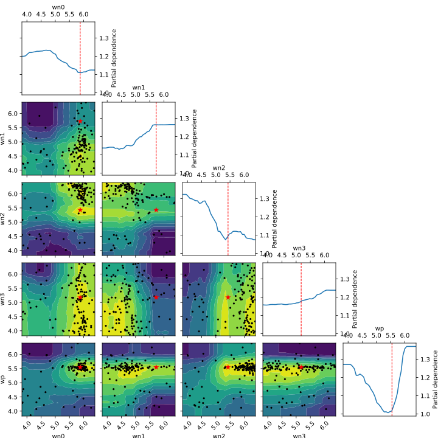


<h4 align="center">gbrt_minimize-ET-random-gp_hedge</h4>

```
optimizer     gbrt_minimize
estimator                ET
generator            random
acquisitor         gp_hedge
wn0                0.000001
wn1                0.000089
wn2                0.000053
wn3                0.000036
wp                 0.000006
vs0                1.887359
vs1                1.621005
vs2                1.637611
vs3                1.654258
cost               0.171516
time_stamp    034847-211103
```

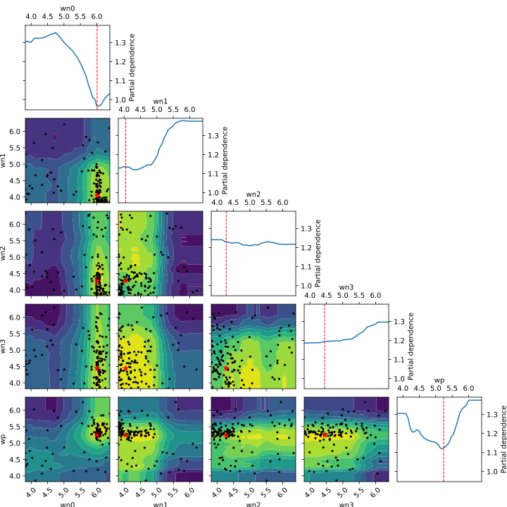


<h4 align="center">gbrt_minimize-ET-sobol-LCB</h4>

```
optimizer     gbrt_minimize
estimator                ET
generator             sobol
acquisitor              LCB
wn0                     0.0
wn1                0.000001
wn2                0.000002
wn3                0.000001
wp                 0.000001
vs0                1.657091
vs1                1.664682
vs2                1.607844
vs3                1.679344
cost               0.056529
time_stamp    035114-211103
```


<h4 align="center">gbrt_minimize-ET-sobol-EI</h4>

```
optimizer     gbrt_minimize
estimator                ET
generator             sobol
acquisitor               EI
wn0                0.000017
wn1                0.000021
wn2                0.000056
wn3                0.000136
wp                 0.000046
vs0                1.656905
vs1                1.739195
vs2                 1.69459
vs3                1.663047
cost               0.093174
time_stamp    035321-211103
```

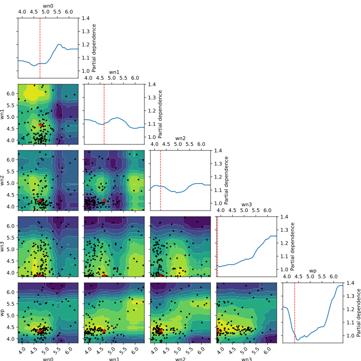


<h4 align="center">gbrt_minimize-ET-sobol-PI</h4>

```
optimizer     gbrt_minimize
estimator                ET
generator             sobol
acquisitor               PI
wn0                0.000012
wn1                0.000026
wn2                0.000093
wn3                0.000068
wp                 0.000036
vs0                1.688155
vs1                1.663205
vs2                1.593324
vs3                1.640958
cost               0.070957
time_stamp    035549-211103
```

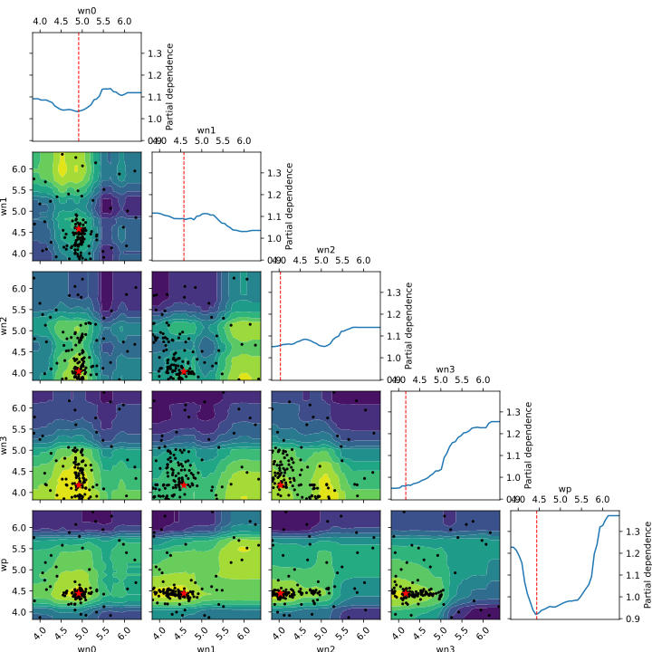


<h4 align="center">gbrt_minimize-ET-sobol-gp_hedge</h4>

```
optimizer     gbrt_minimize
estimator                ET
generator             sobol
acquisitor         gp_hedge
wn0                0.000009
wn1                0.000022
wn2                0.000028
wn3                0.000051
wp                 0.000028
vs0                1.689203
vs1                1.653638
vs2                1.681769
vs3                1.670727
cost                0.05778
time_stamp    035752-211103
```

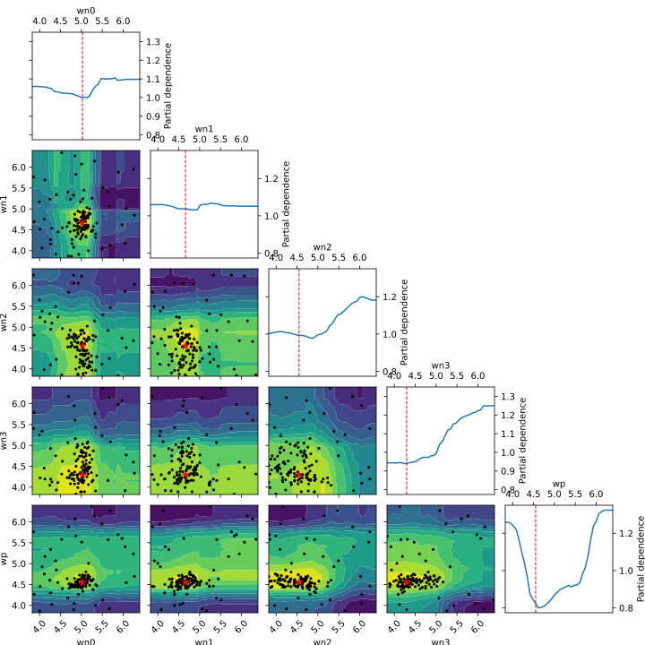


<h4 align="center">gbrt_minimize-ET-halton-LCB</h4>

```
optimizer     gbrt_minimize
estimator                ET
generator            halton
acquisitor              LCB
wn0                0.000001
wn1                0.000001
wn2                0.000003
wn3                0.000047
wp                 0.000002
vs0                1.743697
vs1                 1.68472
vs2                1.645101
vs3                1.554541
cost               0.138652
time_stamp    040039-211103
```

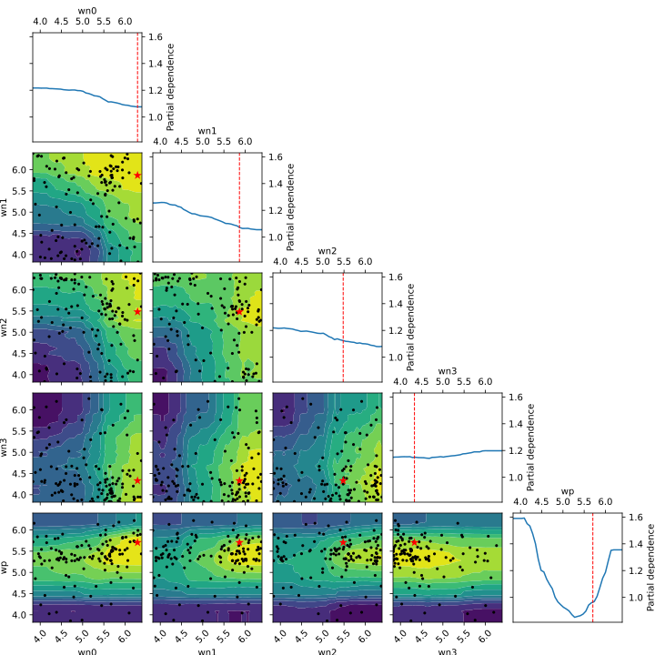


<h4 align="center">gbrt_minimize-ET-halton-EI</h4>

```
optimizer     gbrt_minimize
estimator                ET
generator            halton
acquisitor               EI
wn0                     0.0
wn1                0.000007
wn2                0.000011
wn3                0.000023
wp                 0.000003
vs0                1.870021
vs1                1.658638
vs2                1.655668
vs3                1.638629
cost               0.148908
time_stamp    040252-211103
```


<h4 align="center">gbrt_minimize-ET-halton-PI</h4>

```
optimizer     gbrt_minimize
estimator                ET
generator            halton
acquisitor               PI
wn0                0.000002
wn1                0.000003
wn2                0.000007
wn3                0.000007
wp                 0.000004
vs0                     1.6
vs1                1.651105
vs2                1.587378
vs3                1.630486
cost               0.080752
time_stamp    040517-211103
```

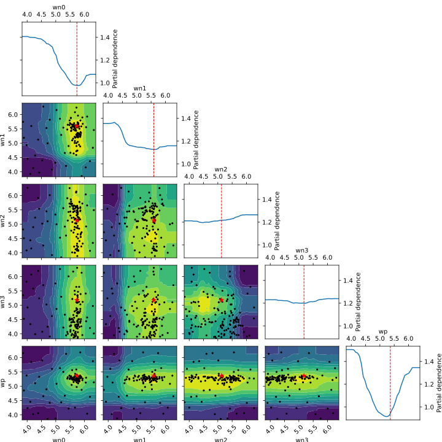


<h4 align="center">gbrt_minimize-ET-halton-gp_hedge</h4>

```
optimizer     gbrt_minimize
estimator                ET
generator            halton
acquisitor         gp_hedge
wn0                0.000001
wn1                0.000001
wn2                0.000002
wn3                0.000003
wp                 0.000002
vs0                 1.64097
vs1                1.625564
vs2                1.675478
vs3                1.650369
cost               0.035947
time_stamp    040722-211103
```

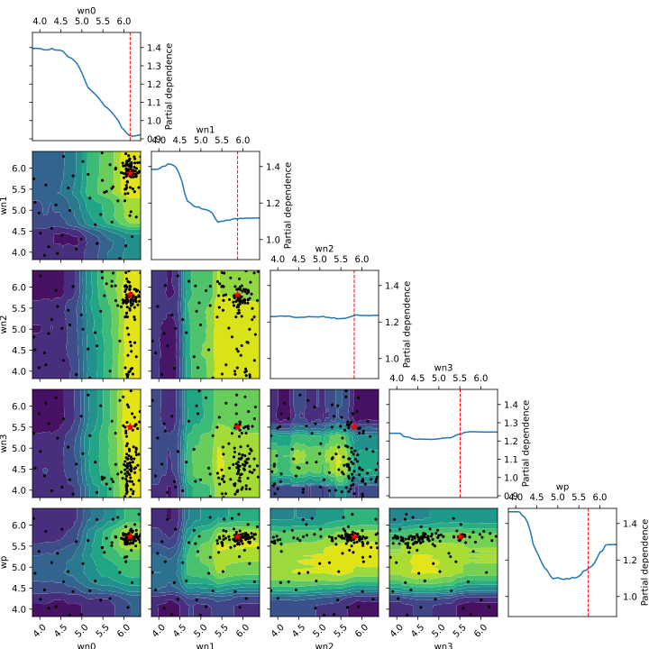


<h4 align="center">gbrt_minimize-ET-hammersly-LCB</h4>

```
optimizer     gbrt_minimize
estimator                ET
generator         hammersly
acquisitor              LCB
wn0                0.000003
wn1                0.000023
wn2                 0.00003
wn3                0.000051
wp                 0.000016
vs0                1.821753
vs1                1.664487
vs2                 1.67435
vs3                1.664836
cost               0.136622
time_stamp    041010-211103
```

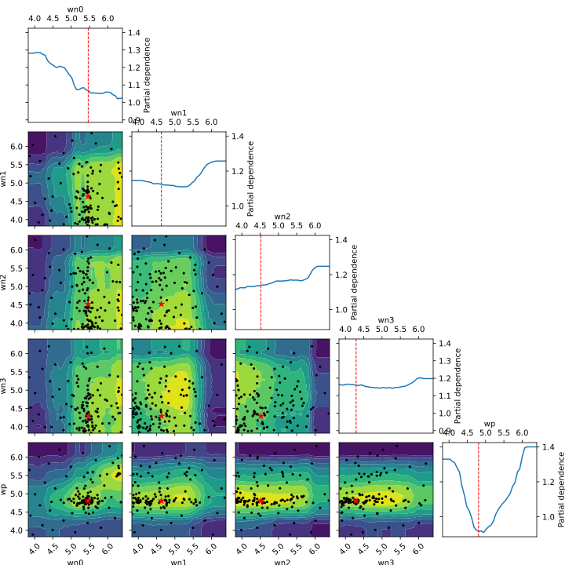


<h4 align="center">gbrt_minimize-ET-hammersly-EI</h4>

```
optimizer     gbrt_minimize
estimator                ET
generator         hammersly
acquisitor               EI
wn0                0.000005
wn1                0.000017
wn2                0.000018
wn3                 0.00003
wp                 0.000015
vs0                1.714992
vs1                1.616247
vs2                1.654997
vs3                1.648683
cost               0.063672
time_stamp    041242-211103
```

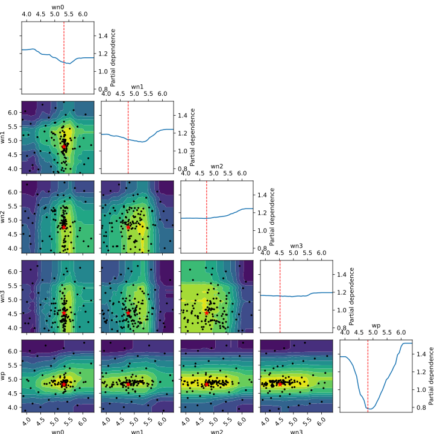


<h4 align="center">gbrt_minimize-ET-hammersly-PI</h4>

```
optimizer     gbrt_minimize
estimator                ET
generator         hammersly
acquisitor               PI
wn0                 0.00001
wn1                 0.00002
wn2                0.000016
wn3                0.000092
wp                 0.000028
vs0                1.661398
vs1                1.655359
vs2                1.754715
vs3                1.662118
cost               0.080964
time_stamp    041513-211103
```

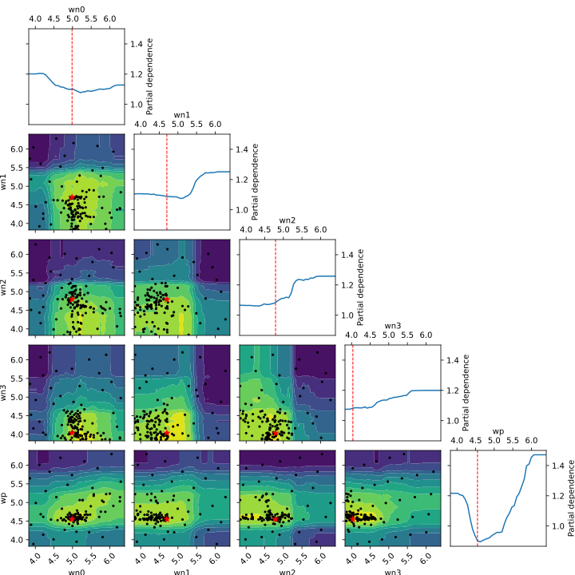


<h4 align="center">gbrt_minimize-ET-hammersly-gp_hedge</h4>

```
optimizer     gbrt_minimize
estimator                ET
generator         hammersly
acquisitor         gp_hedge
wn0                0.000006
wn1                0.000014
wn2                0.000014
wn3                0.000042
wp                 0.000015
vs0                1.648902
vs1                 1.60375
vs2                1.658869
vs3                1.606859
cost               0.060217
time_stamp    041737-211103
```

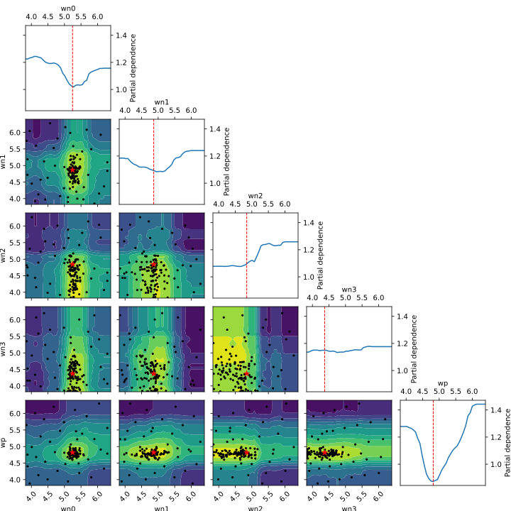


<h4 align="center">gbrt_minimize-ET-lhs-LCB</h4>

```
optimizer     gbrt_minimize
estimator                ET
generator               lhs
acquisitor              LCB
wn0                0.000001
wn1                0.000004
wn2                0.000016
wn3                0.000008
wp                 0.000004
vs0                1.756661
vs1                1.674466
vs2                1.599183
vs3                1.658868
cost               0.115644
time_stamp    042025-211103
```

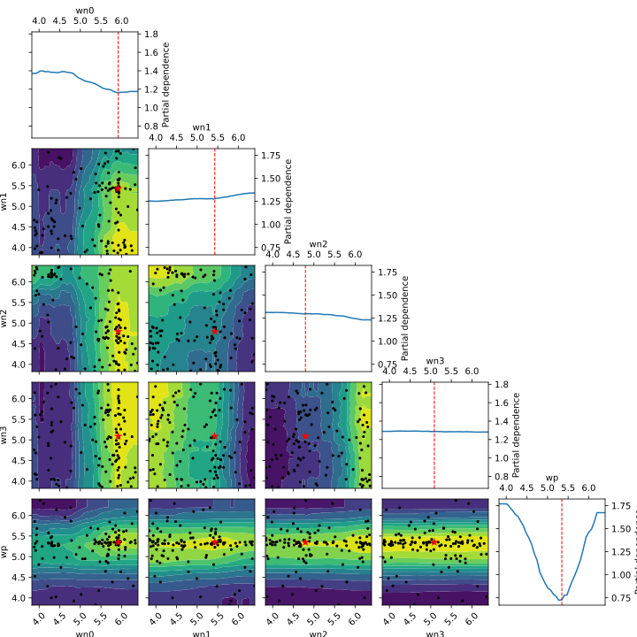


<h4 align="center">gbrt_minimize-ET-lhs-EI</h4>

```
optimizer     gbrt_minimize
estimator                ET
generator               lhs
acquisitor               EI
wn0                0.000007
wn1                0.000007
wn2                 0.00012
wn3                0.000057
wp                 0.000019
vs0                1.644522
vs1                1.789772
vs2                1.613094
vs3                1.657746
cost               0.115092
time_stamp    042239-211103
```

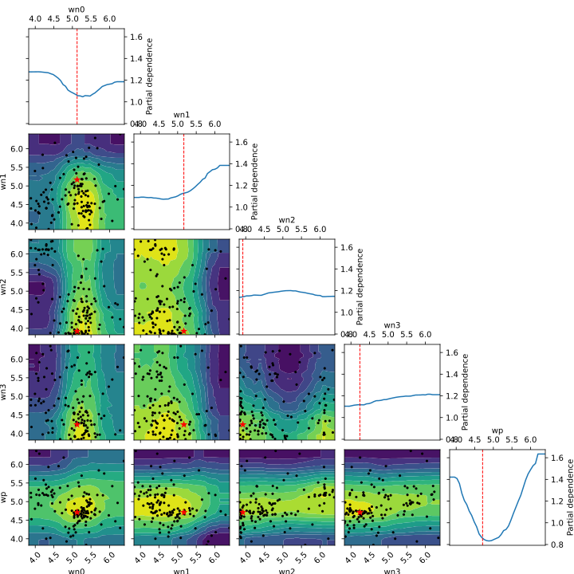


<h4 align="center">gbrt_minimize-ET-lhs-PI</h4>

```
optimizer     gbrt_minimize
estimator                ET
generator               lhs
acquisitor               PI
wn0                0.000009
wn1                 0.00003
wn2                0.000018
wn3                0.000001
wp                 0.000011
vs0                1.693963
vs1                 1.67529
vs2                1.682704
vs3                2.019254
cost               0.285583
time_stamp    042507-211103
```

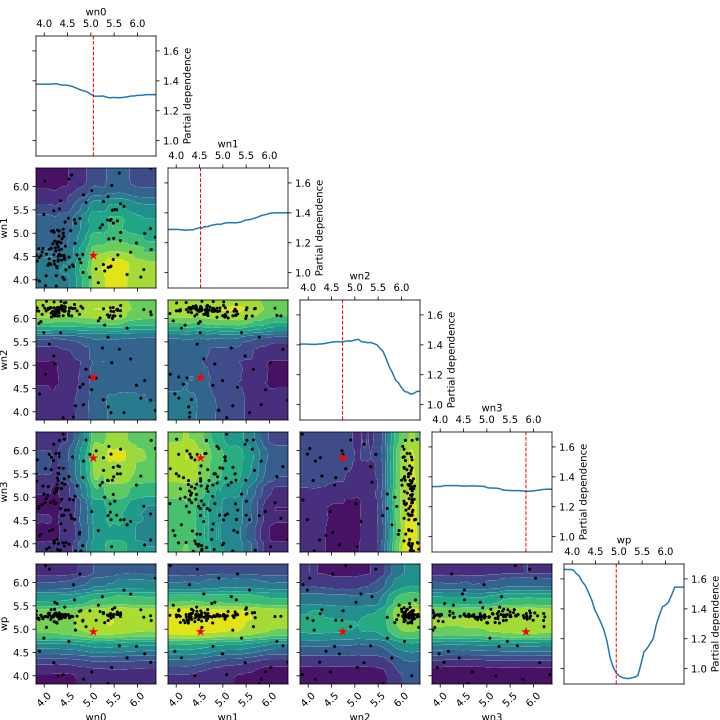


<h4 align="center">gbrt_minimize-ET-lhs-gp_hedge</h4>

```
optimizer     gbrt_minimize
estimator                ET
generator               lhs
acquisitor         gp_hedge
wn0                0.000002
wn1                0.000012
wn2                0.000007
wn3                0.000008
wp                 0.000006
vs0                1.727479
vs1                1.542423
vs2                1.628533
vs3                1.656358
cost               0.129018
time_stamp    042713-211103
```

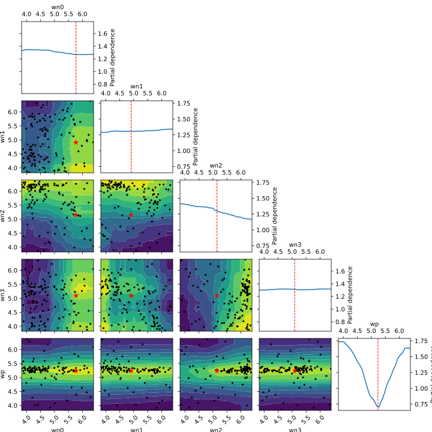


<h4 align="center">gbrt_minimize-ET-grid-LCB</h4>

```
optimizer     gbrt_minimize
estimator                ET
generator              grid
acquisitor              LCB
wn0                0.000011
wn1                0.000029
wn2                0.000029
wn3                0.000068
wp                 0.000029
vs0                1.635566
vs1                1.579743
vs2                1.639847
vs3                1.604662
cost               0.084959
time_stamp    043004-211103
```

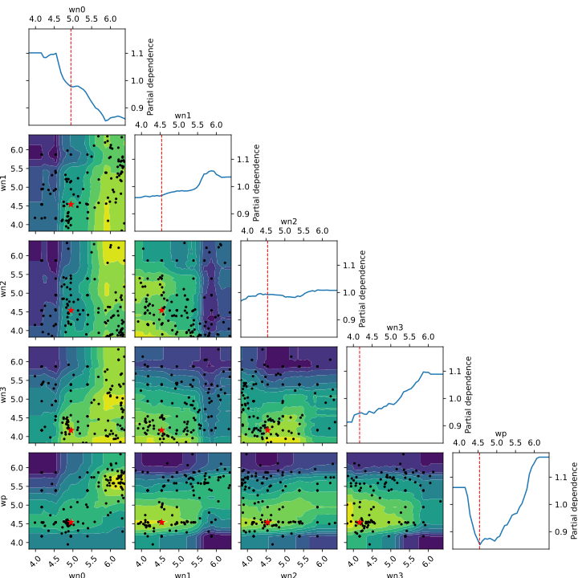


<h4 align="center">gbrt_minimize-ET-grid-EI</h4>

```
optimizer     gbrt_minimize
estimator                ET
generator              grid
acquisitor               EI
wn0                0.000015
wn1                0.000029
wn2                0.000045
wn3                0.000072
wp                 0.000041
vs0                  1.6602
vs1                1.652853
vs2                1.662488
vs3                1.659937
cost               0.021502
time_stamp    043238-211103
```

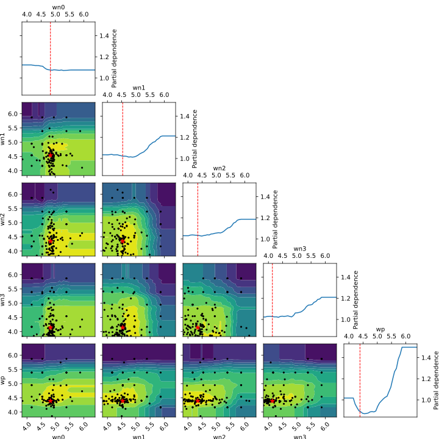


<h4 align="center">gbrt_minimize-ET-grid-PI</h4>

```
optimizer     gbrt_minimize
estimator                ET
generator              grid
acquisitor               PI
wn0                0.000012
wn1                0.000026
wn2                0.000044
wn3                0.000043
wp                 0.000032
vs0                1.649283
vs1                1.623721
vs2                1.621212
vs3                1.663603
cost               0.042052
time_stamp    043443-211103
```

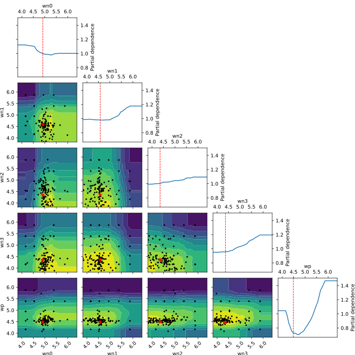


<h4 align="center">gbrt_minimize-ET-grid-gp_hedge</h4>

```
optimizer     gbrt_minimize
estimator                ET
generator              grid
acquisitor         gp_hedge
wn0                0.000019
wn1                0.000031
wn2                0.000056
wn3                0.000105
wp                 0.000048
vs0                1.631462
vs1                1.657785
vs2                1.650943
vs3                1.635056
cost               0.025582
time_stamp    043716-211103
```

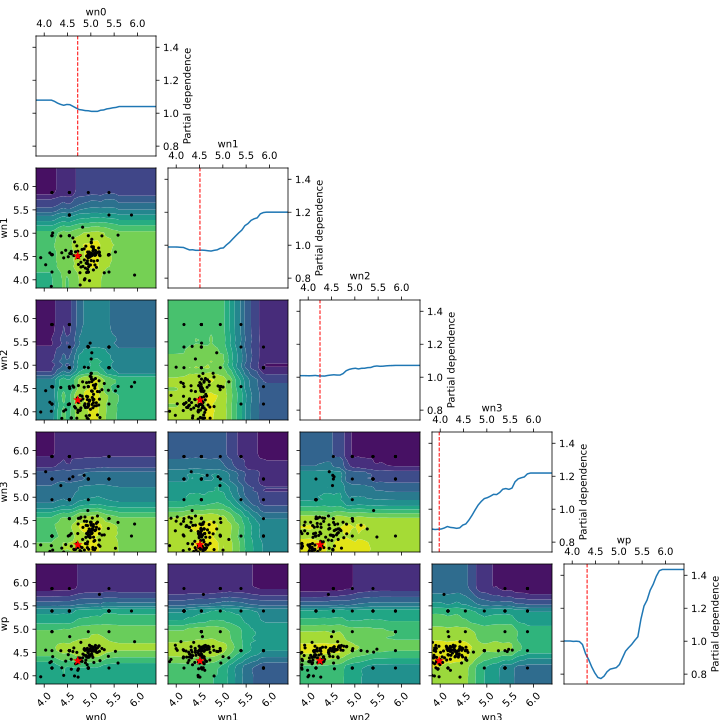


<h4 align="center">gbrt_minimize-GBRT-random-LCB</h4>

```
optimizer     gbrt_minimize
estimator              GBRT
generator            random
acquisitor              LCB
wn0                     0.0
wn1                0.000009
wn2                0.000005
wn3                0.000103
wp                 0.000003
vs0                1.893733
vs1                1.677592
vs2                1.719704
vs3                1.644474
cost               0.210033
time_stamp    044005-211103
```

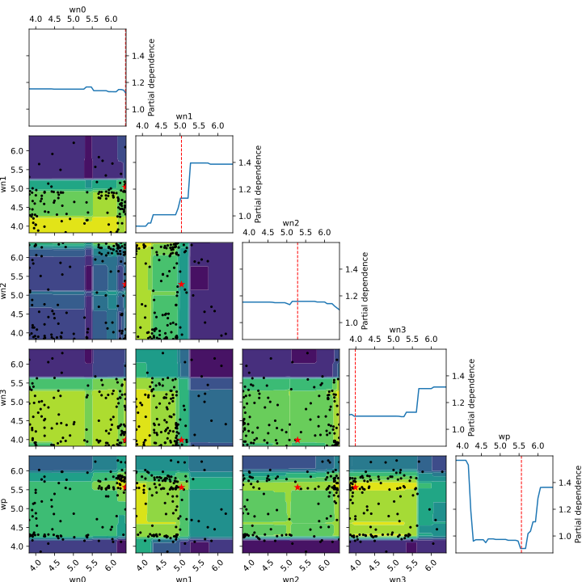


<h4 align="center">gbrt_minimize-GBRT-random-EI</h4>

```
optimizer     gbrt_minimize
estimator              GBRT
generator            random
acquisitor               EI
wn0                0.000001
wn1                0.000022
wn2                0.000074
wn3                0.000009
wp                 0.000004
vs0                1.882772
vs1                1.640654
vs2                  1.6149
vs3                1.692458
cost               0.193743
time_stamp    044052-211103
```

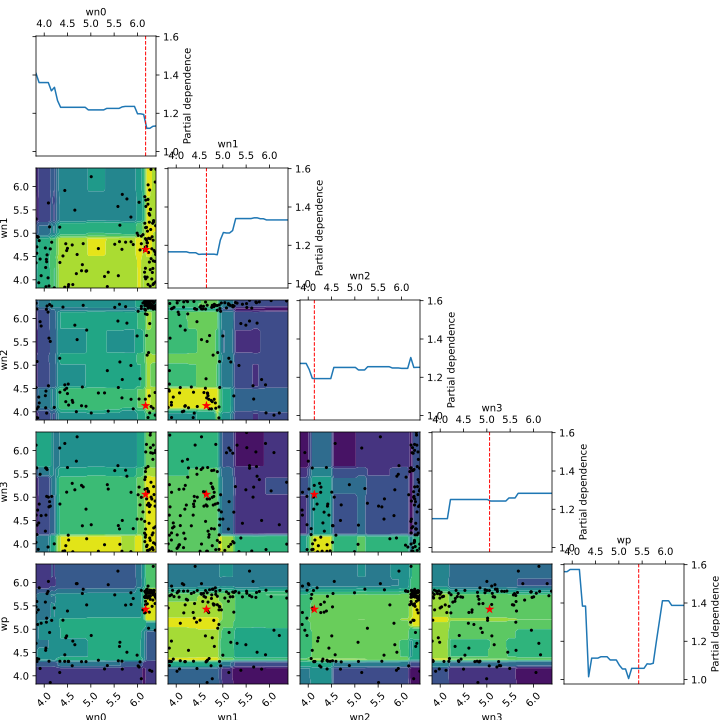


<h4 align="center">gbrt_minimize-GBRT-random-PI</h4>

```
optimizer     gbrt_minimize
estimator              GBRT
generator            random
acquisitor               PI
wn0                     0.0
wn1                0.000011
wn2                0.000014
wn3                0.000006
wp                 0.000003
vs0                1.876032
vs1                1.646285
vs2                1.648598
vs3                1.698965
cost               0.169766
time_stamp    044147-211103
```

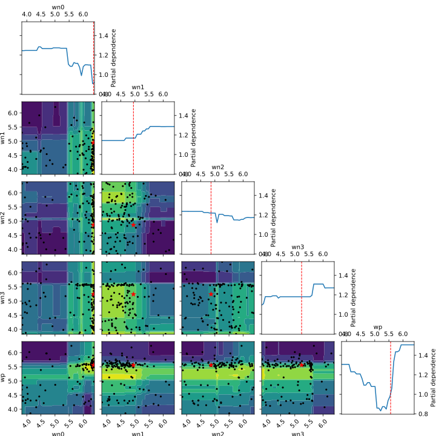


<h4 align="center">gbrt_minimize-GBRT-random-gp_hedge</h4>

```
optimizer     gbrt_minimize
estimator              GBRT
generator            random
acquisitor         gp_hedge
wn0                0.000135
wn1                0.000019
wn2                0.000054
wn3                0.000106
wp                 0.000058
vs0                1.160184
vs1                1.718863
vs2                1.654058
vs3                 1.63537
cost               0.349919
time_stamp    044310-211103
```

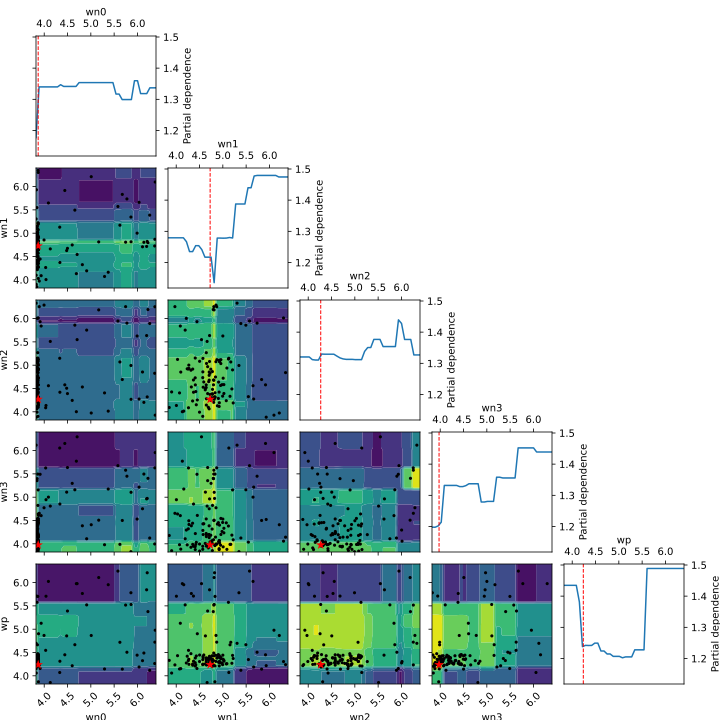


<h4 align="center">gbrt_minimize-GBRT-sobol-LCB</h4>

```
optimizer     gbrt_minimize
estimator              GBRT
generator             sobol
acquisitor              LCB
wn0                0.000018
wn1                0.000016
wn2                0.000025
wn3                0.000069
wp                 0.000037
vs0                1.564201
vs1                1.715712
vs2                1.734948
vs3                1.691441
cost               0.168424
time_stamp    044431-211103
```

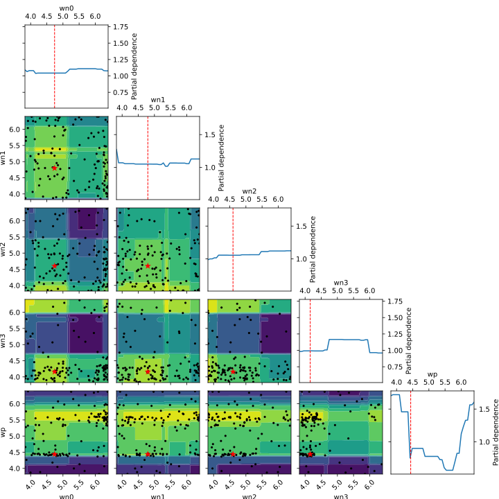


<h4 align="center">gbrt_minimize-GBRT-sobol-EI</h4>

```
optimizer     gbrt_minimize
estimator              GBRT
generator             sobol
acquisitor               EI
wn0                     0.0
wn1                 0.00002
wn2                0.000072
wn3                0.000077
wp                 0.000003
vs0                1.906891
vs1                1.666983
vs2                1.642136
vs3                1.642424
cost               0.175342
time_stamp    044519-211103
```

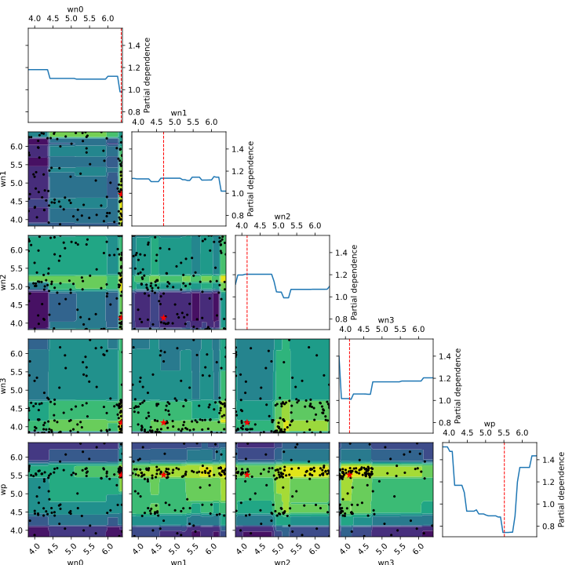


<h4 align="center">gbrt_minimize-GBRT-sobol-PI</h4>

```
optimizer     gbrt_minimize
estimator              GBRT
generator             sobol
acquisitor               PI
wn0                0.000015
wn1                0.000029
wn2                0.000045
wn3                0.000072
wp                 0.000041
vs0                  1.6602
vs1                1.652853
vs2                1.662488
vs3                1.659937
cost               0.021502
time_stamp    044635-211103
```

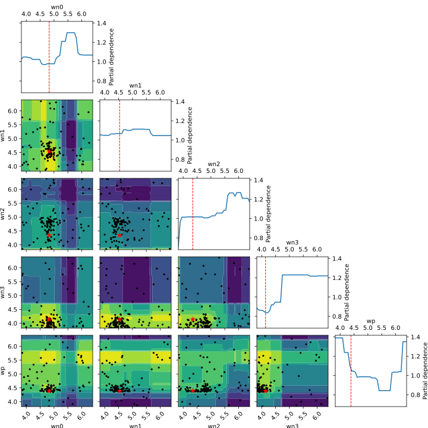


<h4 align="center">gbrt_minimize-GBRT-sobol-gp_hedge</h4>

```
optimizer     gbrt_minimize
estimator              GBRT
generator             sobol
acquisitor         gp_hedge
wn0                0.000013
wn1                0.000031
wn2                0.000022
wn3                0.000115
wp                 0.000036
vs0                1.670652
vs1                  1.6289
vs2                1.739087
vs3                1.651085
cost               0.079954
time_stamp    044723-211103
```

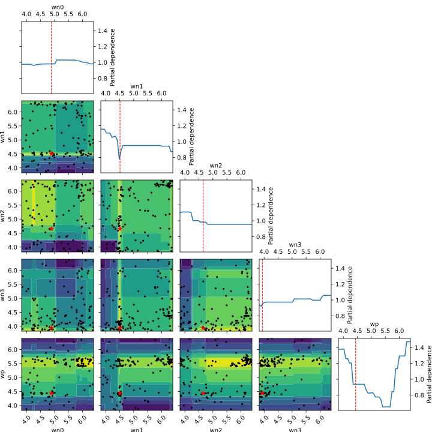


<h4 align="center">gbrt_minimize-GBRT-halton-LCB</h4>

```
optimizer     gbrt_minimize
estimator              GBRT
generator            halton
acquisitor              LCB
wn0                     0.0
wn1                0.000004
wn2                0.000012
wn3                0.000021
wp                 0.000002
vs0                 1.83977
vs1                1.667644
vs2                1.626964
vs3                 1.61448
cost               0.161194
time_stamp    044838-211103
```

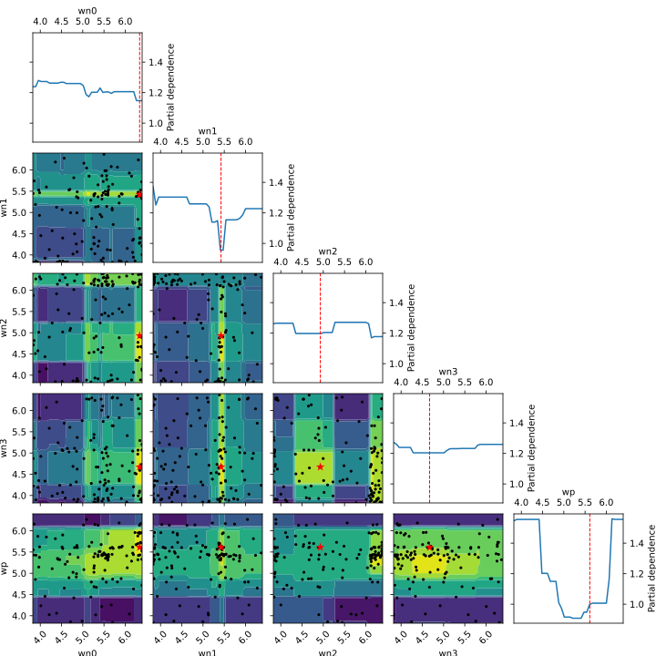


<h4 align="center">gbrt_minimize-GBRT-halton-EI</h4>

```
optimizer     gbrt_minimize
estimator              GBRT
generator            halton
acquisitor               EI
wn0                     0.0
wn1                0.000003
wn2                0.000002
wn3                0.000006
wp                 0.000002
vs0                1.788006
vs1                1.620096
vs2                 1.71157
vs3                1.655148
cost               0.142199
time_stamp    044927-211103
```


<h4 align="center">gbrt_minimize-GBRT-halton-PI</h4>

```
optimizer     gbrt_minimize
estimator              GBRT
generator            halton
acquisitor               PI
wn0                     0.0
wn1                0.000004
wn2                0.000005
wn3                0.000009
wp                 0.000002
vs0                1.840418
vs1                1.662093
vs2                1.671056
vs3                1.660173
cost               0.141661
time_stamp    045114-211103
```

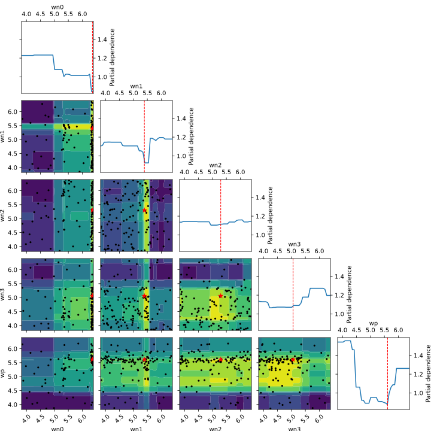


<h4 align="center">gbrt_minimize-GBRT-halton-gp_hedge</h4>

```
optimizer     gbrt_minimize
estimator              GBRT
generator            halton
acquisitor         gp_hedge
wn0                0.000007
wn1                0.000011
wn2                0.000024
wn3                0.000089
wp                 0.000021
vs0                1.708445
vs1                1.722029
vs2                 1.69987
vs3                1.646523
cost               0.111406
time_stamp    045233-211103
```

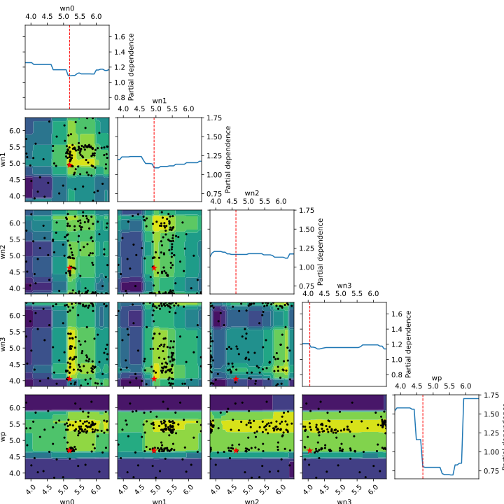


<h4 align="center">gbrt_minimize-GBRT-hammersly-LCB</h4>

```
optimizer     gbrt_minimize
estimator              GBRT
generator         hammersly
acquisitor              LCB
wn0                 0.00002
wn1                0.000056
wn2                0.000145
wn3                0.000058
wp                 0.000054
vs0                1.643292
vs1                  1.5787
vs2                1.530724
vs3                1.652036
cost                 0.1208
time_stamp    045402-211103
```

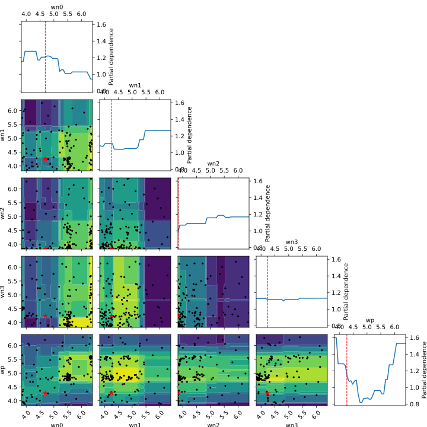


<h4 align="center">gbrt_minimize-GBRT-hammersly-EI</h4>

```
optimizer     gbrt_minimize
estimator              GBRT
generator         hammersly
acquisitor               EI
wn0                0.000004
wn1                 0.00001
wn2                0.000031
wn3                  0.0001
wp                 0.000014
vs0                1.719672
vs1                1.685683
vs2                1.625267
vs3                1.583473
cost               0.119161
time_stamp    045506-211103
```

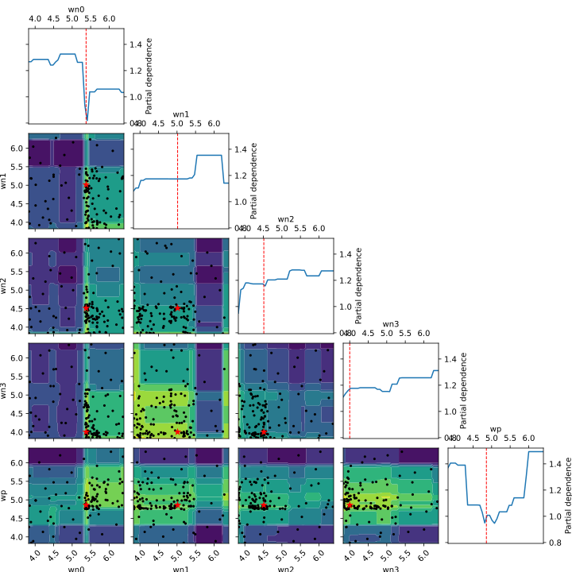


<h4 align="center">gbrt_minimize-GBRT-hammersly-PI</h4>

```
optimizer     gbrt_minimize
estimator              GBRT
generator         hammersly
acquisitor               PI
wn0                0.000006
wn1                0.000005
wn2                0.000019
wn3                0.000043
wp                 0.000015
vs0                1.647206
vs1                1.777742
vs2                1.702119
vs3                1.677029
cost               0.127081
time_stamp    045633-211103
```

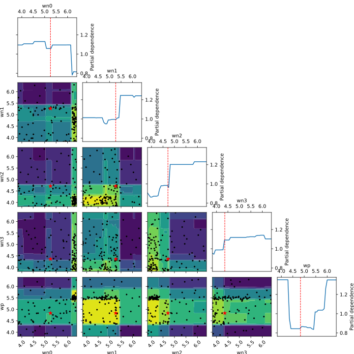


<h4 align="center">gbrt_minimize-GBRT-hammersly-gp_hedge</h4>

```
optimizer     gbrt_minimize
estimator              GBRT
generator         hammersly
acquisitor         gp_hedge
wn0                0.000001
wn1                0.000015
wn2                0.000027
wn3                 0.00005
wp                 0.000004
vs0                1.873573
vs1                 1.65005
vs2                1.638334
vs3                1.627146
cost               0.156451
time_stamp    045729-211103
```

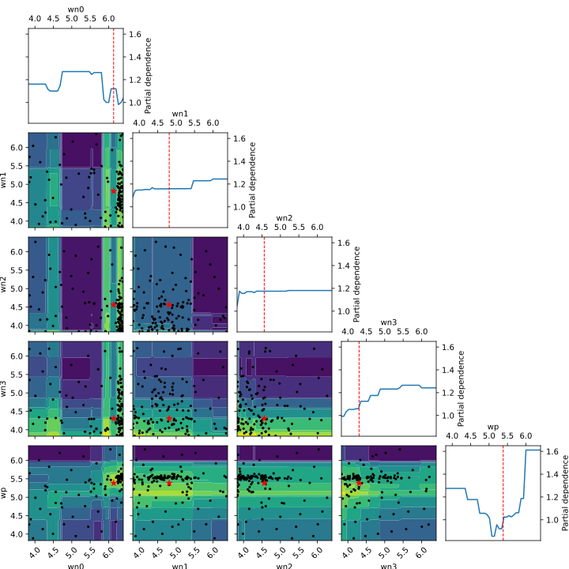


<h4 align="center">gbrt_minimize-GBRT-lhs-LCB</h4>

```
optimizer     gbrt_minimize
estimator              GBRT
generator               lhs
acquisitor              LCB
wn0                     0.0
wn1                0.000137
wn2                 0.00001
wn3                0.000002
wp                 0.000003
vs0                1.865529
vs1                1.562675
vs2                1.639219
vs3                1.764066
cost               0.259213
time_stamp    045839-211103
```


<h4 align="center">gbrt_minimize-GBRT-lhs-EI</h4>

```
optimizer     gbrt_minimize
estimator              GBRT
generator               lhs
acquisitor               EI
wn0                0.000135
wn1                0.000124
wn2                0.000126
wn3                0.000001
wp                 0.000009
vs0                1.671372
vs1                1.671463
vs2                1.671465
vs3                2.024777
cost               0.266107
time_stamp    045934-211103
```

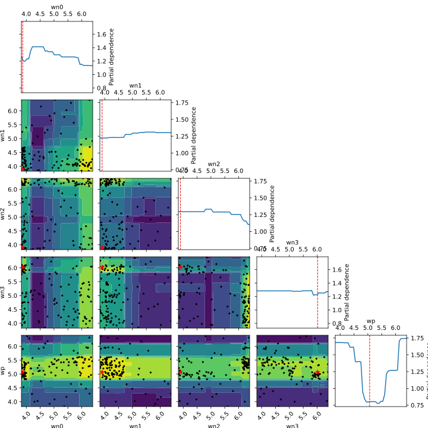


<h4 align="center">gbrt_minimize-GBRT-lhs-PI</h4>

```
optimizer     gbrt_minimize
estimator              GBRT
generator               lhs
acquisitor               PI
wn0                0.000001
wn1                0.000038
wn2                 0.00003
wn3                0.000044
wp                 0.000005
vs0                1.878081
vs1                1.627985
vs2                 1.64217
vs3                1.636893
cost               0.164263
time_stamp    050052-211103
```

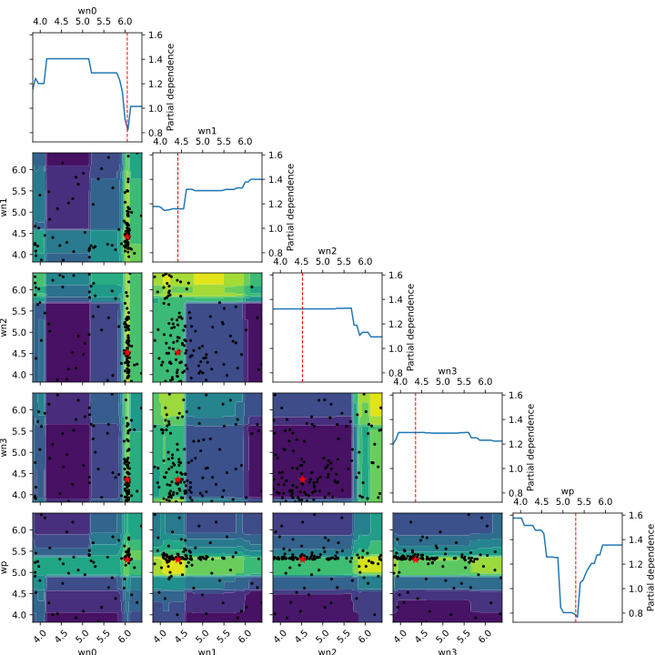


<h4 align="center">gbrt_minimize-GBRT-lhs-gp_hedge</h4>

```
optimizer     gbrt_minimize
estimator              GBRT
generator               lhs
acquisitor         gp_hedge
wn0                     0.0
wn1                0.000009
wn2                0.000011
wn3                 0.00004
wp                 0.000003
vs0                1.876139
vs1                1.654991
vs2                1.656818
vs3                1.626914
cost               0.158203
time_stamp    050141-211103
```

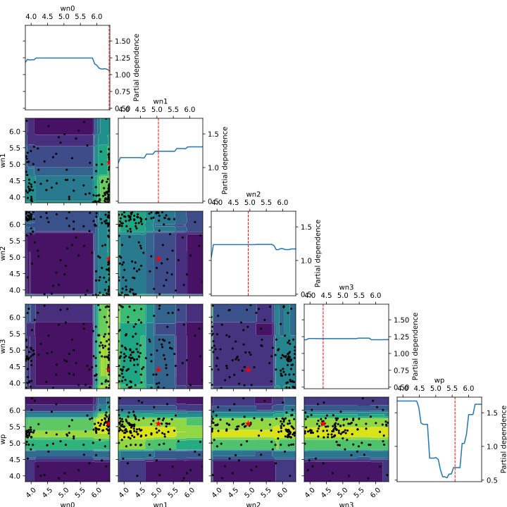


<h4 align="center">gbrt_minimize-GBRT-grid-LCB</h4>

```
optimizer     gbrt_minimize
estimator              GBRT
generator              grid
acquisitor              LCB
wn0                0.000009
wn1                0.000021
wn2                0.000021
wn3                 0.00005
wp                 0.000025
vs0                  1.6722
vs1                1.627583
vs2                1.693507
vs3                 1.65807
cost                 0.0583
time_stamp    050320-211103
```

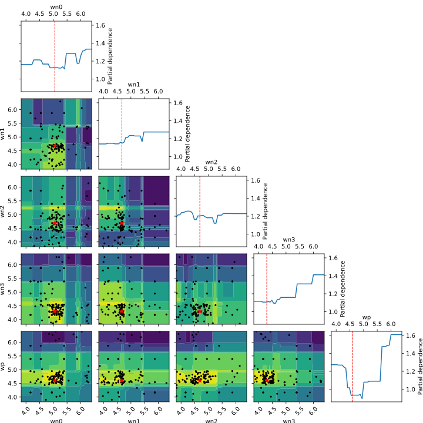


<h4 align="center">gbrt_minimize-GBRT-grid-EI</h4>

```
optimizer     gbrt_minimize
estimator              GBRT
generator              grid
acquisitor               EI
wn0                0.000007
wn1                0.000018
wn2                0.000037
wn3                0.000052
wp                 0.000022
vs0                1.726123
vs1                 1.66817
vs2                1.642903
vs3                1.646694
cost               0.063452
time_stamp    050409-211103
```


<h4 align="center">gbrt_minimize-GBRT-grid-PI</h4>

```
optimizer     gbrt_minimize
estimator              GBRT
generator              grid
acquisitor               PI
wn0                0.000012
wn1                0.000026
wn2                0.000044
wn3                0.000043
wp                 0.000032
vs0                1.649283
vs1                1.623721
vs2                1.621212
vs3                1.663603
cost               0.042052
time_stamp    050538-211103
```

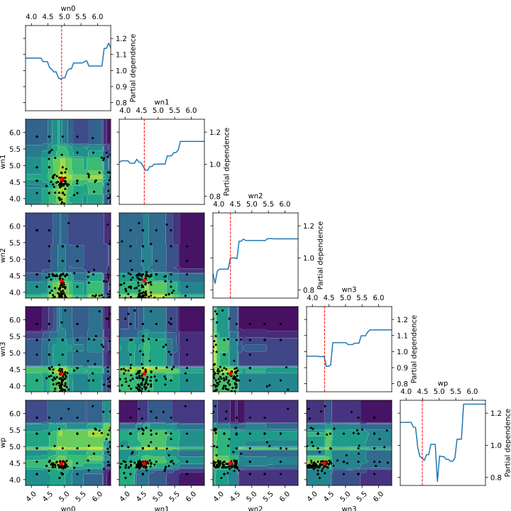


<h4 align="center">gbrt_minimize-GBRT-grid-gp_hedge</h4>

```
optimizer     gbrt_minimize
estimator              GBRT
generator              grid
acquisitor         gp_hedge
wn0                0.000009
wn1                0.000018
wn2                0.000028
wn3                 0.00008
wp                 0.000027
vs0                1.677332
vs1                1.669319
vs2                1.679007
vs3                1.635128
cost               0.054867
time_stamp    050627-211103
```

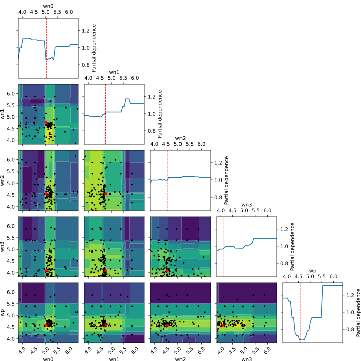


<h4 align="center">gp_minimize-GP-random-LCB</h4>

```
optimizer       gp_minimize
estimator                GP
generator            random
acquisitor              LCB
wn0                0.000007
wn1                0.000028
wn2                 0.00015
wn3                 0.00015
wp                 0.000031
vs0                 1.80719
vs1                1.710134
vs2                1.633147
vs3                1.643425
cost                0.14591
time_stamp    050754-211103
```

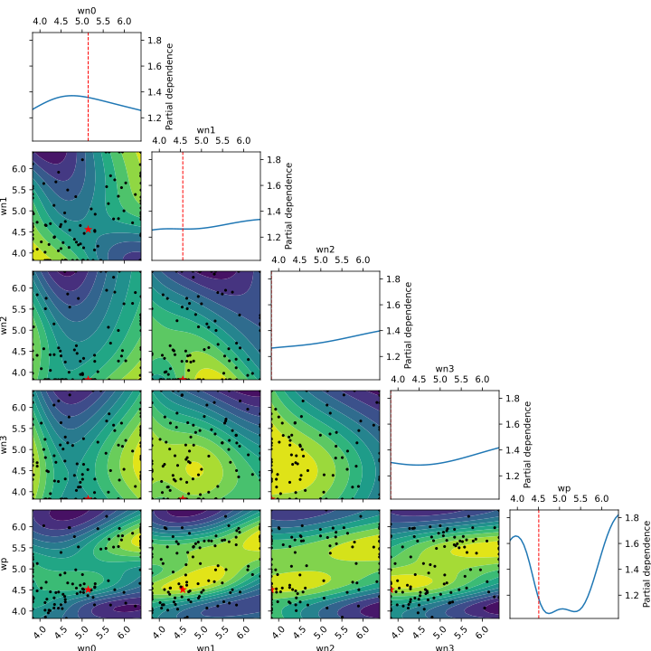


<h4 align="center">gp_minimize-GP-random-EI</h4>

```
optimizer       gp_minimize
estimator                GP
generator            random
acquisitor               EI
wn0                0.000007
wn1                0.000079
wn2                0.000023
wn3                0.000039
wp                 0.000024
vs0                1.750807
vs1                1.531893
vs2                1.674174
vs3                1.667011
cost               0.157635
time_stamp    050938-211103
```

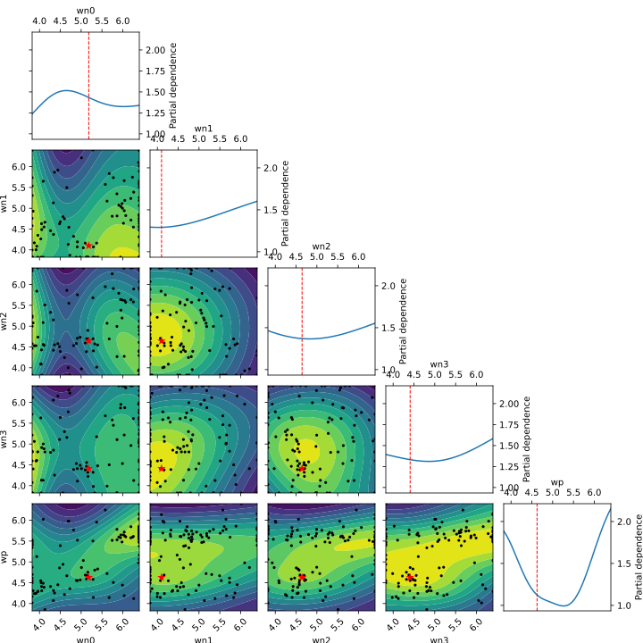


<h4 align="center">gp_minimize-GP-random-PI</h4>

```
optimizer       gp_minimize
estimator                GP
generator            random
acquisitor               PI
wn0                0.000001
wn1                0.000002
wn2                0.000003
wn3                0.000003
wp                 0.000003
vs0                1.724663
vs1                 1.64673
vs2                1.647518
vs3                1.689697
cost               0.072795
time_stamp    051155-211103
```

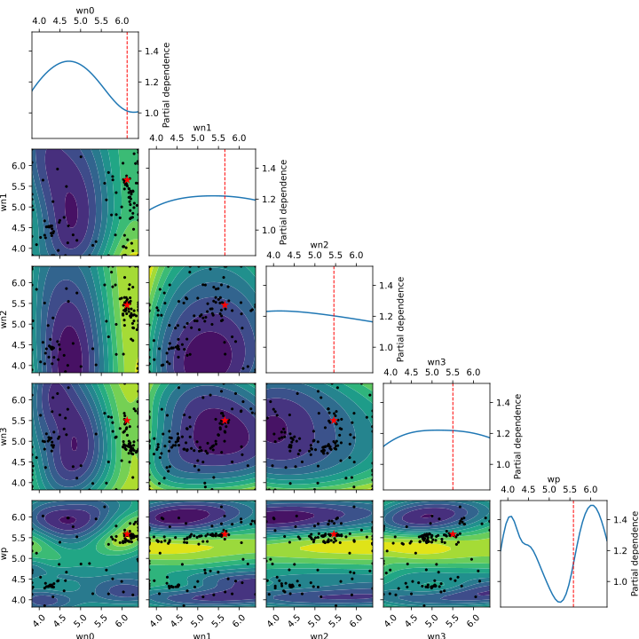


<h4 align="center">gp_minimize-GP-random-gp_hedge</h4>

```
optimizer       gp_minimize
estimator                GP
generator            random
acquisitor         gp_hedge
wn0                 0.00002
wn1                0.000039
wn2                0.000067
wn3                0.000134
wp                 0.000054
vs0                 1.64643
vs1                 1.64458
vs2                1.641931
vs3                1.620889
cost               0.027982
time_stamp    051323-211103
```

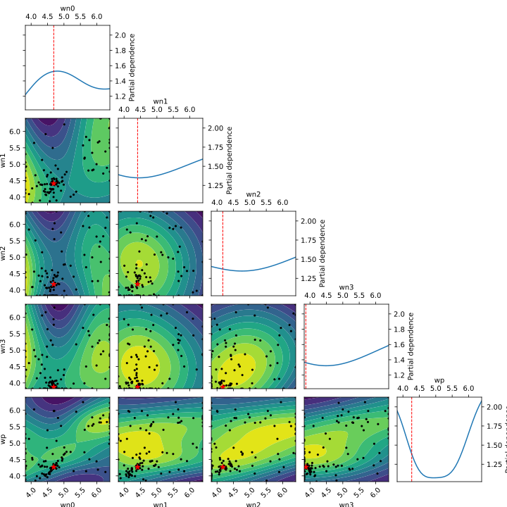


<h4 align="center">gp_minimize-GP-sobol-LCB</h4>

```
optimizer       gp_minimize
estimator                GP
generator             sobol
acquisitor              LCB
wn0                0.000016
wn1                0.000026
wn2                0.000016
wn3                 0.00015
wp                 0.000038
vs0                1.611874
vs1                1.636154
vs2                1.789597
vs3                1.664463
cost               0.124868
time_stamp    051532-211103
```

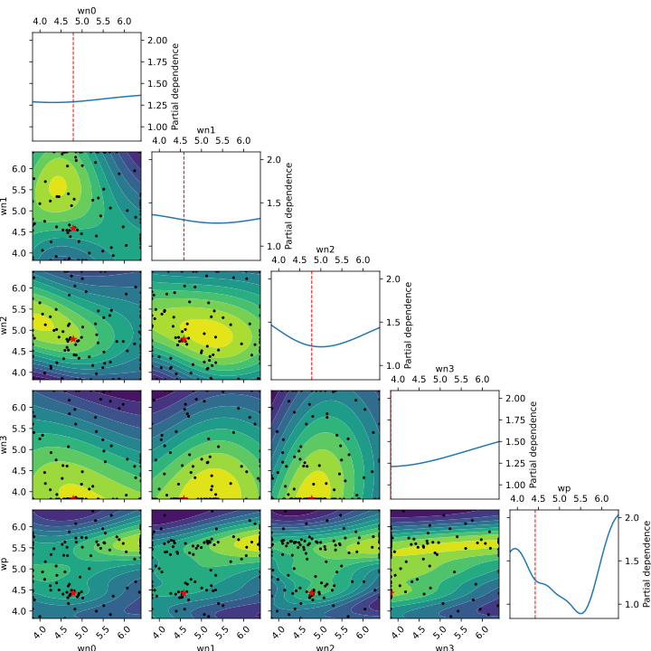


<h4 align="center">gp_minimize-GP-sobol-EI</h4>

```
optimizer       gp_minimize
estimator                GP
generator             sobol
acquisitor               EI
wn0                0.000013
wn1                0.000033
wn2                0.000048
wn3                0.000133
wp                 0.000039
vs0                1.686805
vs1                1.635867
vs2                1.648461
vs3                 1.60653
cost               0.058149
time_stamp    051659-211103
```

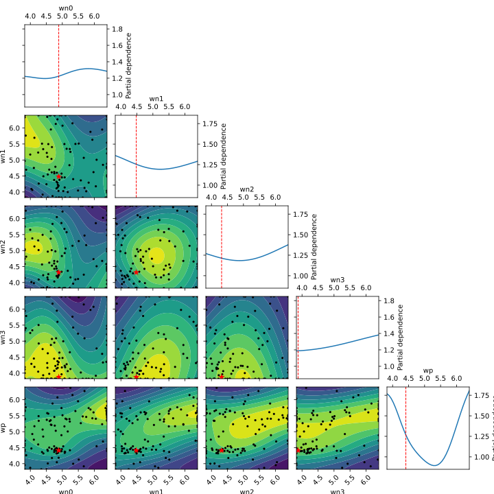


<h4 align="center">gp_minimize-GP-sobol-PI</h4>

```
optimizer       gp_minimize
estimator                GP
generator             sobol
acquisitor               PI
wn0                0.000013
wn1                0.000023
wn2                0.000054
wn3                0.000067
wp                 0.000037
vs0                1.664076
vs1                1.680682
vs2                1.645028
vs3                1.659184
cost               0.035706
time_stamp    051900-211103
```

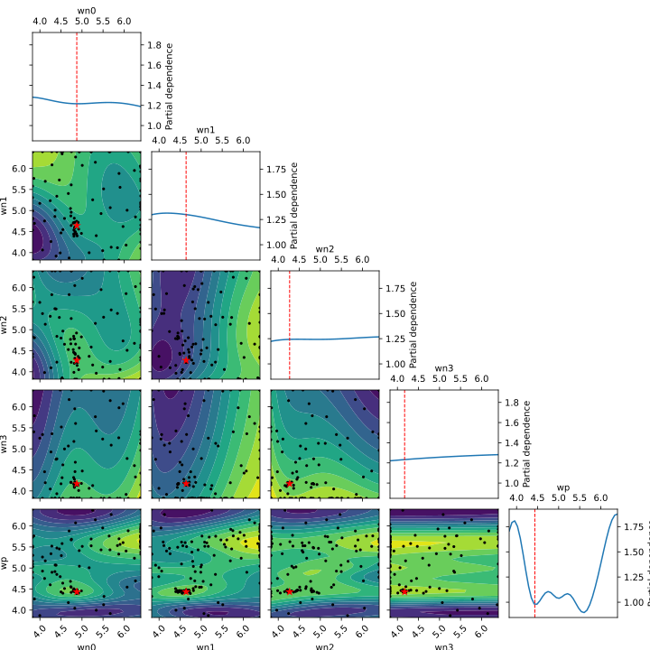


<h4 align="center">gp_minimize-GP-sobol-gp_hedge</h4>

```
optimizer       gp_minimize
estimator                GP
generator             sobol
acquisitor         gp_hedge
wn0                0.000011
wn1                0.000023
wn2                0.000039
wn3                0.000059
wp                  0.00003
vs0                1.664007
vs1                1.644327
vs2                1.641018
vs3                1.642941
cost               0.021648
time_stamp    052031-211103
```

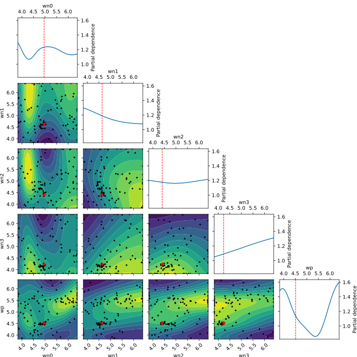


<h4 align="center">gp_minimize-GP-halton-LCB</h4>

```
optimizer       gp_minimize
estimator                GP
generator            halton
acquisitor              LCB
wn0                0.000014
wn1                0.000031
wn2                0.000077
wn3                0.000065
wp                 0.000041
vs0                1.683871
vs1                1.654342
vs2                1.612935
vs3                1.657053
cost               0.049897
time_stamp    052309-211103
```

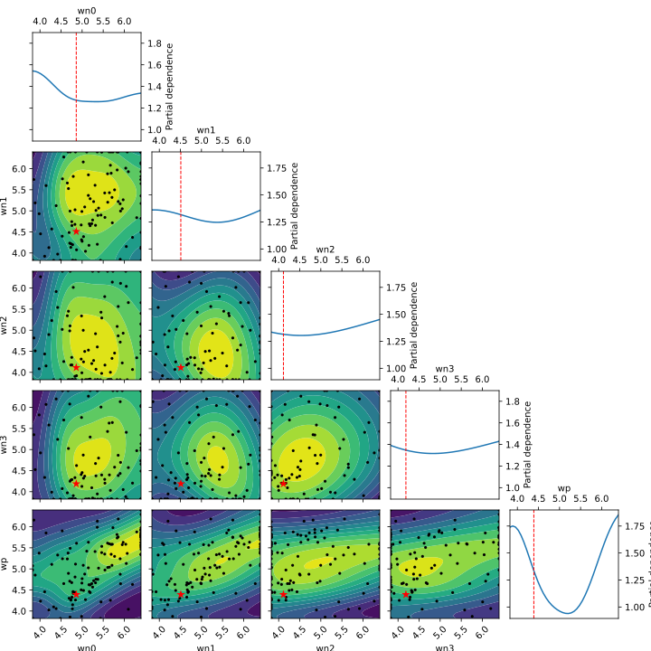


<h4 align="center">gp_minimize-GP-halton-EI</h4>

```
optimizer       gp_minimize
estimator                GP
generator            halton
acquisitor               EI
wn0                0.000002
wn1                0.000008
wn2                0.000009
wn3                0.000014
wp                 0.000007
vs0                1.758096
vs1                1.637463
vs2                1.664869
vs3                1.663313
cost               0.090191
time_stamp    052435-211103
```

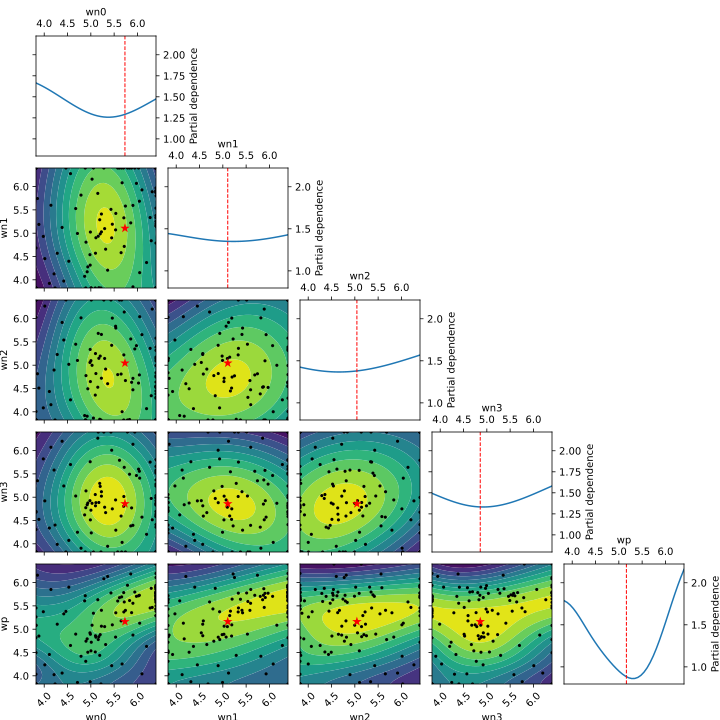


<h4 align="center">gp_minimize-GP-halton-PI</h4>

```
optimizer       gp_minimize
estimator                GP
generator            halton
acquisitor               PI
wn0                0.000008
wn1                0.000019
wn2                 0.00003
wn3                0.000038
wp                 0.000023
vs0                1.668891
vs1                1.632129
vs2                1.637448
vs3                1.655512
cost               0.033228
time_stamp    052634-211103
```

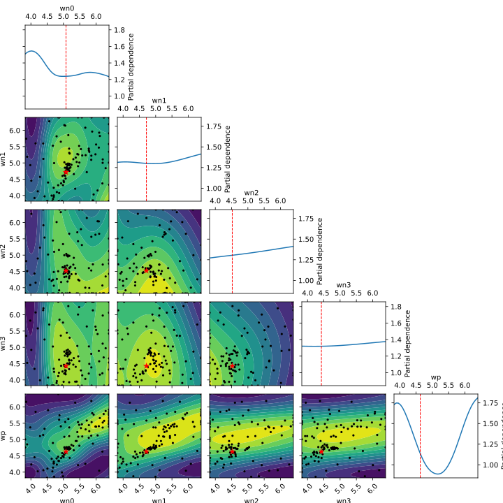


<h4 align="center">gp_minimize-GP-halton-gp_hedge</h4>

```
optimizer       gp_minimize
estimator                GP
generator            halton
acquisitor         gp_hedge
wn0                0.000012
wn1                0.000018
wn2                0.000044
wn3                0.000064
wp                 0.000031
vs0                  1.6526
vs1                1.695084
vs2                1.654003
vs3                  1.6567
cost               0.035386
time_stamp    052759-211103
```

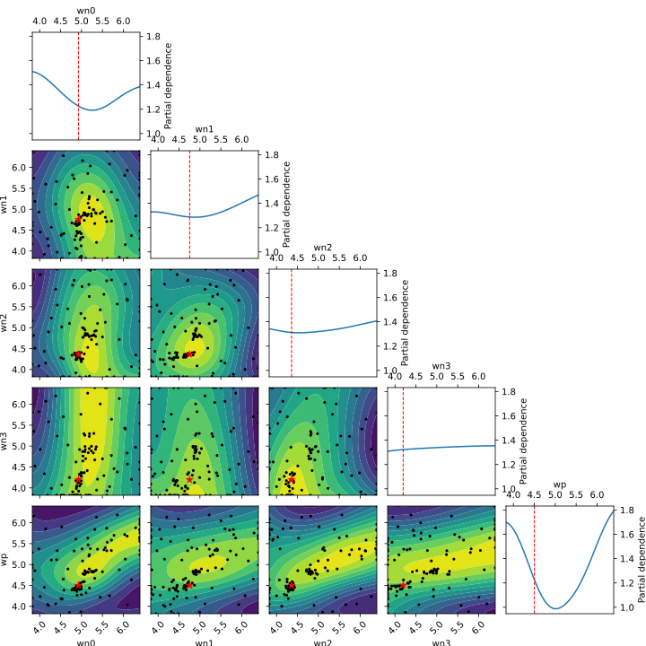


<h4 align="center">gp_minimize-GP-hammersly-LCB</h4>

```
optimizer       gp_minimize
estimator                GP
generator         hammersly
acquisitor              LCB
wn0                0.000014
wn1                0.000026
wn2                 0.00004
wn3                0.000054
wp                 0.000037
vs0                1.648981
vs1                1.655434
vs2                1.663227
vs3                1.677531
cost               0.028612
time_stamp    053032-211103
```

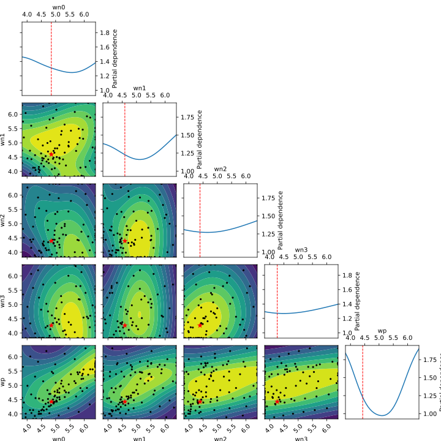


<h4 align="center">gp_minimize-GP-hammersly-EI</h4>

```
optimizer       gp_minimize
estimator                GP
generator         hammersly
acquisitor               EI
wn0                0.000021
wn1                0.000029
wn2                 0.00015
wn3                 0.00015
wp                 0.000062
vs0                1.679692
vs1                1.741884
vs2                1.641049
vs3                1.661965
cost               0.086359
time_stamp    053159-211103
```

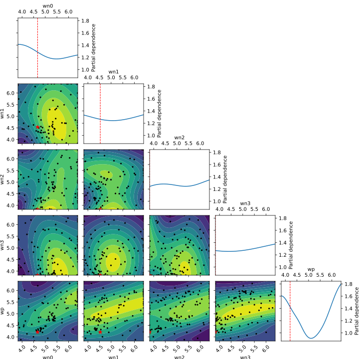


<h4 align="center">gp_minimize-GP-hammersly-PI</h4>

```
optimizer       gp_minimize
estimator                GP
generator         hammersly
acquisitor               PI
wn0                0.000006
wn1                0.000012
wn2                0.000022
wn3                0.000022
wp                 0.000016
vs0                1.655713
vs1                1.634232
vs2                1.624671
vs3                1.661608
cost               0.035405
time_stamp    053405-211103
```

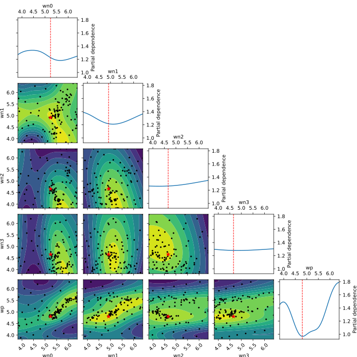


<h4 align="center">gp_minimize-GP-hammersly-gp_hedge</h4>

```
optimizer       gp_minimize
estimator                GP
generator         hammersly
acquisitor         gp_hedge
wn0                0.000005
wn1                0.000008
wn2                0.000017
wn3                0.000035
wp                 0.000014
vs0                1.646053
vs1                1.678817
vs2                1.657665
vs3                1.634592
cost               0.033841
time_stamp    053533-211103
```

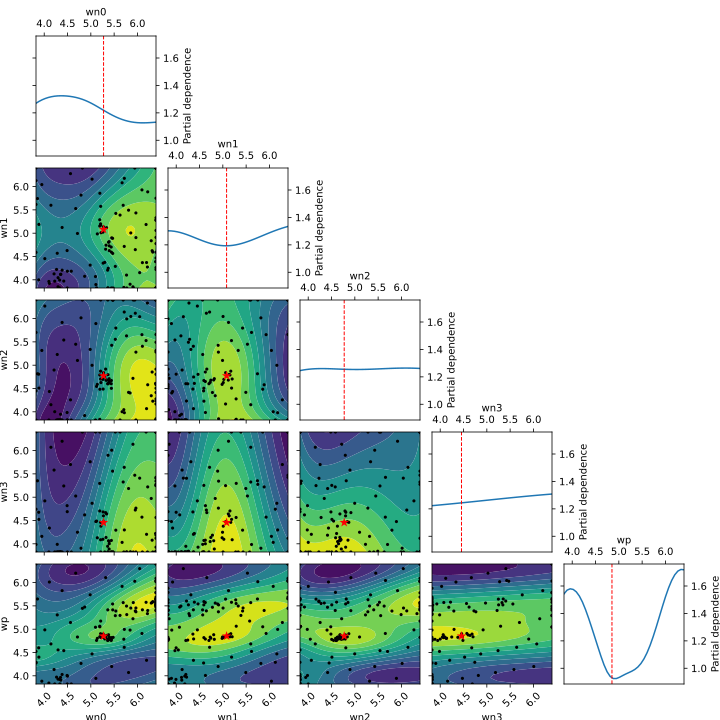


<h4 align="center">gp_minimize-GP-lhs-LCB</h4>

```
optimizer       gp_minimize
estimator                GP
generator               lhs
acquisitor              LCB
wn0                     0.0
wn1                     0.0
wn2                0.000001
wn3                     0.0
wp                 0.000001
vs0                1.591927
vs1                1.690238
vs2                 1.65215
vs3                1.799406
cost               0.151435
time_stamp    053807-211103
```

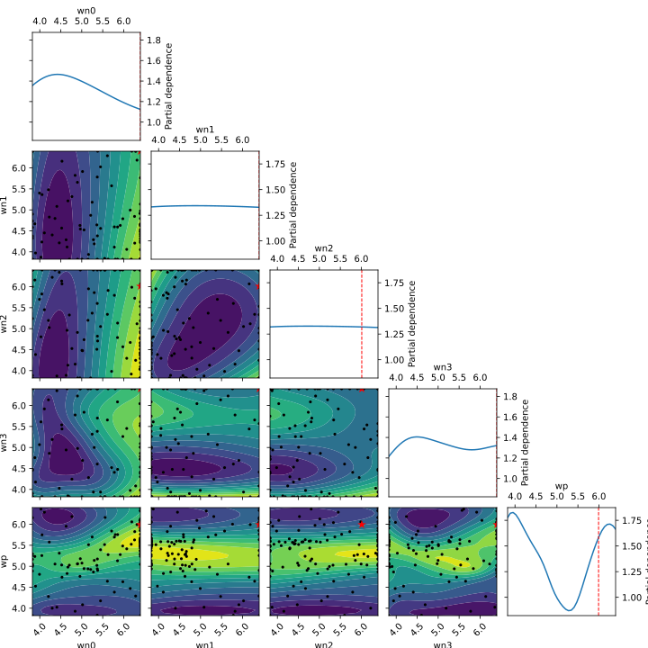


<h4 align="center">gp_minimize-GP-lhs-EI</h4>

```
optimizer       gp_minimize
estimator                GP
generator               lhs
acquisitor               EI
wn0                0.000002
wn1                0.000004
wn2                 0.00015
wn3                0.000021
wp                 0.000008
vs0                1.709469
vs1                1.743809
vs2                1.557174
vs3                1.643663
cost               0.152995
time_stamp    053934-211103
```

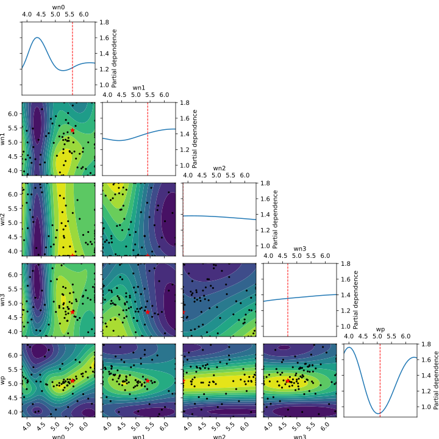


<h4 align="center">gp_minimize-GP-lhs-PI</h4>

```
optimizer       gp_minimize
estimator                GP
generator               lhs
acquisitor               PI
wn0                0.000001
wn1                0.000005
wn2                0.000007
wn3                0.000011
wp                 0.000005
vs0                1.773889
vs1                1.648294
vs2                1.658501
vs3                1.651633
cost                0.08226
time_stamp    054143-211103
```

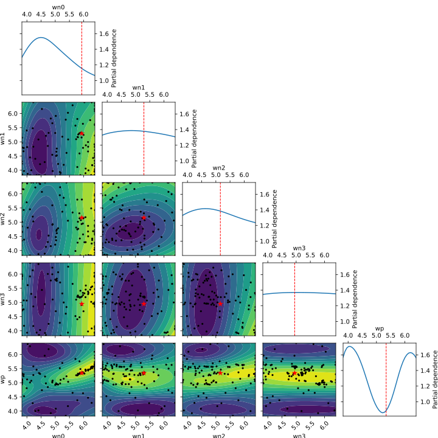


<h4 align="center">gp_minimize-GP-lhs-gp_hedge</h4>

```
optimizer       gp_minimize
estimator                GP
generator               lhs
acquisitor         gp_hedge
wn0                0.000004
wn1                0.000008
wn2                0.000012
wn3                0.000036
wp                 0.000011
vs0                1.657182
vs1                1.641353
vs2                1.661007
vs3                1.611064
cost               0.039861
time_stamp    054312-211103
```

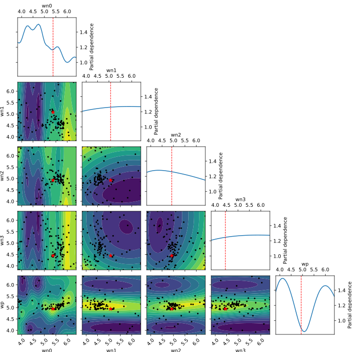


<h4 align="center">gp_minimize-GP-grid-LCB</h4>

```
optimizer       gp_minimize
estimator                GP
generator              grid
acquisitor              LCB
wn0                0.000012
wn1                0.000032
wn2                0.000067
wn3                0.000059
wp                 0.000039
vs0                1.710208
vs1                1.657262
vs2                1.633625
vs3                1.674198
cost               0.065481
time_stamp    054519-211103
```

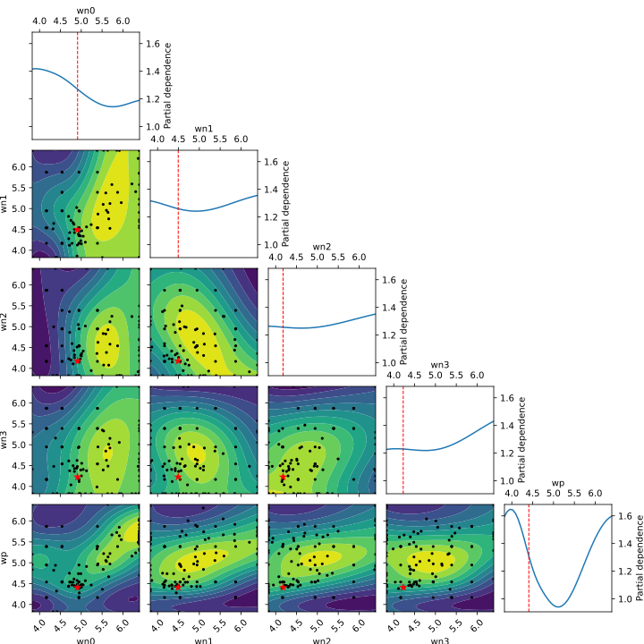


<h4 align="center">gp_minimize-GP-grid-EI</h4>

```
optimizer       gp_minimize
estimator                GP
generator              grid
acquisitor               EI
wn0                0.000004
wn1                0.000008
wn2                0.000016
wn3                0.000014
wp                  0.00001
vs0                1.672803
vs1                1.643215
vs2                1.617355
vs3                1.661794
cost               0.044864
time_stamp    054652-211103
```

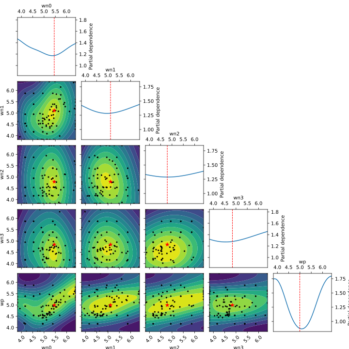


<h4 align="center">gp_minimize-GP-grid-PI</h4>

```
optimizer       gp_minimize
estimator                GP
generator              grid
acquisitor               PI
wn0                0.000008
wn1                0.000021
wn2                 0.00003
wn3                0.000048
wp                 0.000025
vs0                1.687366
vs1                1.638729
vs2                1.653753
vs3                1.648896
cost                0.03242
time_stamp    054816-211103
```

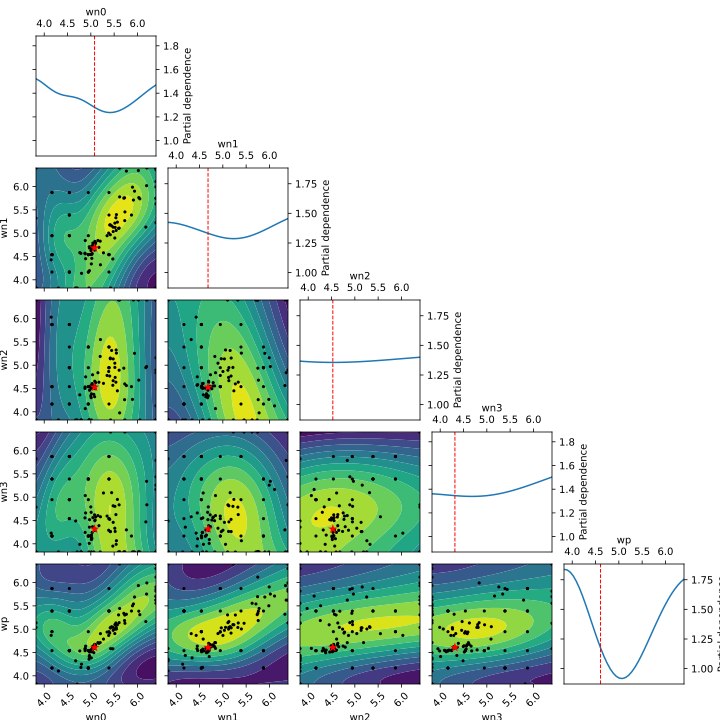


<h4 align="center">gp_minimize-GP-grid-gp_hedge</h4>

```
optimizer       gp_minimize
estimator                GP
generator              grid
acquisitor         gp_hedge
wn0                0.000009
wn1                0.000019
wn2                0.000019
wn3                0.000063
wp                 0.000024
vs0                1.650861
vs1                 1.63181
vs2                1.694014
vs3                1.636292
cost               0.046529
time_stamp    055015-211103
```

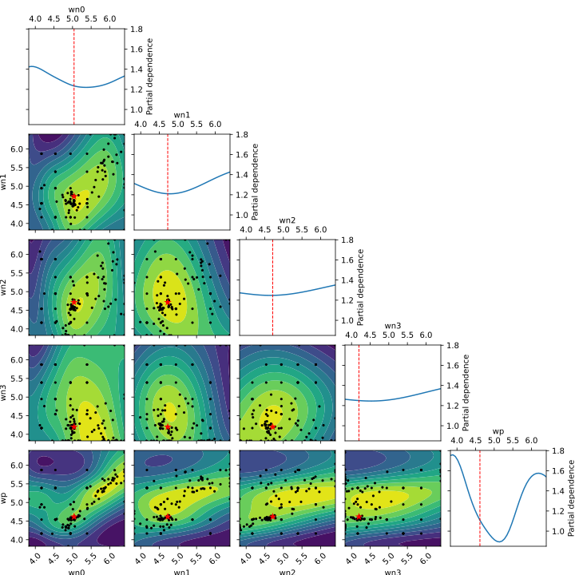


<h4 align="center">gp_minimize-RF-random-LCB</h4>

```
optimizer       gp_minimize
estimator                RF
generator            random
acquisitor              LCB
wn0                     0.0
wn1                0.000021
wn2                0.000036
wn3                0.000026
wp                 0.000003
vs0                1.903793
vs1                1.660202
vs2                1.651655
vs3                1.662352
cost               0.168486
time_stamp    055216-211103
```

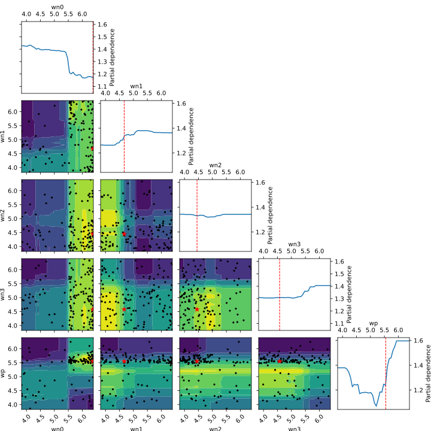


<h4 align="center">gp_minimize-RF-random-EI</h4>

```
optimizer       gp_minimize
estimator                RF
generator            random
acquisitor               EI
wn0                0.000027
wn1                0.000057
wn2                0.000136
wn3                0.000029
wp                 0.000076
vs0                1.676564
vs1                1.656663
vs2                1.618301
vs3                1.843505
cost               0.156625
time_stamp    060248-211103
```

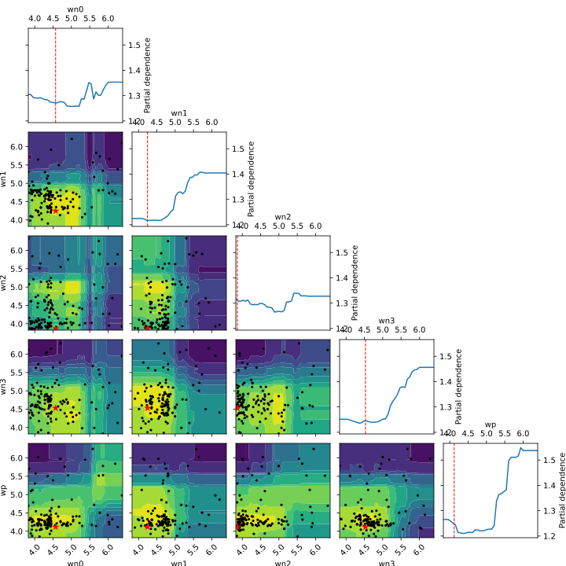


<h4 align="center">gp_minimize-RF-random-PI</h4>

```
optimizer       gp_minimize
estimator                RF
generator            random
acquisitor               PI
wn0                0.000001
wn1                0.000002
wn2                0.000001
wn3                0.000004
wp                 0.000002
vs0                1.617005
vs1                1.558194
vs2                1.717776
vs3                1.645242
cost               0.119597
time_stamp    061030-211103
```

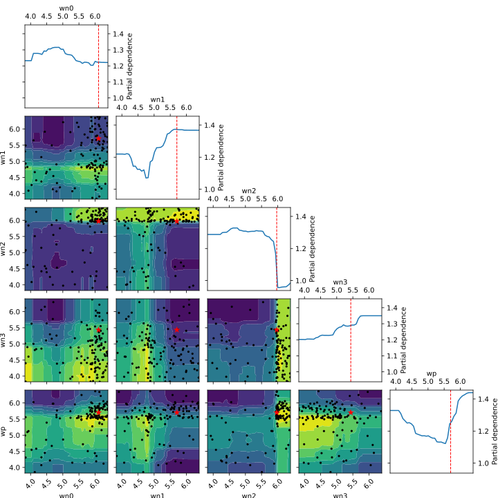


<h4 align="center">gp_minimize-RF-random-gp_hedge</h4>

```
optimizer       gp_minimize
estimator                RF
generator            random
acquisitor         gp_hedge
wn0                0.000033
wn1                0.000075
wn2                0.000063
wn3                0.000132
wp                 0.000074
vs0                1.595869
vs1                1.555706
vs2                1.646858
vs3                1.621359
cost               0.109217
time_stamp    061808-211103
```

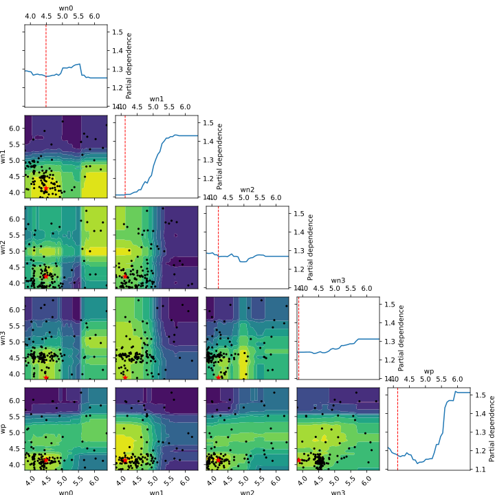


<h4 align="center">gp_minimize-RF-sobol-LCB</h4>

```
optimizer       gp_minimize
estimator                RF
generator             sobol
acquisitor              LCB
wn0                0.000007
wn1                0.000014
wn2                0.000093
wn3                0.000039
wp                 0.000019
vs0                1.659628
vs1                1.646006
vs2                1.528616
vs3                1.605778
cost               0.108623
time_stamp    062635-211103
```

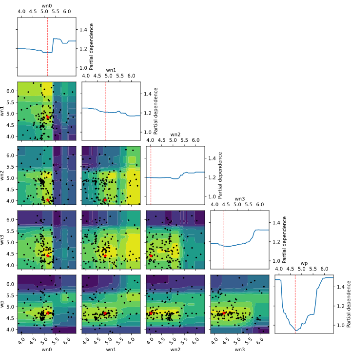


<h4 align="center">gp_minimize-RF-sobol-EI</h4>

```
optimizer       gp_minimize
estimator                RF
generator             sobol
acquisitor               EI
wn0                0.000011
wn1                 0.00003
wn2                0.000065
wn3                 0.00006
wp                 0.000034
vs0                1.712912
vs1                1.646757
vs2                1.619771
vs3                1.655593
cost               0.061804
time_stamp    063416-211103
```


<h4 align="center">gp_minimize-RF-sobol-PI</h4>

```
optimizer       gp_minimize
estimator                RF
generator             sobol
acquisitor               PI
wn0                0.000013
wn1                0.000029
wn2                0.000047
wn3                0.000113
wp                 0.000038
vs0                1.681416
vs1                1.655008
vs2                1.656206
vs3                1.623584
cost               0.041846
time_stamp    064240-211103
```

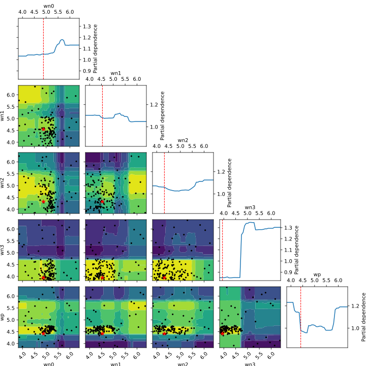


<h4 align="center">gp_minimize-RF-sobol-gp_hedge</h4>

```
optimizer       gp_minimize
estimator                RF
generator             sobol
acquisitor         gp_hedge
wn0                0.000015
wn1                 0.00002
wn2                0.000055
wn3                0.000144
wp                 0.000039
vs0                1.643688
vs1                1.710294
vs2                1.659062
vs3                1.622548
cost               0.062497
time_stamp    065021-211103
```

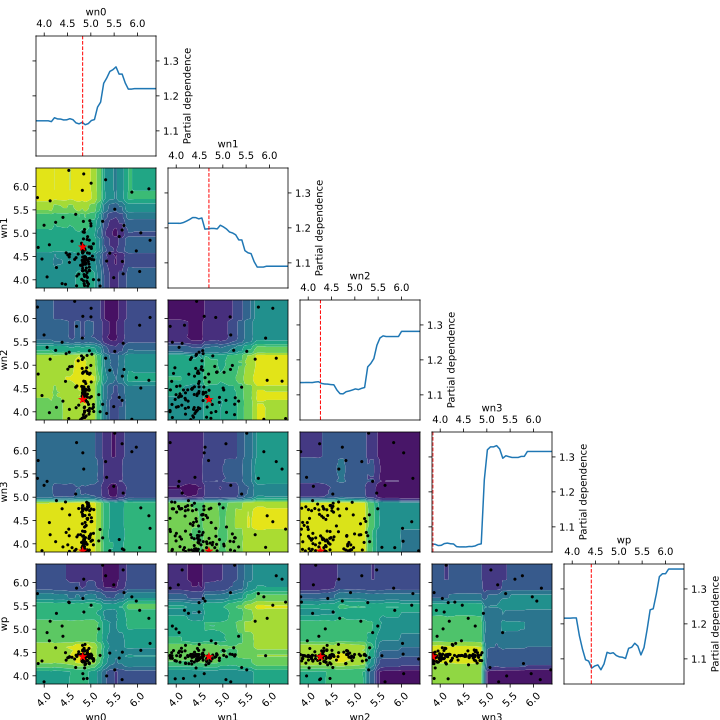


<h4 align="center">gp_minimize-RF-halton-LCB</h4>

```
optimizer       gp_minimize
estimator                RF
generator            halton
acquisitor              LCB
wn0                0.000001
wn1                0.000004
wn2                0.000028
wn3                0.000137
wp                 0.000005
vs0                1.804348
vs1                 1.72537
vs2                1.627941
vs3                1.590122
cost               0.188882
time_stamp    065841-211103
```

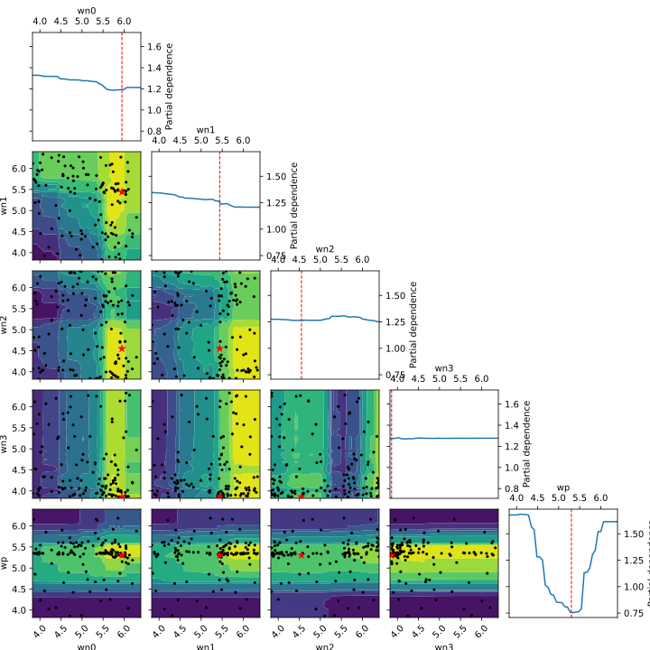


<h4 align="center">gp_minimize-RF-halton-EI</h4>

```
optimizer       gp_minimize
estimator                RF
generator            halton
acquisitor               EI
wn0                0.000001
wn1                0.000005
wn2                0.000111
wn3                0.000141
wp                 0.000004
vs0                1.877852
vs1                1.720446
vs2                1.630243
vs3                 1.62743
cost               0.206439
time_stamp    070858-211103
```

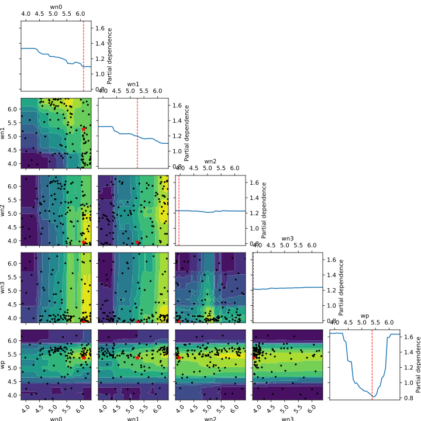


<h4 align="center">gp_minimize-RF-halton-PI</h4>

```
optimizer       gp_minimize
estimator                RF
generator            halton
acquisitor               PI
wn0                0.000003
wn1                0.000005
wn2                0.000008
wn3                 0.00002
wp                 0.000009
vs0                1.651611
vs1                1.669799
vs2                1.679718
vs3                1.646288
cost               0.033236
time_stamp    071647-211103
```

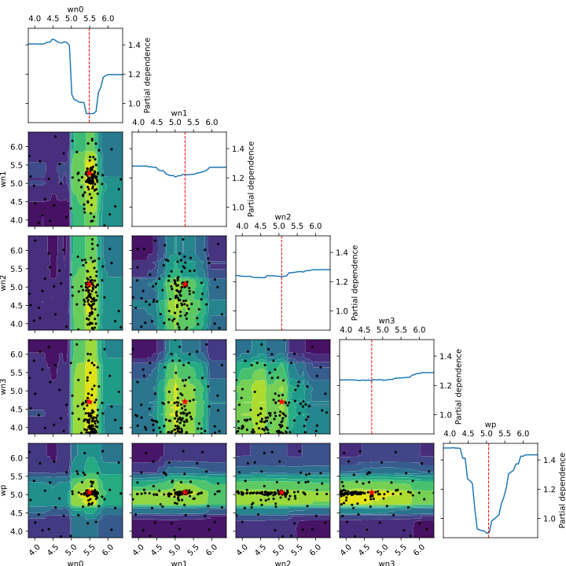


<h4 align="center">gp_minimize-RF-halton-gp_hedge</h4>

```
optimizer       gp_minimize
estimator                RF
generator            halton
acquisitor         gp_hedge
wn0                0.000002
wn1                0.000022
wn2                0.000003
wn3                0.000005
wp                 0.000005
vs0                1.699334
vs1                1.453892
vs2                1.688404
vs3                1.694429
cost               0.198955
time_stamp    072630-211103
```

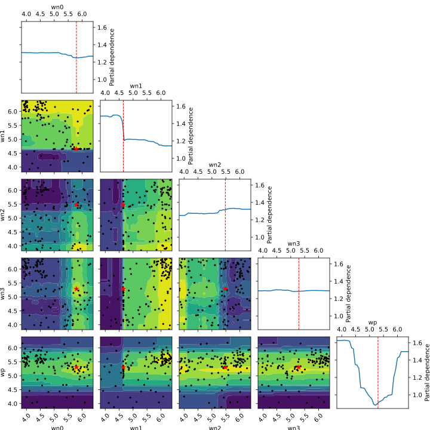


<h4 align="center">gp_minimize-RF-hammersly-LCB</h4>

```
optimizer       gp_minimize
estimator                RF
generator         hammersly
acquisitor              LCB
wn0                0.000006
wn1                0.000015
wn2                0.000016
wn3                0.000023
wp                 0.000016
vs0                1.633715
vs1                1.585429
vs2                1.636372
vs3                1.645942
cost               0.059722
time_stamp    073435-211103
```

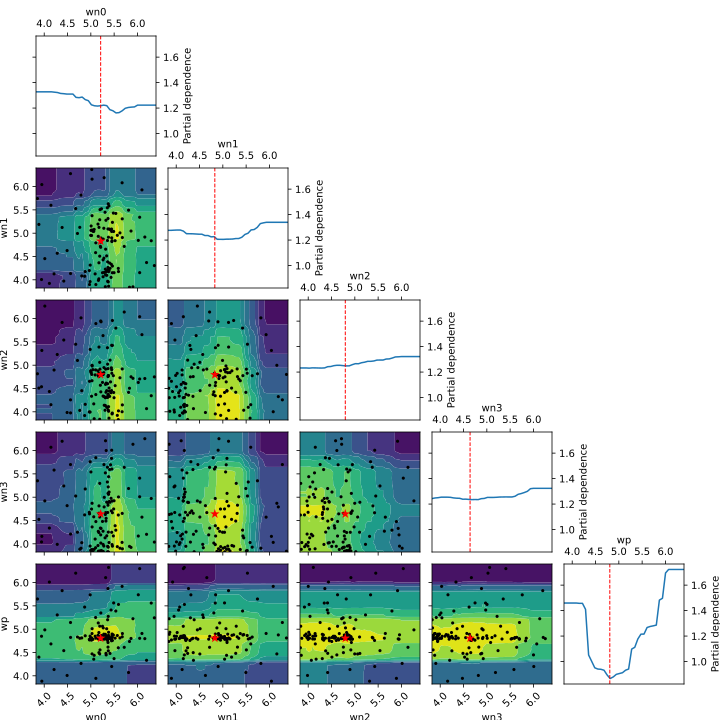


<h4 align="center">gp_minimize-RF-hammersly-EI</h4>

```
optimizer       gp_minimize
estimator                RF
generator         hammersly
acquisitor               EI
wn0                0.000004
wn1                0.000007
wn2                0.000009
wn3                0.000052
wp                  0.00001
vs0                1.665933
vs1                 1.66267
vs2                1.698743
vs3                1.609099
cost               0.071665
time_stamp    074420-211103
```

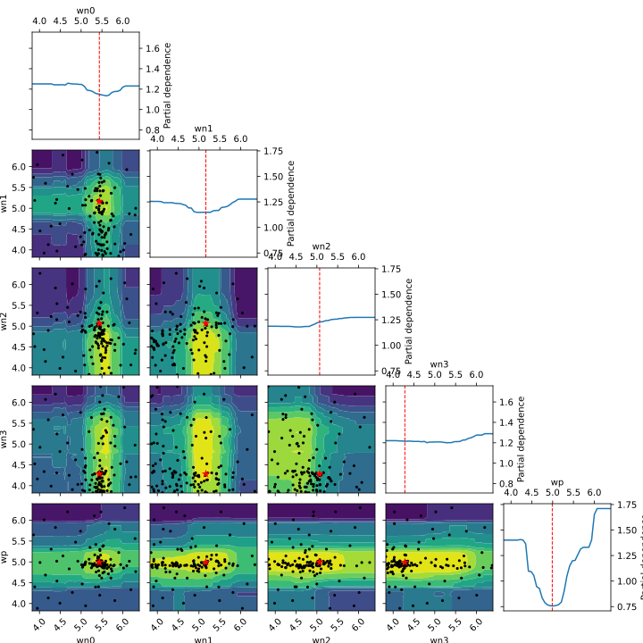


<h4 align="center">gp_minimize-RF-hammersly-PI</h4>

```
optimizer       gp_minimize
estimator                RF
generator         hammersly
acquisitor               PI
wn0                0.000004
wn1                0.000011
wn2                0.000013
wn3                0.000045
wp                 0.000011
vs0                1.674478
vs1                1.604209
vs2                1.640439
vs3                1.579891
cost               0.090872
time_stamp    075209-211103
```

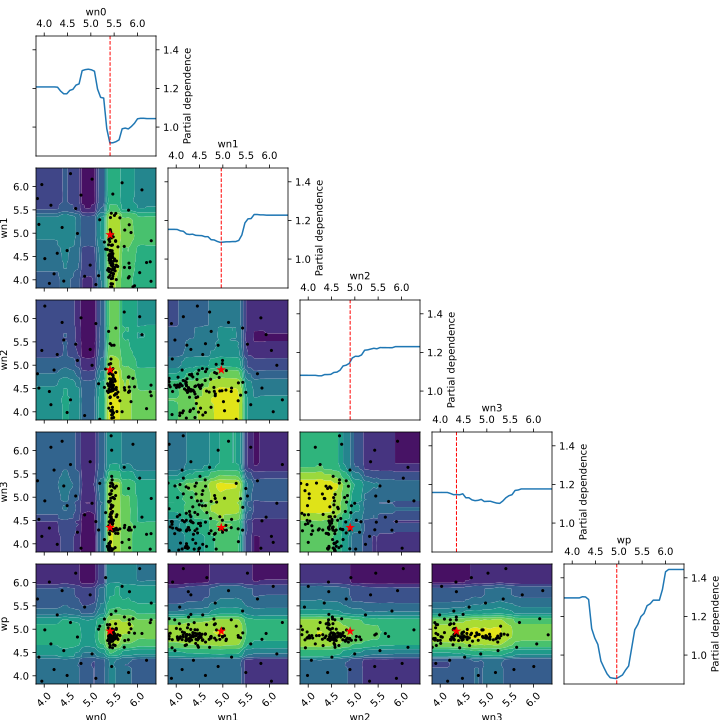


<h4 align="center">gp_minimize-RF-hammersly-gp_hedge</h4>

```
optimizer       gp_minimize
estimator                RF
generator         hammersly
acquisitor         gp_hedge
wn0                     0.0
wn1                0.000008
wn2                0.000019
wn3                0.000008
wp                 0.000003
vs0                 1.85927
vs1                1.646468
vs2                 1.62204
vs3                 1.66825
cost               0.156978
time_stamp    080049-211103
```

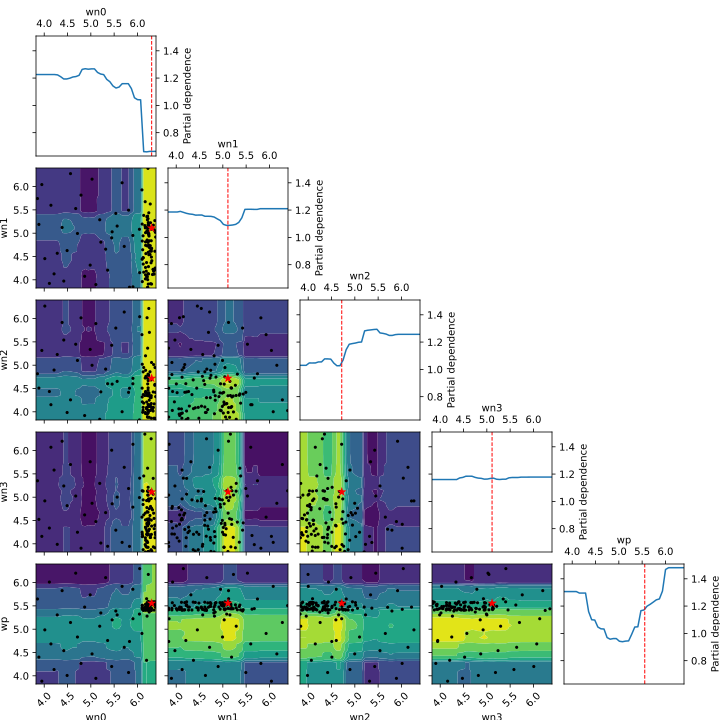


<h4 align="center">gp_minimize-RF-lhs-LCB</h4>

```
optimizer       gp_minimize
estimator                RF
generator               lhs
acquisitor              LCB
wn0                0.000001
wn1                0.000033
wn2                0.000001
wn3                0.000004
wp                 0.000002
vs0                1.727457
vs1                1.407581
vs2                1.736955
vs3                1.649724
cost               0.246732
time_stamp    080856-211103
```

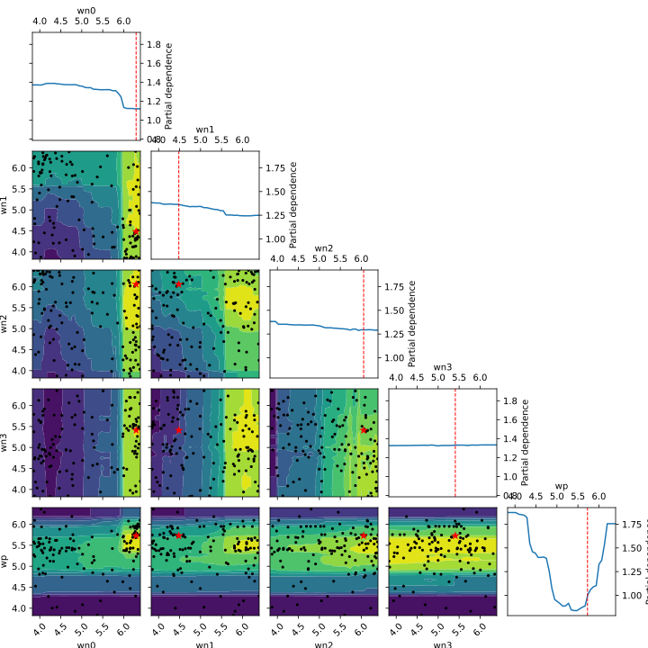


<h4 align="center">gp_minimize-RF-lhs-EI</h4>

```
optimizer       gp_minimize
estimator                RF
generator               lhs
acquisitor               EI
wn0                0.000005
wn1                0.000021
wn2                0.000039
wn3                0.000144
wp                 0.000018
vs0                1.773255
vs1                1.646796
vs2                1.633277
vs3                1.587307
cost               0.124773
time_stamp    081653-211103
```

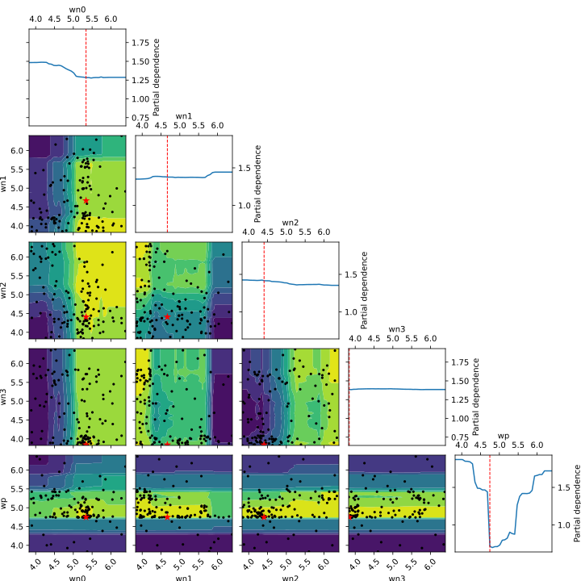


<h4 align="center">gp_minimize-RF-lhs-PI</h4>

```
optimizer       gp_minimize
estimator                RF
generator               lhs
acquisitor               PI
wn0                0.000001
wn1                0.000024
wn2                0.000014
wn3                0.000025
wp                 0.000003
vs0                1.891783
vs1                1.644959
vs2                1.670801
vs3                1.659841
cost               0.168161
time_stamp    082443-211103
```

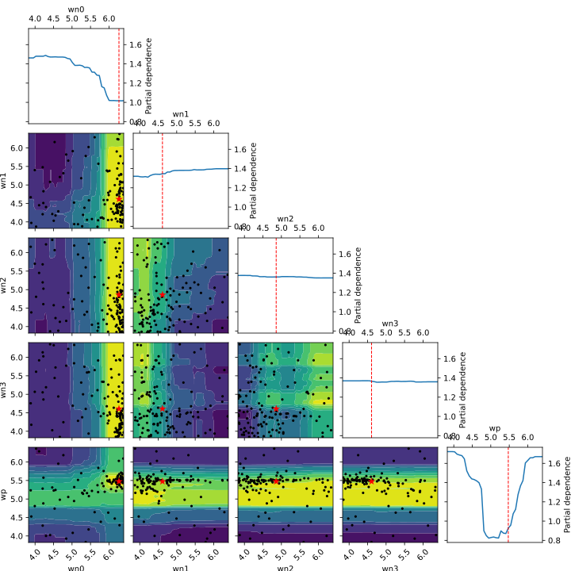


<h4 align="center">gp_minimize-RF-lhs-gp_hedge</h4>

```
optimizer       gp_minimize
estimator                RF
generator               lhs
acquisitor         gp_hedge
wn0                0.000001
wn1                0.000014
wn2                0.000008
wn3                0.000007
wp                 0.000004
vs0                1.806453
vs1                1.586633
vs2                1.644535
vs3                1.675004
cost               0.151691
time_stamp    083322-211103
```

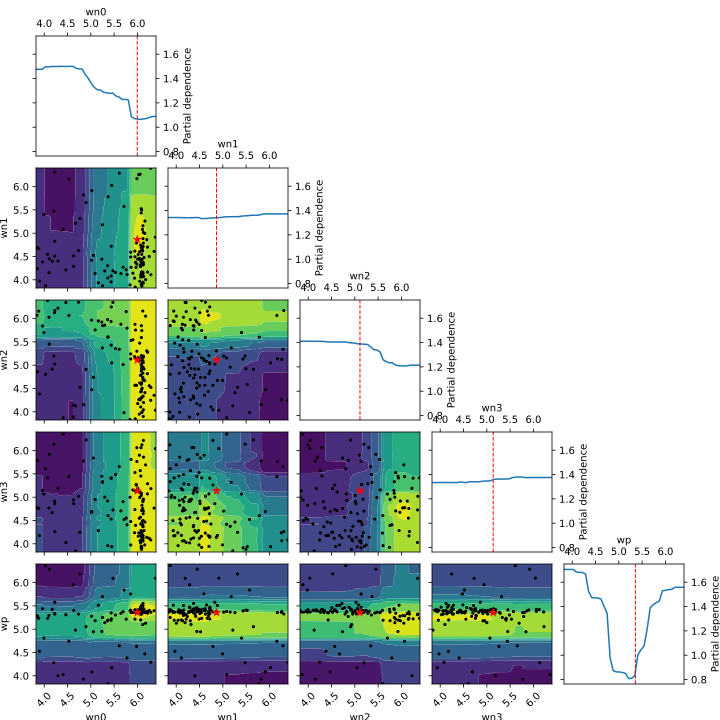


<h4 align="center">gp_minimize-RF-grid-LCB</h4>

```
optimizer       gp_minimize
estimator                RF
generator              grid
acquisitor              LCB
wn0                0.000011
wn1                0.000029
wn2                0.000029
wn3                0.000068
wp                 0.000029
vs0                1.635566
vs1                1.579743
vs2                1.639847
vs3                1.604662
cost               0.084959
time_stamp    084135-211103
```

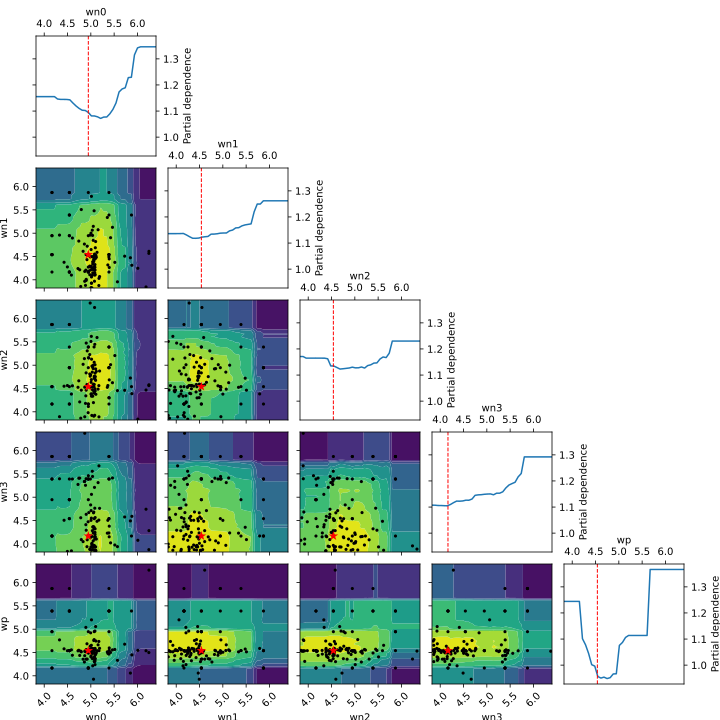


<h4 align="center">gp_minimize-RF-grid-EI</h4>

```
optimizer       gp_minimize
estimator                RF
generator              grid
acquisitor               EI
wn0                0.000012
wn1                0.000018
wn2                0.000041
wn3                0.000068
wp                  0.00003
vs0                1.626371
vs1                1.663618
vs2                1.631195
vs3                1.624231
cost               0.049588
time_stamp    085006-211103
```

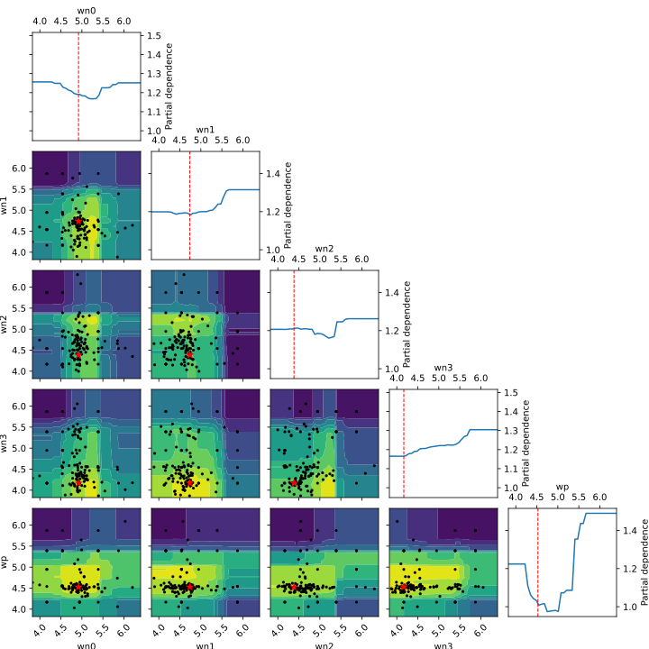


<h4 align="center">gp_minimize-RF-grid-PI</h4>

```
optimizer       gp_minimize
estimator                RF
generator              grid
acquisitor               PI
wn0                0.000004
wn1                0.000008
wn2                0.000011
wn3                0.000055
wp                 0.000012
vs0                 1.67123
vs1                1.658396
vs2                1.678833
vs3                1.603357
cost               0.063699
time_stamp    085758-211103
```

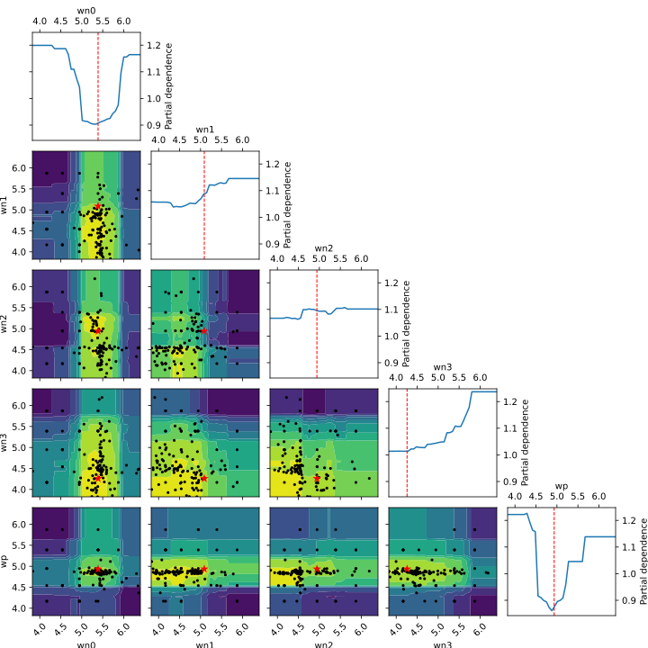


<h4 align="center">gp_minimize-RF-grid-gp_hedge</h4>

```
optimizer       gp_minimize
estimator                RF
generator              grid
acquisitor         gp_hedge
wn0                0.000012
wn1                0.000018
wn2                0.000041
wn3                0.000068
wp                  0.00003
vs0                1.626371
vs1                1.663618
vs2                1.631195
vs3                1.624231
cost               0.049588
time_stamp    090630-211103
```

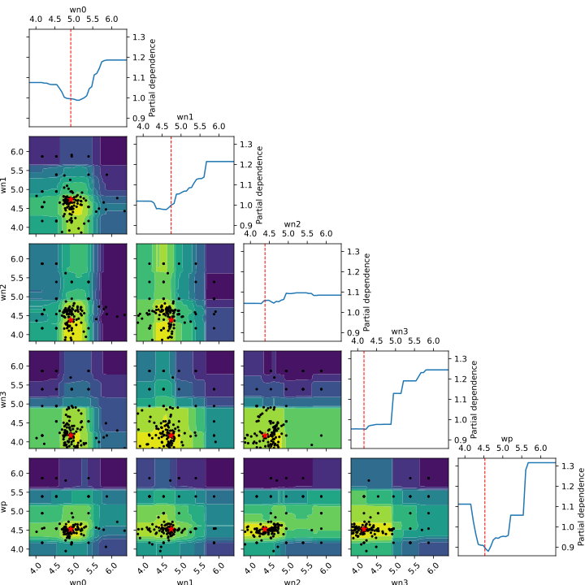


<h4 align="center">gp_minimize-ET-random-LCB</h4>

```
optimizer       gp_minimize
estimator                ET
generator            random
acquisitor              LCB
wn0                 0.00001
wn1                0.000046
wn2                0.000021
wn3                0.000087
wp                 0.000026
vs0                1.629138
vs1                1.489797
vs2                1.647402
vs3                1.563239
cost               0.163893
time_stamp    091443-211103
```

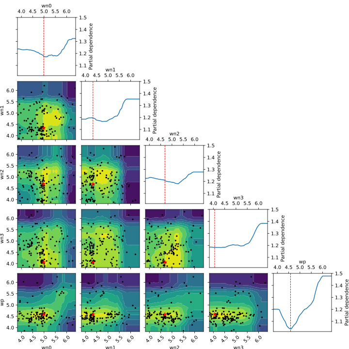


<h4 align="center">gp_minimize-ET-random-EI</h4>

```
optimizer       gp_minimize
estimator                ET
generator            random
acquisitor               EI
wn0                0.000015
wn1                0.000034
wn2                0.000028
wn3                0.000097
wp                 0.000041
vs0                1.653631
vs1                1.626447
vs2                1.715951
vs3                1.655023
cost                0.05949
time_stamp    092414-211103
```

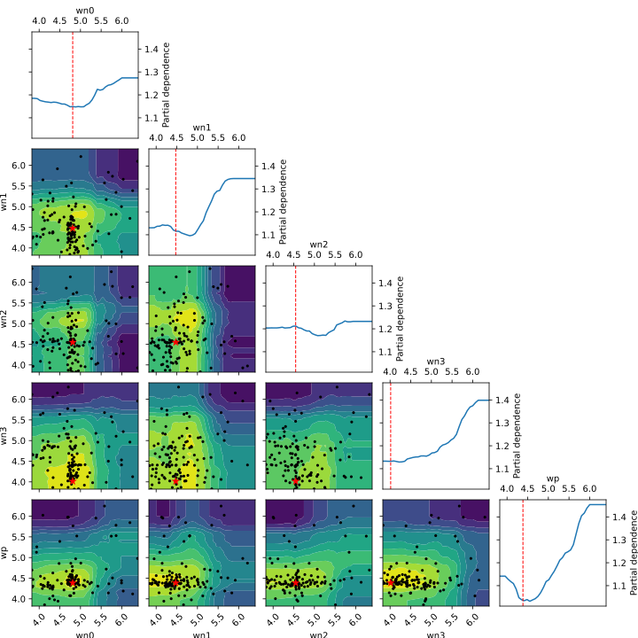


<h4 align="center">gp_minimize-ET-random-PI</h4>

```
optimizer       gp_minimize
estimator                ET
generator            random
acquisitor               PI
wn0                0.000001
wn1                0.000002
wn2                0.000004
wn3                0.000007
wp                 0.000003
vs0                 1.57631
vs1                1.618409
vs2                1.594028
vs3                1.578501
cost               0.141062
time_stamp    093214-211103
```

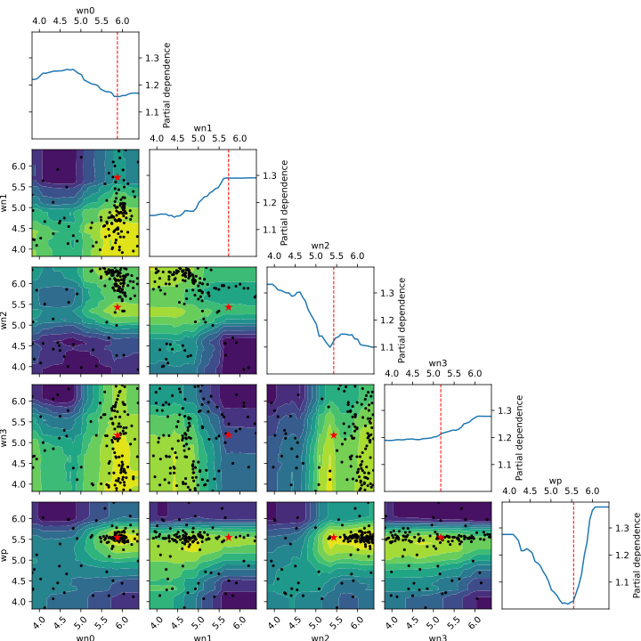


<h4 align="center">gp_minimize-ET-random-gp_hedge</h4>

```
optimizer       gp_minimize
estimator                ET
generator            random
acquisitor         gp_hedge
wn0                0.000001
wn1                0.000089
wn2                0.000053
wn3                0.000036
wp                 0.000006
vs0                1.887359
vs1                1.621005
vs2                1.637611
vs3                1.654258
cost               0.171516
time_stamp    094102-211103
```

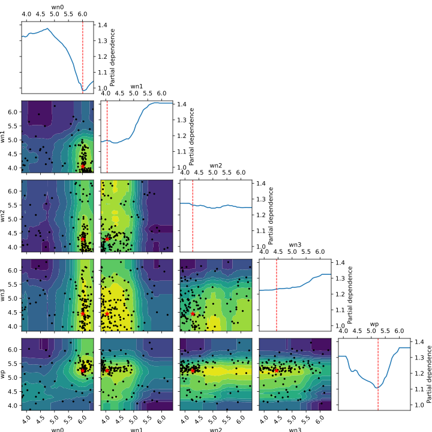


<h4 align="center">gp_minimize-ET-sobol-LCB</h4>

```
optimizer       gp_minimize
estimator                ET
generator             sobol
acquisitor              LCB
wn0                     0.0
wn1                0.000001
wn2                0.000002
wn3                0.000001
wp                 0.000001
vs0                1.657091
vs1                1.664682
vs2                1.607844
vs3                1.679344
cost               0.056529
time_stamp    094924-211103
```

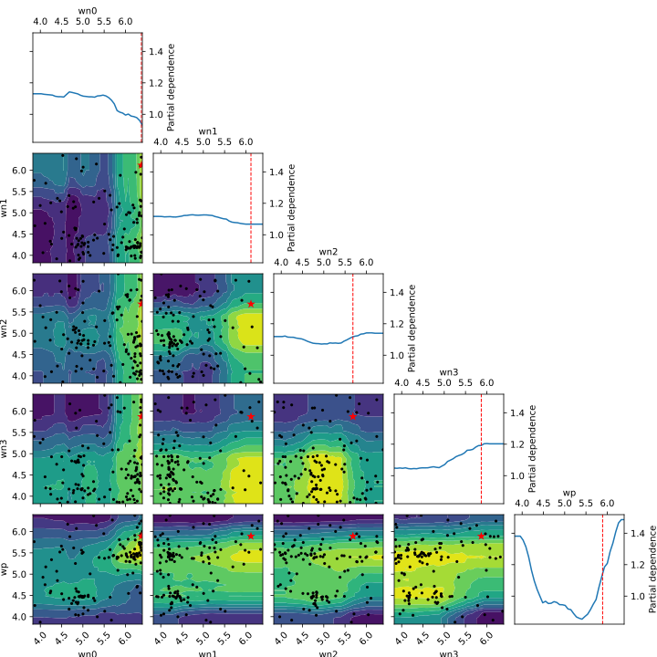


<h4 align="center">gp_minimize-ET-sobol-EI</h4>

```
optimizer       gp_minimize
estimator                ET
generator             sobol
acquisitor               EI
wn0                0.000017
wn1                0.000021
wn2                0.000056
wn3                0.000136
wp                 0.000046
vs0                1.656905
vs1                1.739195
vs2                 1.69459
vs3                1.663047
cost               0.093174
time_stamp    095740-211103
```

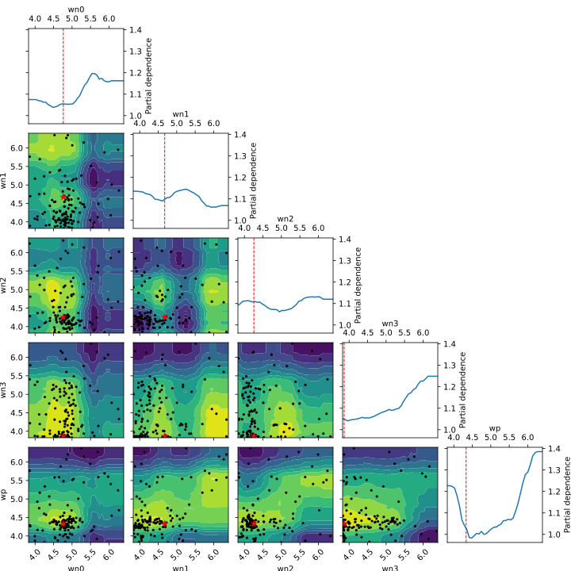


<h4 align="center">gp_minimize-ET-sobol-PI</h4>

```
optimizer       gp_minimize
estimator                ET
generator             sobol
acquisitor               PI
wn0                0.000012
wn1                0.000026
wn2                0.000093
wn3                0.000068
wp                 0.000036
vs0                1.688155
vs1                1.663205
vs2                1.593324
vs3                1.640958
cost               0.070957
time_stamp    100539-211103
```

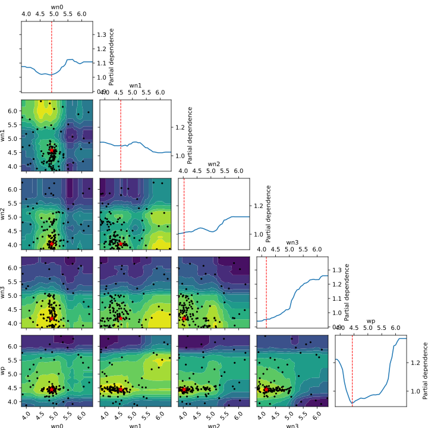


<h4 align="center">gp_minimize-ET-sobol-gp_hedge</h4>

```
optimizer       gp_minimize
estimator                ET
generator             sobol
acquisitor         gp_hedge
wn0                0.000009
wn1                0.000022
wn2                0.000028
wn3                0.000051
wp                 0.000028
vs0                1.689203
vs1                1.653638
vs2                1.681769
vs3                1.670727
cost                0.05778
time_stamp    101346-211103
```

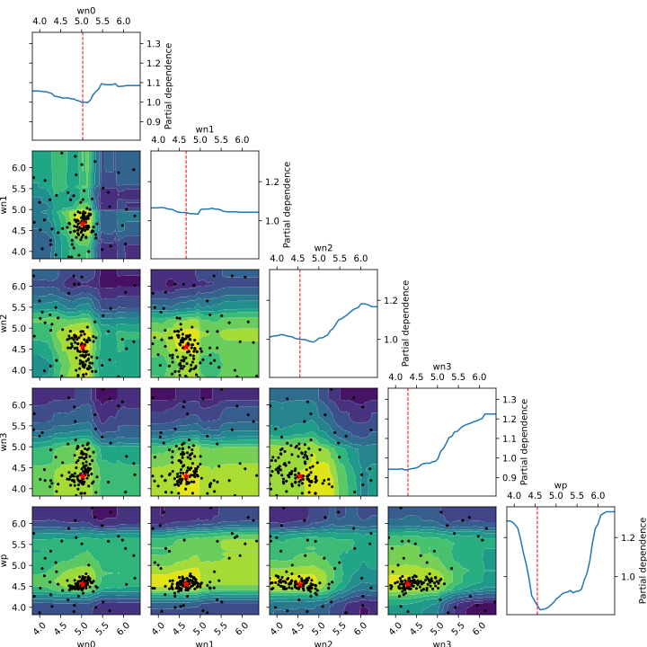


<h4 align="center">gp_minimize-ET-halton-LCB</h4>

```
optimizer       gp_minimize
estimator                ET
generator            halton
acquisitor              LCB
wn0                0.000001
wn1                0.000001
wn2                0.000003
wn3                0.000047
wp                 0.000002
vs0                1.743697
vs1                 1.68472
vs2                1.645101
vs3                1.554541
cost               0.138652
time_stamp    102156-211103
```

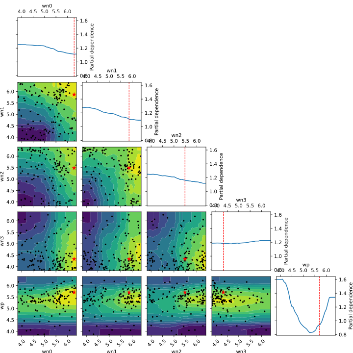


<h4 align="center">gp_minimize-ET-halton-EI</h4>

```
optimizer       gp_minimize
estimator                ET
generator            halton
acquisitor               EI
wn0                     0.0
wn1                0.000007
wn2                0.000011
wn3                0.000023
wp                 0.000003
vs0                1.870021
vs1                1.658638
vs2                1.655668
vs3                1.638629
cost               0.148908
time_stamp    102948-211103
```

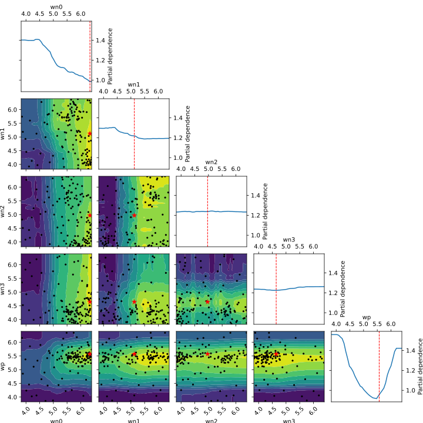


<h4 align="center">gp_minimize-ET-halton-PI</h4>

```
optimizer       gp_minimize
estimator                ET
generator            halton
acquisitor               PI
wn0                0.000002
wn1                0.000003
wn2                0.000007
wn3                0.000007
wp                 0.000004
vs0                     1.6
vs1                1.651105
vs2                1.587378
vs3                1.630486
cost               0.080752
time_stamp    103647-211103
```

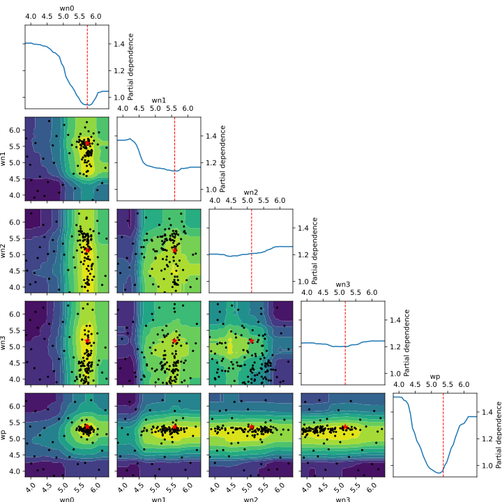


<h4 align="center">gp_minimize-ET-halton-gp_hedge</h4>

```
optimizer       gp_minimize
estimator                ET
generator            halton
acquisitor         gp_hedge
wn0                0.000001
wn1                0.000001
wn2                0.000002
wn3                0.000003
wp                 0.000002
vs0                 1.64097
vs1                1.625564
vs2                1.675478
vs3                1.650369
cost               0.035947
time_stamp    104459-211103
```

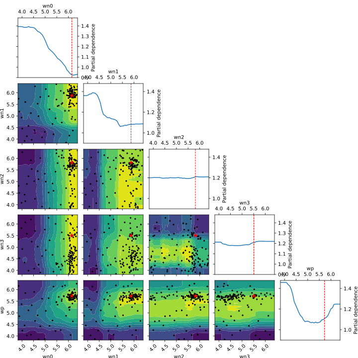


<h4 align="center">gp_minimize-ET-hammersly-LCB</h4>

```
optimizer       gp_minimize
estimator                ET
generator         hammersly
acquisitor              LCB
wn0                0.000003
wn1                0.000023
wn2                 0.00003
wn3                0.000051
wp                 0.000016
vs0                1.821753
vs1                1.664487
vs2                 1.67435
vs3                1.664836
cost               0.136622
time_stamp    105727-211103
```

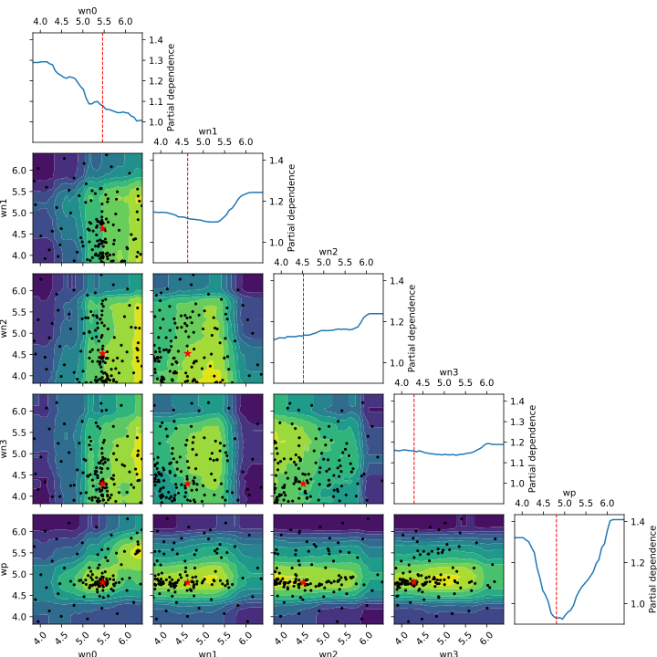


<h4 align="center">gp_minimize-ET-hammersly-EI</h4>

```
optimizer       gp_minimize
estimator                ET
generator         hammersly
acquisitor               EI
wn0                0.000005
wn1                0.000017
wn2                0.000018
wn3                 0.00003
wp                 0.000015
vs0                1.714992
vs1                1.616247
vs2                1.654997
vs3                1.648683
cost               0.063672
time_stamp    110434-211103
```

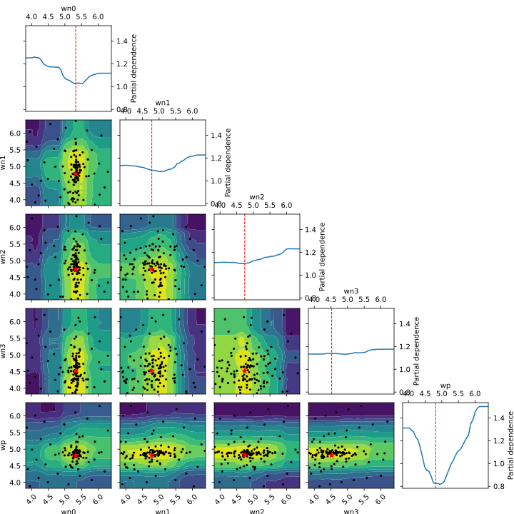


<h4 align="center">gp_minimize-ET-hammersly-PI</h4>

```
optimizer       gp_minimize
estimator                ET
generator         hammersly
acquisitor               PI
wn0                 0.00001
wn1                 0.00002
wn2                0.000016
wn3                0.000092
wp                 0.000028
vs0                1.661398
vs1                1.655359
vs2                1.754715
vs3                1.662118
cost               0.080964
time_stamp    111305-211103
```

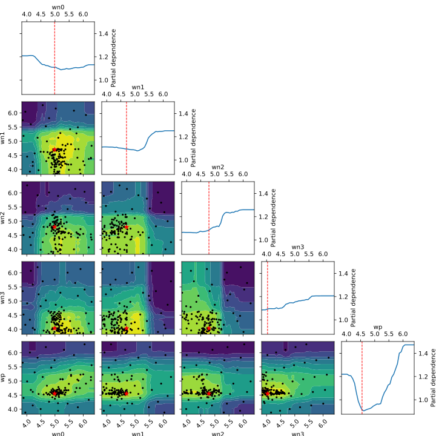


<h4 align="center">gp_minimize-ET-hammersly-gp_hedge</h4>

```
optimizer       gp_minimize
estimator                ET
generator         hammersly
acquisitor         gp_hedge
wn0                0.000006
wn1                0.000014
wn2                0.000014
wn3                0.000042
wp                 0.000015
vs0                1.648902
vs1                 1.60375
vs2                1.658869
vs3                1.606859
cost               0.060217
time_stamp    112000-211103
```

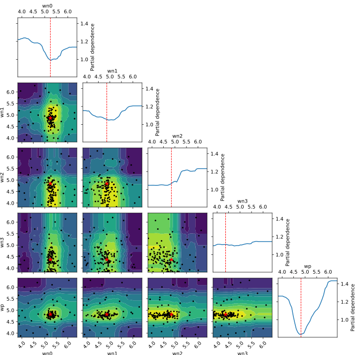


<h4 align="center">gp_minimize-ET-lhs-LCB</h4>

```
optimizer       gp_minimize
estimator                ET
generator               lhs
acquisitor              LCB
wn0                0.000001
wn1                0.000004
wn2                0.000016
wn3                0.000008
wp                 0.000004
vs0                1.756661
vs1                1.674466
vs2                1.599183
vs3                1.658868
cost               0.115644
time_stamp    113022-211103
```

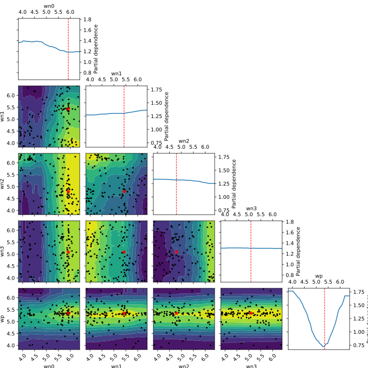


<h4 align="center">gp_minimize-ET-lhs-EI</h4>

```
optimizer       gp_minimize
estimator                ET
generator               lhs
acquisitor               EI
wn0                0.000007
wn1                0.000007
wn2                 0.00012
wn3                0.000057
wp                 0.000019
vs0                1.644522
vs1                1.789772
vs2                1.613094
vs3                1.657746
cost               0.115092
time_stamp    113827-211103
```

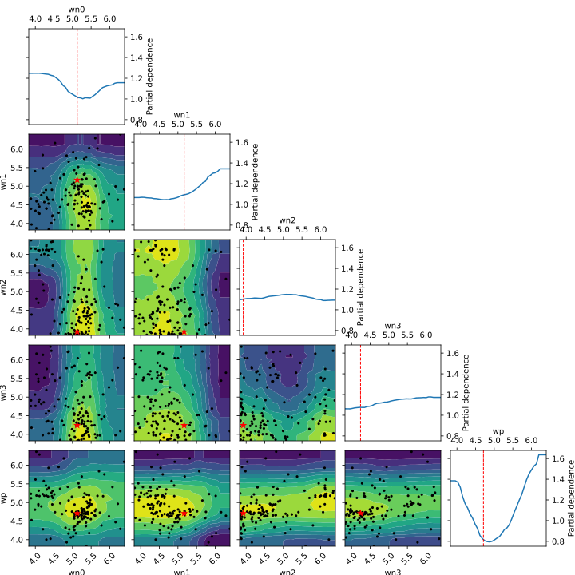


<h4 align="center">gp_minimize-ET-lhs-PI</h4>

```
optimizer       gp_minimize
estimator                ET
generator               lhs
acquisitor               PI
wn0                0.000009
wn1                 0.00003
wn2                0.000018
wn3                0.000001
wp                 0.000011
vs0                1.693963
vs1                 1.67529
vs2                1.682704
vs3                2.019254
cost               0.285583
time_stamp    114733-211103
```

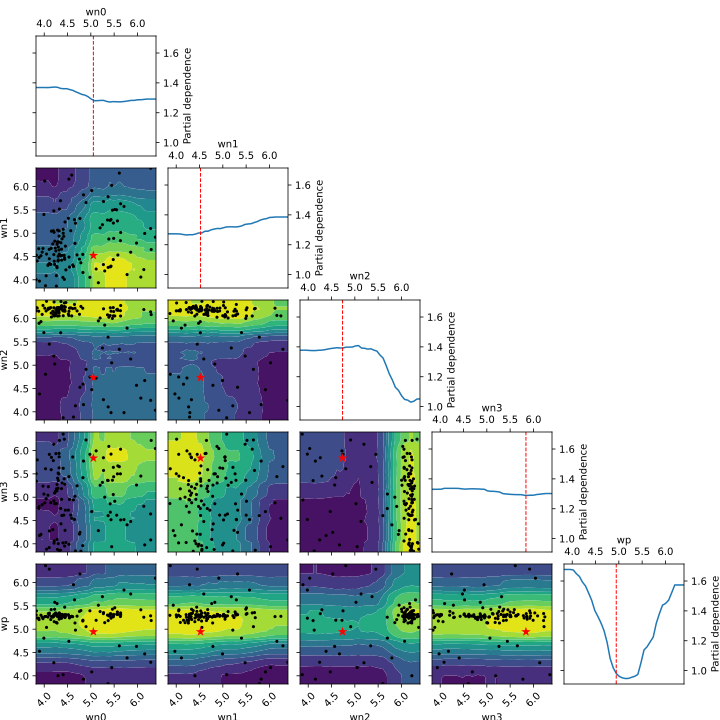


<h4 align="center">gp_minimize-ET-lhs-gp_hedge</h4>

```
optimizer       gp_minimize
estimator                ET
generator               lhs
acquisitor         gp_hedge
wn0                0.000002
wn1                0.000012
wn2                0.000007
wn3                0.000008
wp                 0.000006
vs0                1.727479
vs1                1.542423
vs2                1.628533
vs3                1.656358
cost               0.129018
time_stamp    115537-211103
```

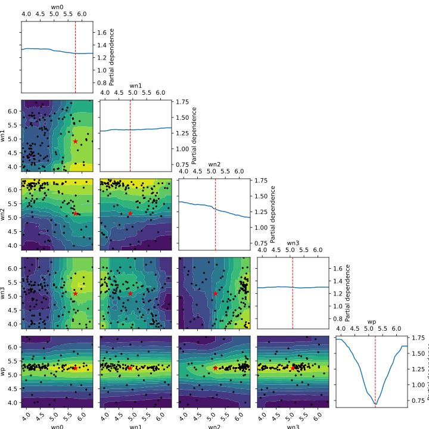


<h4 align="center">gp_minimize-ET-grid-LCB</h4>

```
optimizer       gp_minimize
estimator                ET
generator              grid
acquisitor              LCB
wn0                0.000011
wn1                0.000029
wn2                0.000029
wn3                0.000068
wp                 0.000029
vs0                1.635566
vs1                1.579743
vs2                1.639847
vs3                1.604662
cost               0.084959
time_stamp    120433-211103
```

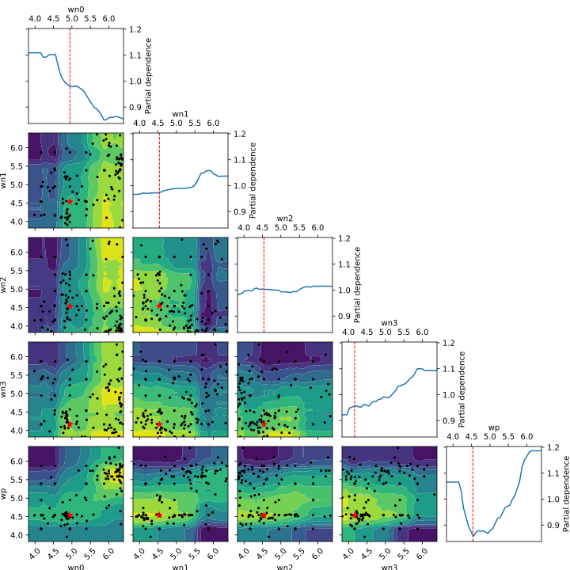


<h4 align="center">gp_minimize-ET-grid-EI</h4>

```
optimizer       gp_minimize
estimator                ET
generator              grid
acquisitor               EI
wn0                0.000015
wn1                0.000029
wn2                0.000045
wn3                0.000072
wp                 0.000041
vs0                  1.6602
vs1                1.652853
vs2                1.662488
vs3                1.659937
cost               0.021502
time_stamp    121245-211103
```

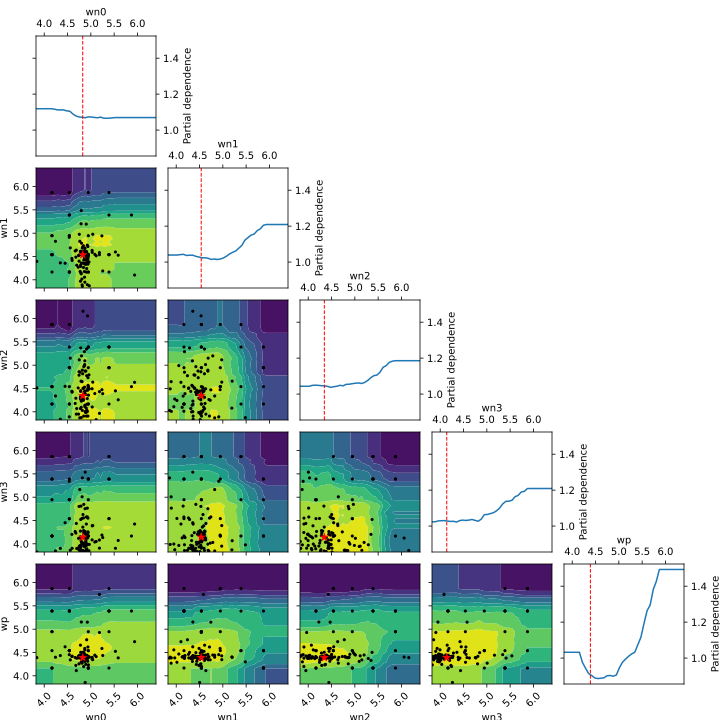


<h4 align="center">gp_minimize-ET-grid-PI</h4>

```
optimizer       gp_minimize
estimator                ET
generator              grid
acquisitor               PI
wn0                0.000012
wn1                0.000026
wn2                0.000044
wn3                0.000043
wp                 0.000032
vs0                1.649283
vs1                1.623721
vs2                1.621212
vs3                1.663603
cost               0.042052
time_stamp    122133-211103
```


<h4 align="center">gp_minimize-ET-grid-gp_hedge</h4>

```
optimizer       gp_minimize
estimator                ET
generator              grid
acquisitor         gp_hedge
wn0                0.000019
wn1                0.000031
wn2                0.000056
wn3                0.000105
wp                 0.000048
vs0                1.631462
vs1                1.657785
vs2                1.650943
vs3                1.635056
cost               0.025582
time_stamp    122942-211103
```

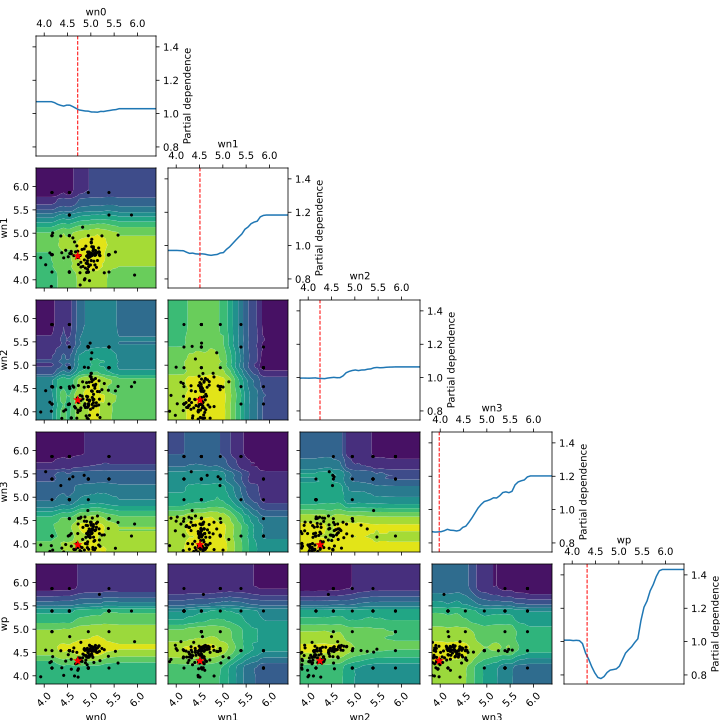


<h4 align="center">gp_minimize-GBRT-random-LCB</h4>

```
optimizer       gp_minimize
estimator              GBRT
generator            random
acquisitor              LCB
wn0                     0.0
wn1                0.000009
wn2                0.000005
wn3                0.000103
wp                 0.000003
vs0                1.893733
vs1                1.677592
vs2                1.719704
vs3                1.644474
cost               0.210033
time_stamp    123818-211103
```


<h4 align="center">gp_minimize-GBRT-random-EI</h4>

```
optimizer       gp_minimize
estimator              GBRT
generator            random
acquisitor               EI
wn0                0.000001
wn1                0.000022
wn2                0.000074
wn3                0.000009
wp                 0.000004
vs0                1.882772
vs1                1.640654
vs2                  1.6149
vs3                1.692458
cost               0.193743
time_stamp    123920-211103
```

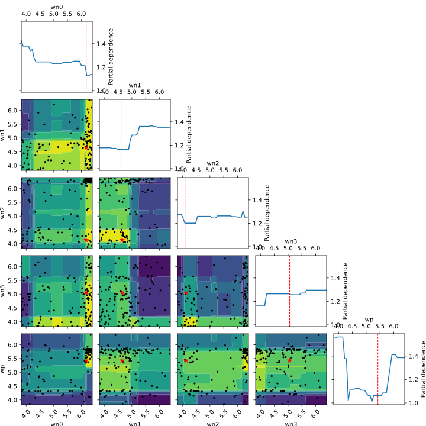


<h4 align="center">gp_minimize-GBRT-random-PI</h4>

```
optimizer       gp_minimize
estimator              GBRT
generator            random
acquisitor               PI
wn0                     0.0
wn1                0.000011
wn2                0.000014
wn3                0.000006
wp                 0.000003
vs0                1.876032
vs1                1.646285
vs2                1.648598
vs3                1.698965
cost               0.169766
time_stamp    124044-211103
```

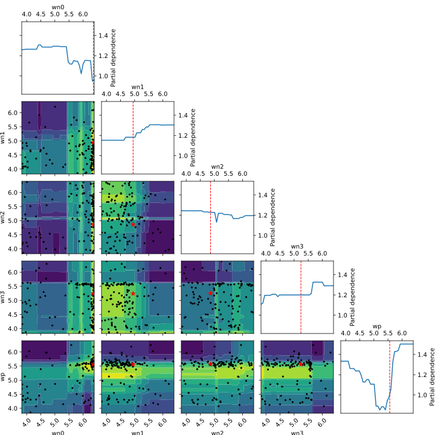


<h4 align="center">gp_minimize-GBRT-random-gp_hedge</h4>

```
optimizer       gp_minimize
estimator              GBRT
generator            random
acquisitor         gp_hedge
wn0                0.000135
wn1                0.000019
wn2                0.000054
wn3                0.000106
wp                 0.000058
vs0                1.160184
vs1                1.718863
vs2                1.654058
vs3                 1.63537
cost               0.349919
time_stamp    124146-211103
```

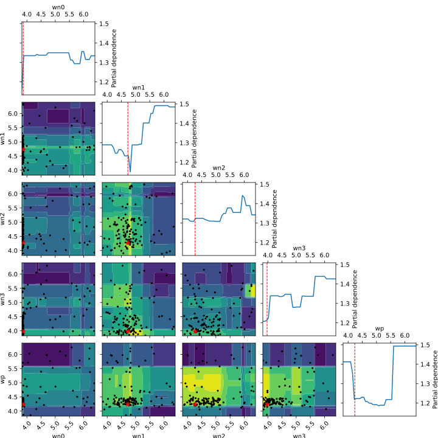


<h4 align="center">gp_minimize-GBRT-sobol-LCB</h4>

```
optimizer       gp_minimize
estimator              GBRT
generator             sobol
acquisitor              LCB
wn0                0.000018
wn1                0.000016
wn2                0.000025
wn3                0.000069
wp                 0.000037
vs0                1.564201
vs1                1.715712
vs2                1.734948
vs3                1.691441
cost               0.168424
time_stamp    124251-211103
```

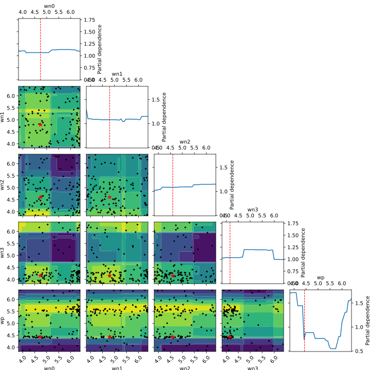


<h4 align="center">gp_minimize-GBRT-sobol-EI</h4>

```
optimizer       gp_minimize
estimator              GBRT
generator             sobol
acquisitor               EI
wn0                     0.0
wn1                 0.00002
wn2                0.000072
wn3                0.000077
wp                 0.000003
vs0                1.906891
vs1                1.666983
vs2                1.642136
vs3                1.642424
cost               0.175342
time_stamp    124353-211103
```

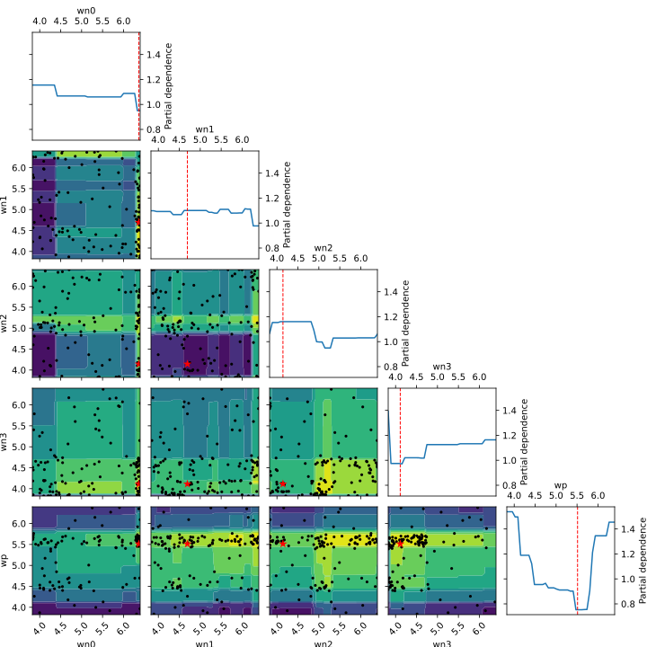


<h4 align="center">gp_minimize-GBRT-sobol-PI</h4>

```
optimizer       gp_minimize
estimator              GBRT
generator             sobol
acquisitor               PI
wn0                0.000015
wn1                0.000029
wn2                0.000045
wn3                0.000072
wp                 0.000041
vs0                  1.6602
vs1                1.652853
vs2                1.662488
vs3                1.659937
cost               0.021502
time_stamp    124505-211103
```


<h4 align="center">gp_minimize-GBRT-sobol-gp_hedge</h4>

```
optimizer       gp_minimize
estimator              GBRT
generator             sobol
acquisitor         gp_hedge
wn0                0.000013
wn1                0.000031
wn2                0.000022
wn3                0.000115
wp                 0.000036
vs0                1.670652
vs1                  1.6289
vs2                1.739087
vs3                1.651085
cost               0.079954
time_stamp    124649-211103
```

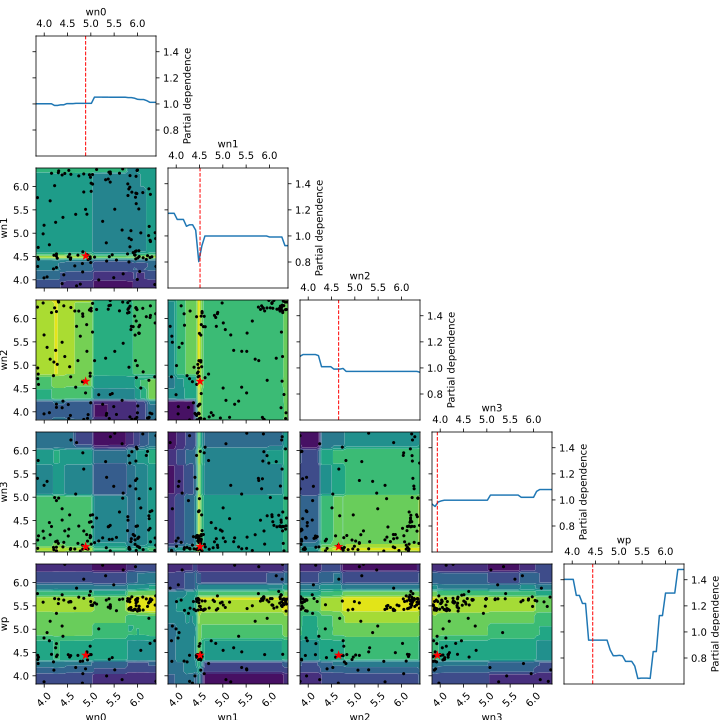


<h4 align="center">gp_minimize-GBRT-halton-LCB</h4>

```
optimizer       gp_minimize
estimator              GBRT
generator            halton
acquisitor              LCB
wn0                     0.0
wn1                0.000004
wn2                0.000012
wn3                0.000021
wp                 0.000002
vs0                 1.83977
vs1                1.667644
vs2                1.626964
vs3                 1.61448
cost               0.161194
time_stamp    124743-211103
```

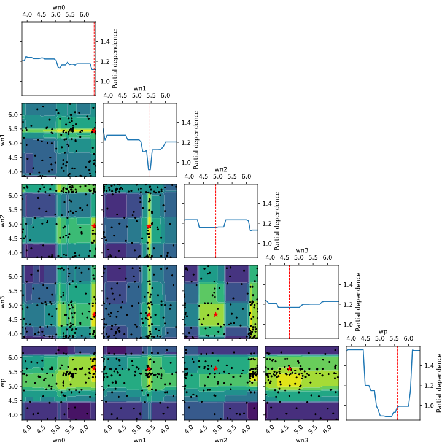


<h4 align="center">gp_minimize-GBRT-halton-EI</h4>

```
optimizer       gp_minimize
estimator              GBRT
generator            halton
acquisitor               EI
wn0                     0.0
wn1                0.000003
wn2                0.000002
wn3                0.000006
wp                 0.000002
vs0                1.788006
vs1                1.620096
vs2                 1.71157
vs3                1.655148
cost               0.142199
time_stamp    124930-211103
```


<h4 align="center">gp_minimize-GBRT-halton-PI</h4>

```
optimizer       gp_minimize
estimator              GBRT
generator            halton
acquisitor               PI
wn0                     0.0
wn1                0.000004
wn2                0.000005
wn3                0.000009
wp                 0.000002
vs0                1.840418
vs1                1.662093
vs2                1.671056
vs3                1.660173
cost               0.141661
time_stamp    125020-211103
```

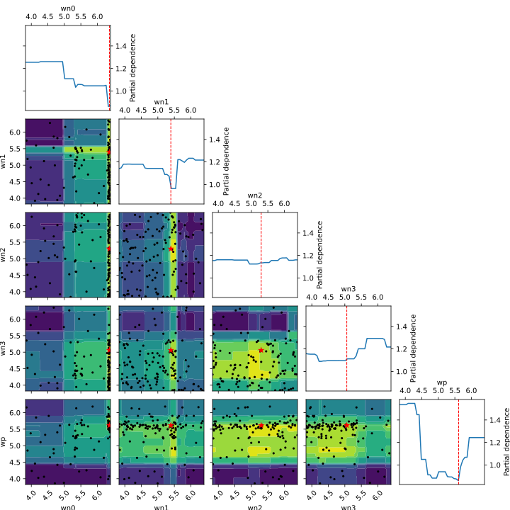


<h4 align="center">gp_minimize-GBRT-halton-gp_hedge</h4>

```
optimizer       gp_minimize
estimator              GBRT
generator            halton
acquisitor         gp_hedge
wn0                0.000007
wn1                0.000011
wn2                0.000024
wn3                0.000089
wp                 0.000021
vs0                1.708445
vs1                1.722029
vs2                 1.69987
vs3                1.646523
cost               0.111406
time_stamp    125219-211103
```

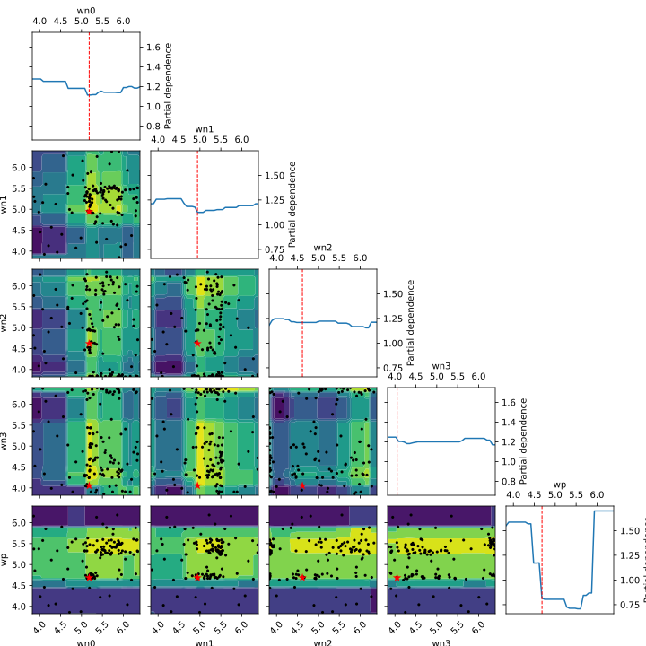


<h4 align="center">gp_minimize-GBRT-hammersly-LCB</h4>

```
optimizer       gp_minimize
estimator              GBRT
generator         hammersly
acquisitor              LCB
wn0                 0.00002
wn1                0.000056
wn2                0.000145
wn3                0.000058
wp                 0.000054
vs0                1.643292
vs1                  1.5787
vs2                1.530724
vs3                1.652036
cost                 0.1208
time_stamp    125312-211103
```


<h4 align="center">gp_minimize-GBRT-hammersly-EI</h4>

```
optimizer       gp_minimize
estimator              GBRT
generator         hammersly
acquisitor               EI
wn0                0.000004
wn1                 0.00001
wn2                0.000031
wn3                  0.0001
wp                 0.000014
vs0                1.719672
vs1                1.685683
vs2                1.625267
vs3                1.583473
cost               0.119161
time_stamp    125511-211103
```


<h4 align="center">gp_minimize-GBRT-hammersly-PI</h4>

```
optimizer       gp_minimize
estimator              GBRT
generator         hammersly
acquisitor               PI
wn0                0.000006
wn1                0.000005
wn2                0.000019
wn3                0.000043
wp                 0.000015
vs0                1.647206
vs1                1.777742
vs2                1.702119
vs3                1.677029
cost               0.127081
time_stamp    125602-211103
```

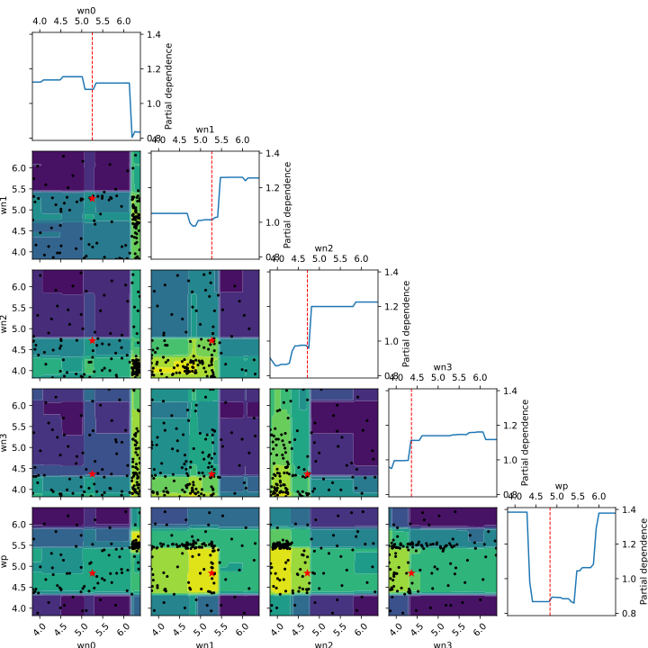


<h4 align="center">gp_minimize-GBRT-hammersly-gp_hedge</h4>

```
optimizer       gp_minimize
estimator              GBRT
generator         hammersly
acquisitor         gp_hedge
wn0                0.000001
wn1                0.000015
wn2                0.000027
wn3                 0.00005
wp                 0.000004
vs0                1.873573
vs1                 1.65005
vs2                1.638334
vs3                1.627146
cost               0.156451
time_stamp    125802-211103
```

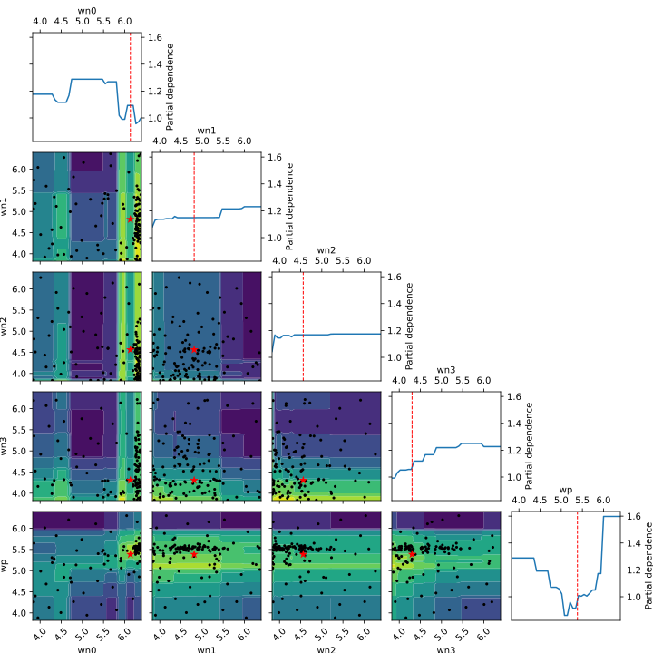


<h4 align="center">gp_minimize-GBRT-lhs-LCB</h4>

```
optimizer       gp_minimize
estimator              GBRT
generator               lhs
acquisitor              LCB
wn0                     0.0
wn1                0.000137
wn2                 0.00001
wn3                0.000002
wp                 0.000003
vs0                1.865529
vs1                1.562675
vs2                1.639219
vs3                1.764066
cost               0.259213
time_stamp    125857-211103
```


<h4 align="center">gp_minimize-GBRT-lhs-EI</h4>

```
optimizer       gp_minimize
estimator              GBRT
generator               lhs
acquisitor               EI
wn0                0.000135
wn1                0.000124
wn2                0.000126
wn3                0.000001
wp                 0.000009
vs0                1.671372
vs1                1.671463
vs2                1.671465
vs3                2.024777
cost               0.266107
time_stamp    130035-211103
```

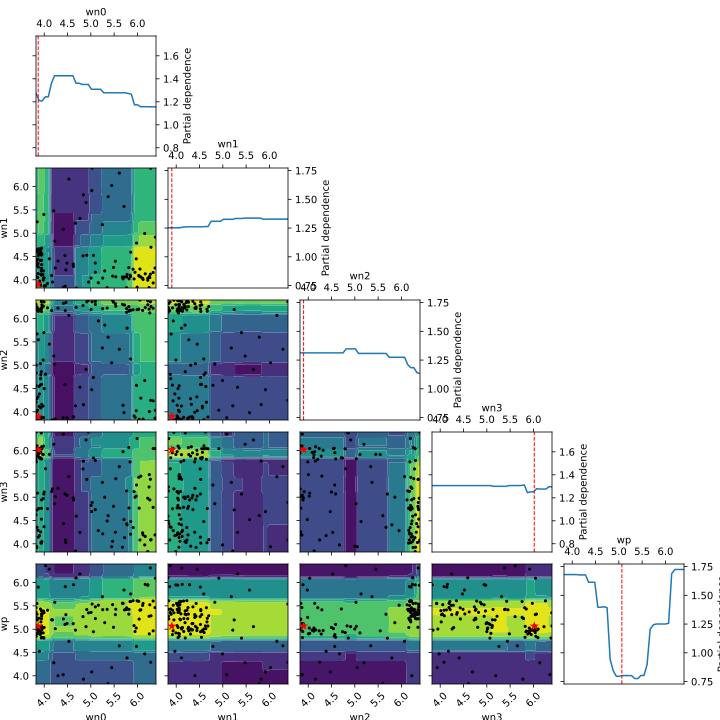


<h4 align="center">gp_minimize-GBRT-lhs-PI</h4>

```
optimizer       gp_minimize
estimator              GBRT
generator               lhs
acquisitor               PI
wn0                0.000001
wn1                0.000038
wn2                 0.00003
wn3                0.000044
wp                 0.000005
vs0                1.878081
vs1                1.627985
vs2                 1.64217
vs3                1.636893
cost               0.164263
time_stamp    130124-211103
```

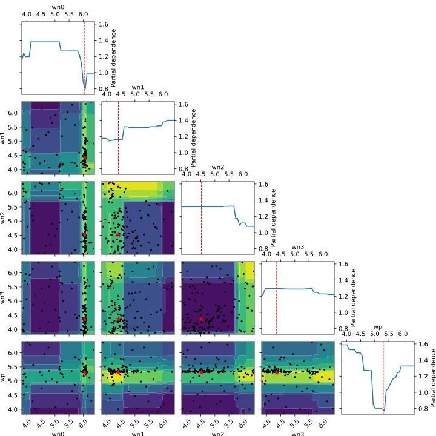


<h4 align="center">gp_minimize-GBRT-lhs-gp_hedge</h4>

```
optimizer       gp_minimize
estimator              GBRT
generator               lhs
acquisitor         gp_hedge
wn0                     0.0
wn1                0.000009
wn2                0.000011
wn3                 0.00004
wp                 0.000003
vs0                1.876139
vs1                1.654991
vs2                1.656818
vs3                1.626914
cost               0.158203
time_stamp    130314-211103
```

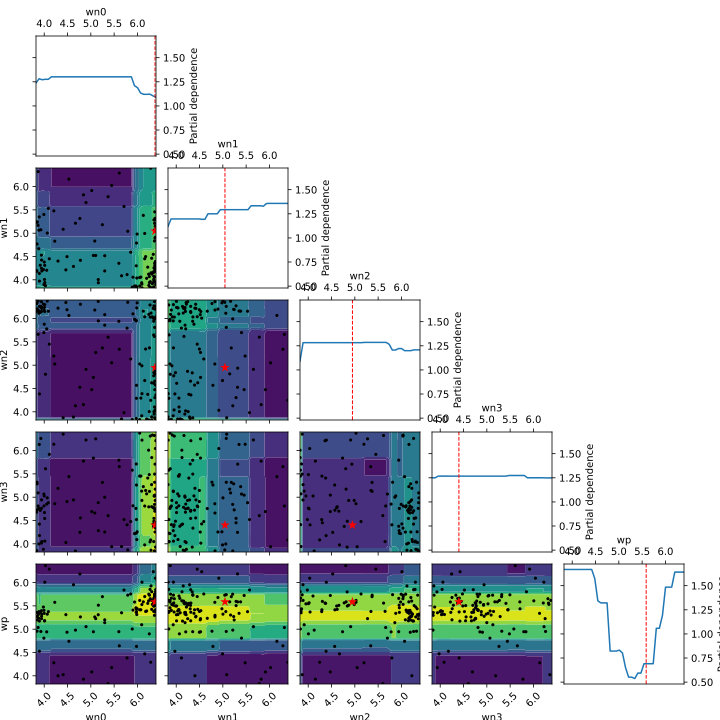


<h4 align="center">gp_minimize-GBRT-grid-LCB</h4>

```
optimizer       gp_minimize
estimator              GBRT
generator              grid
acquisitor              LCB
wn0                0.000009
wn1                0.000021
wn2                0.000021
wn3                 0.00005
wp                 0.000025
vs0                  1.6722
vs1                1.627583
vs2                1.693507
vs3                 1.65807
cost                 0.0583
time_stamp    130408-211103
```

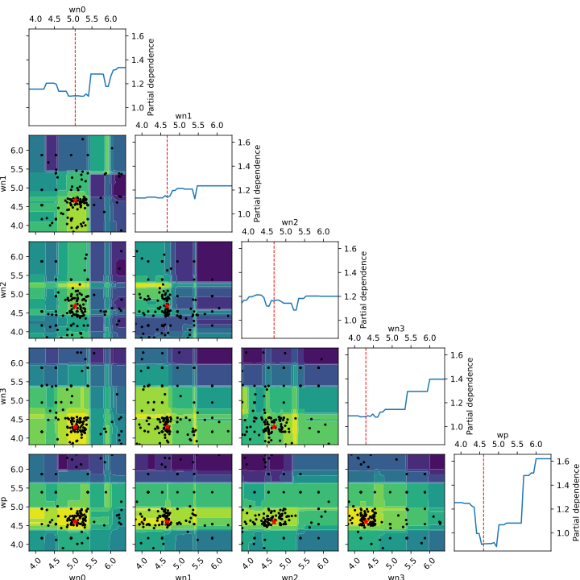


<h4 align="center">gp_minimize-GBRT-grid-EI</h4>

```
optimizer       gp_minimize
estimator              GBRT
generator              grid
acquisitor               EI
wn0                0.000007
wn1                0.000018
wn2                0.000037
wn3                0.000052
wp                 0.000022
vs0                1.726123
vs1                 1.66817
vs2                1.642903
vs3                1.646694
cost               0.063452
time_stamp    130600-211103
```

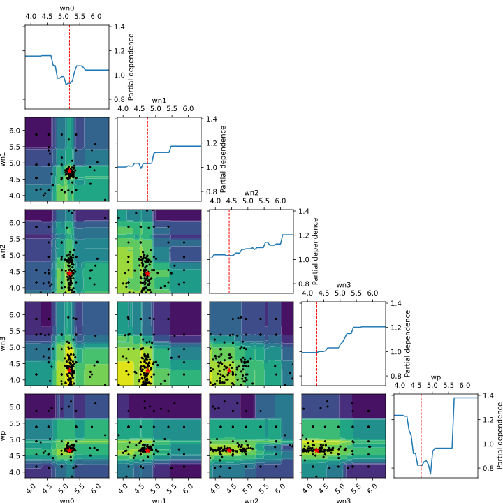


<h4 align="center">gp_minimize-GBRT-grid-PI</h4>

```
optimizer       gp_minimize
estimator              GBRT
generator              grid
acquisitor               PI
wn0                0.000012
wn1                0.000026
wn2                0.000044
wn3                0.000043
wp                 0.000032
vs0                1.649283
vs1                1.623721
vs2                1.621212
vs3                1.663603
cost               0.042052
time_stamp    130652-211103
```


<h4 align="center">gp_minimize-GBRT-grid-gp_hedge</h4>

```
optimizer       gp_minimize
estimator              GBRT
generator              grid
acquisitor         gp_hedge
wn0                0.000009
wn1                0.000018
wn2                0.000028
wn3                 0.00008
wp                 0.000027
vs0                1.677332
vs1                1.669319
vs2                1.679007
vs3                1.635128
cost               0.054867
time_stamp    130807-211103
```

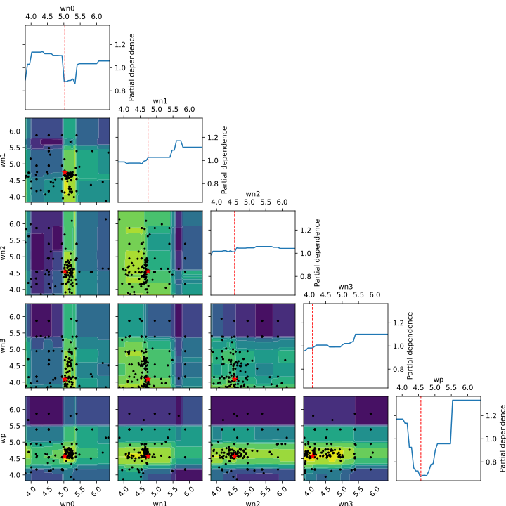
